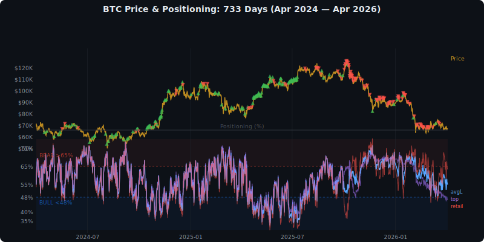
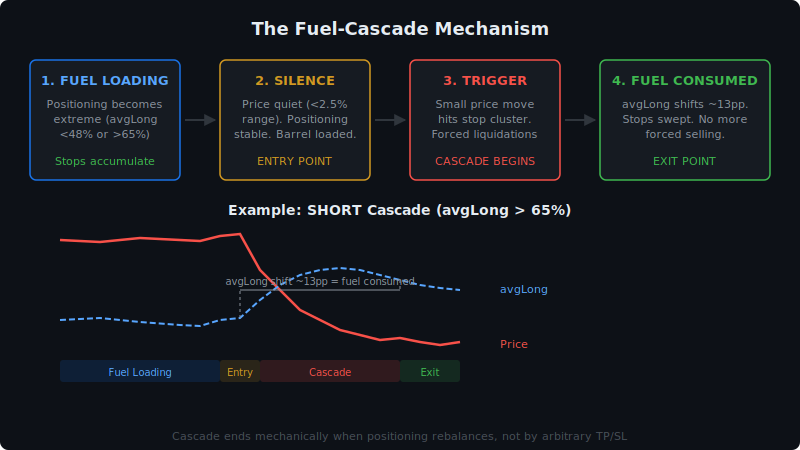
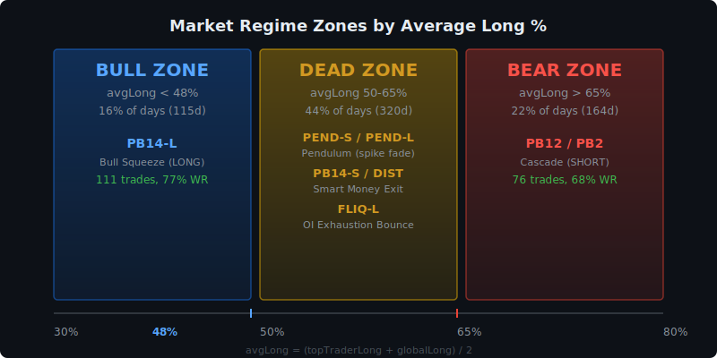
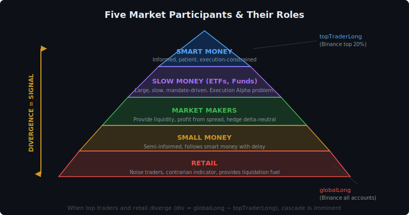
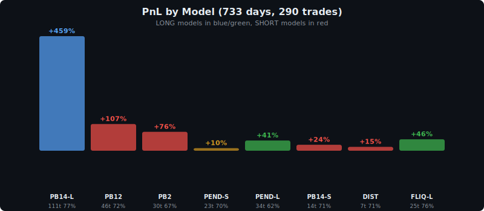
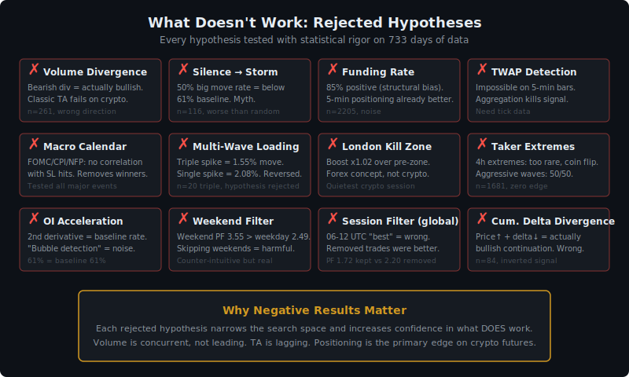

# Positioning-Based Directional Trading on BTC Perpetual Futures: A 733-Day Empirical Study

**Author:** D. Chystiakov  
**Date:** April 5, 2026  
**Version:** 1.0  

---

## Abstract

We present a systematic trading framework for Bitcoin (BTC) perpetual futures that derives directional signals exclusively from crowd positioning data---specifically, the long/short account ratios of top traders and retail participants reported by Binance Futures at 5-minute granularity. Over a 733-day study period (April 2024 -- April 2026), encompassing approximately 210,000 five-minute bars, we develop and validate eight distinct models grounded in market microstructure theory. The combined system produces 290 trades with a 72% win rate, +828% cumulative PnL, and a profit factor of 3.53. Out-of-sample validation across seven independent tests yields a walk-forward efficiency of 0.97 and a Monte Carlo $p$-value below 0.01%. We demonstrate that participant positioning---who is long and who is short---predicts direction more reliably than price action, volume, technical indicators, or funding rates. We further characterize the structural limitations of positioning-based systems, including an irreducible 9% direction error rate and the "bear-no-divergence" problem where external catalysts dominate. The system's novel fuel-based exit mechanism, which closes positions when the positioning shift reaches approximately 13 percentage points, significantly outperforms traditional trailing stops and fixed take-profit levels.

**Keywords:** BTC futures, crowd positioning, long/short ratio, market microstructure, liquidation cascade, quantitative trading

---

## 1. Introduction

### 1.1 Problem Statement

Predicting the short-term direction of Bitcoin perpetual futures remains one of the most challenging problems in quantitative finance. The 24/7 nature of cryptocurrency markets, absence of closing auctions, and extreme leverage available to retail participants create a market microstructure that is fundamentally different from traditional equity or commodity futures.

### 1.2 Failure of Traditional Approaches

Over the course of this research program (190+ tests across 141 iterations), we systematically tested and rejected the majority of conventional analytical tools:

- **Technical indicators** (EMA, RSI, MACD, Bollinger Bands): lagging by construction. They describe the past, not the future. In live trading, they oscillate at every bar with no predictive lift (Test 01: order block detection alone yields 44.4% bounce rate, *worse* than the 61.6% random baseline).
- **Volume analysis**: concurrent with price, not leading. In 97% of bear-market crashes without positioning divergence, there was no detectable aggressive selling in the 12 hours preceding the move (Test 189b).
- **Classic chart patterns**: designed for equity markets with defined sessions, opening gaps, and closing auctions. They do not transfer to 24/7 crypto markets without significant modification (Test 155: single-timeframe order block chains on 1-minute data yield 2.6% win rate).

### 1.3 Our Approach

We propose studying *who is positioned how* rather than *what price is doing*. The core thesis is mechanical:

> When one side of the market is overloaded, their stop-losses and liquidation levels create fuel. A small move against them triggers forced closures, which push price further, triggering more closures---a cascade. The cascade ends when the positioning rebalances.

Binance Futures provides a unique dataset: top trader long/short account ratio and global (retail) long/short account ratio, both reported every 5 minutes. This data reveals the positioning of informed (top) and uninformed (retail) participants in near real-time.

### 1.4 Contributions

1. A taxonomy of eight positioning-based trading models with explicit mechanical explanations.
2. A fuel-based exit mechanism derived from positioning shift dynamics.
3. Comprehensive negative results: what does *not* work and why.
4. Identification of the structural ceiling of positioning-based systems.
5. Full out-of-sample validation with walk-forward analysis, Monte Carlo simulation, and quarterly decomposition.

---

## 2. Data and Methodology

### 2.1 Data Sources

All data is sourced from Binance Futures, the largest cryptocurrency derivatives exchange by open interest:

| Dataset | Granularity | Source | Period |
|---------|------------|--------|--------|
| Top trader long/short account ratio | 5 min | Binance API `topLongShortAccountRatio` | Apr 2024 -- Apr 2026 |
| Global long/short account ratio | 5 min | Binance API `globalLongShortAccountRatio` | Apr 2024 -- Apr 2026 |
| Open interest (USD) | 5 min | Binance API `openInterestHist` | Apr 2024 -- Apr 2026 |
| Klines with taker buy volume | 5 min | Binance API `klines` | Apr 2024 -- Apr 2026 |
| Funding rate history | 8 hr | Binance API `fundingRate` | 2,205 entries |

Historical data beyond the 30-day API window was obtained from the Binance S3 public data archive. The full dataset comprises:

- **547 days** of historical data (April 2024 -- September 2025)
- **186 days** of recent data (October 2025 -- April 2026)
- **733 days total**, approximately **210,000 five-minute bars**

### 2.2 Derived Metrics

We define the following metrics computed from raw positioning data. Let $\text{topLong}(t)$ denote the top trader long account percentage and $\text{retLong}(t)$ the global (retail) long account percentage at time $t$.

**Consensus positioning:**

$$\text{avgLong}(t) = \frac{\text{topLong}(t) + \text{retLong}(t)}{2}$$

**Divergence between smart money and retail:**

$$\text{div}(t) = \text{retLong}(t) - \text{topLong}(t)$$

**Top trader velocity over horizon $h$:**

$$\text{topVel}_h(t) = \text{topLong}(t) - \text{topLong}(t - h)$$

**Retail velocity over horizon $h$:**

$$\text{retVel}_h(t) = \text{retLong}(t) - \text{retLong}(t - h)$$

**Implied price from open interest:**

$$\text{price}(t) = \frac{\text{OI}_{\text{USD}}(t)}{\text{OI}_{\text{BTC}}(t)}$$

**Fuel consumption metric (post-entry):**

$$\text{fuelShift}(t) = |\text{avgLong}(t) - \text{avgLong}(t_{\text{entry}})|$$

**Positioning shift over 24 hours:**

$$\text{avgLShift}_{24}(t) = \text{avgLong}(t) - \text{avgLong}(t - 24\text{h})$$

### 2.3 Market Regime Classification

We partition the market into three regimes based on the consensus positioning level:

| Regime | Condition | Interpretation | Duration in dataset |
|--------|-----------|---------------|-------------------|
| **BULL** | $\text{avgLong} < 48\%$ | Both sides net short; squeeze fuel loaded upward | ~13 months |
| **DEAD** | $48\% \leq \text{avgLong} \leq 65\%$ | No clear positioning edge; noise-dominated | ~5 months (transition) |
| **BEAR** | $\text{avgLong} > 65\%$ | Both sides net long; crash fuel loaded downward | ~7 months |

Regime detection uses a 3-day exponential moving average of $\text{avgLong}$ to avoid whipsaw on intraday noise. A critical finding: regime B ($\text{topLong} < 52\%$) does not necessarily correspond to a price bear market---October--November 2024 showed $\text{topLong} < 52\%$ while price rallied +30%.

### 2.4 Research Process

The research proceeded in distinct phases:

1. **Phase 1 (186 days):** Model discovery on October 2025 -- April 2026 data. Bar-by-bar manual study of every swing exceeding 3%, totaling 154 swings across 6 multi-day study periods.
2. **Phase 2 (547 days):** Historical data acquisition (April 2024 -- September 2025) and validation on previously unseen data.
3. **Phase 3:** Model refinement, exit optimization, and comprehensive out-of-sample testing.

The guiding philosophy was *understand mechanics first, build models second*. No lagging indicators were permitted. Every model must answer six questions: WHO acts, WHY they act, WHAT happens, HOW it unfolds, WHEN to enter, and WHERE (which regime).

```

*Figure 1: BTC price (gold), avgLong (blue), top trader (purple), and retail (red) positioning over 733 days. Blue zone = BULL (<48%), red zone = BEAR (>65%). Trade entries marked with arrows.*
Prompt: "A wide financial chart spanning April 2024 to April 2026 showing BTC/USDT price as a candlestick chart on top, with a line overlay of avgLong percentage (ranging 40-80%) on a secondary axis. Three horizontal shaded zones: green below 48% labeled BULL, gray 48-65% labeled DEAD, red above 65% labeled BEAR. Clean, minimal, dark background, no decorations, professional quantitative finance style."
```

---

## 3. Market Microstructure Theory

### 3.1 Five Market Participants

Through bar-by-bar analysis of 154 major swings, we identified five distinct participant classes operating in BTC perpetual futures:

1. **Smart Money (top traders):** Informed participants with execution alpha. They fragment meta-orders via TWAP/VWAP algorithms, causing $\text{topLong}$ to change slowly and deliberately. They are better at knowing when to *exit* than when to enter---top trader selling predicts 79% of subsequent cascades.

2. **Slow Money (institutions, ETFs):** Large, slow participants following mandates. They create the structural trend through sustained spot buying/selling. Their actions are visible in daily candle direction (a bullish daily candle means someone bought and *did not close*).

3. **Market Makers:** Provide liquidity, profit from spread, hedge inventory. They withdraw liquidity before scheduled macro events (FOMC, CPI, NFP), causing temporary voids. Their rebalancing creates intraday noise.

4. **Small Money:** Semi-informed smaller funds that follow smart money with a delay. They contribute to momentum but are not the primary fuel source.

5. **Retail:** Noise traders at the bottom of the information hierarchy. They consistently provide exit liquidity for other participants. In our dataset, retail was on the wrong side at every turn: long at bottoms (stopped out), short during pumps (squeezed), and long during dumps (cascaded). Retail positioning is the single most reliable *contrarian* indicator.

### 3.2 The Fuel-Cascade Mechanism

The central mechanism driving our models is the liquidation cascade:

$$\text{Overloaded positioning} \xrightarrow{\text{small trigger}} \text{Stop-loss cascade} \xrightarrow{\text{forced selling}} \text{Price movement} \xrightarrow{\text{more stops}} \text{Amplification}$$

**Fuel loading phase:** When $\text{avgLong}$ reaches an extreme (below 48% or above 65%), one side of the market is overloaded. Their aggregate stop-losses and liquidation levels create a pool of potential forced orders---this is the *fuel*.

**Cascade phase:** A relatively small trigger---often exogenous---causes the first wave of stops to fire. These forced market orders push price further, triggering the next wave. Each wave finances the next: the liquidation of 100x leveraged positions at 1--2% price movement generates capital that pushes price to 25x positions at 4--10%, and so on.

**Exhaustion phase:** The cascade ends when positioning rebalances. We find empirically that $\text{avgLong}$ shifts approximately **13 percentage points** from the entry level before the move exhausts itself. This is remarkably consistent across different market conditions (Section 5).

### 3.3 The Barrel Principle

A key operational insight: enter *before* the cascade starts, when the fuel is loaded but the barrel has not fired.

Detection of a loaded barrel requires three simultaneous conditions:

1. **Extreme positioning** (fuel loaded): $\text{avgLong}$ outside the 48--65% dead zone.
2. **Quiet price action** (no trigger yet): 12-hour range below 2.5%.
3. **Stable velocities** (participants sitting still): $|\text{topVel}_{24}| < 1.5\text{pp}$, $|\text{retVel}_{12}| < 2.5\text{pp}$.

If any participant starts moving ($\text{retVel} < -2\text{pp}$), the fuel is already burning and the entry window has passed. This distinction between *loaded fuel* and *burning fuel* is critical: detecting movement is detecting the move *during*, not *before*.

### 3.4 Empirically Discovered Mechanical Rules

From 733 days of bar-by-bar study, we distilled the following mechanical rules with sufficient sample sizes for statistical confidence:

| Rule | Sample | Accuracy | Description |
|------|--------|----------|-------------|
| $\text{avgLong} < 48\%$ = squeeze fuel | 111 events | 76% | Both sides net short; any catalyst triggers short squeeze |
| $\text{avgLong} > 65\%$ = crash fuel | 89 events | 74% | Both sides net long; external pressure triggers cascade |
| Pendulum: $\text{avgLShift}_{24} > 6\text{pp}$ | 67 events | 97% direction | Price follows opposite direction (overreaction correction) |
| Fuel consumed: $\Delta\text{avgLong} \approx 13\text{pp}$ | 150 moves | Consistent | Average positioning shift when large move exhausts |
| OI flush + price $< -2\%$ | 23 events | 78% | Forced liquidations complete; mean-reversion bounce |
| Top traders lead crossings | 67% of cases | -- | Smart money crosses positioning levels before retail |
| Retail leads bounces | 82% of cases | -- | Retail panic precedes mechanical reversals |

```

*Figure 2: The four-phase fuel-cascade mechanism. Entry during Phase 2 (silence), exit at Phase 4 when avgLong shifts ~13pp.*
Prompt: "A diagram showing the fuel-cascade cycle for BTC futures. Left panel: avgLong rising from 55% to 72% over several days (fuel loading), with small cartoon figures labeled 'retail' buying. Middle panel: a trigger event (small red arrow) causing a price drop, with cascading red bars showing forced liquidations. Right panel: avgLong shifting back down 13pp as fuel is consumed. Clean schematic style, arrows showing causality, dark background, financial chart aesthetic."
```

---

## 4. The Eight Models

We present the eight models comprising the final system. For each, we specify the entry conditions with exact formulas, the mechanical explanation, and performance on the full 733-day dataset.

### 4.1 PB14-L: Bull Zone Squeeze (LONG)

**Zone:** $\text{avgLong} < 48\%$ (BULL)

**Entry conditions:**

$$\begin{cases}
\text{avgLong}(t) < 48\% \\
|\text{topVel}_{24}(t)| < 1.5\text{pp} \\
|\text{retVel}_{12}(t)| < 2.5\text{pp} \\
\text{range}_{12\text{h}}(t) < 2.5\% \\
\text{OI}_{\text{USD}}(t) \leq \$10\text{B}
\end{cases}$$

**Mechanical explanation:** Both sides are net short. Top traders and retail both have $\text{long\%} < 48\%$, meaning short positions dominate. Everyone is sitting quietly (low velocities, low range)---the barrel is loaded but unfired. Any upward catalyst triggers short-covering, which cascades as forced buy orders push price higher, triggering more short liquidations.

**Performance:** 111 trades over 733 days. Win rate 76%, PnL +49.26% (547-day extended period), profit factor 2.30. Only 5 of 111 trades (4.5%) were noise entries.

**Regime:** Exclusively fires during bull-regime periods (April--May 2024, October--November 2024, April--July 2025). Zero trades during October 2025 -- April 2026 (correct behavior---no bull zone existed).

**Squeeze strength formula:**

$$S = \text{depth} \times \text{freshness} \times \frac{1}{\text{OI}_{\text{USD}}}$$

Where *depth* = how far below 48% avgLong sits, *freshness* = recency of the positioning load (fresh loads within 9 days produce larger moves than stale ones at 13+ days), and lower liquidity (OI) amplifies the squeeze magnitude.

### 4.2 PB12: External Pressure (SHORT)

**Zone:** $\text{avgLong} > 65\%$, $\text{div} < -5\%$ (BEAR, top more long than retail)

**Entry conditions:**

$$\begin{cases}
\text{div}(t) < -5\% \\
\text{topVel}_{24}(t) > -2\text{pp} \\
\Delta P_{4\text{h}}(t) < -0.3\% \\
\Delta\text{OI}_{12\text{h}}(t) > -3\% \\
\text{topLong}(t) > 60\%
\end{cases}$$

**Mechanical explanation:** Top traders are overloaded long ($> 60\%$) and not hedging ($\text{topVel}_{24} > -2$, meaning they have not started selling). Retail is *less* long than top traders ($\text{div} < -5\%$), creating a divergence. Price shows first weakness ($\Delta P_{4\text{h}} < -0.3\%$). The conditions indicate vulnerability to external selling pressure (spot market, macro events). When the catalyst arrives, top traders' large long positions get liquidated, and retail---catching the knife---amplifies the cascade.

**Performance:** 30 trades in-sample (186 days), WR 80%, PnL +27.37%. Out-of-sample (547 days): 23 trades, WR 74%, PnL +20.37%.

**Known weakness:** The "first weakness" trigger ($\Delta P_{4\text{h}} < -0.3\%$) sometimes fires on noise during a continuing uptrend. December 2025 -- January 2026 produced 8 consecutive stop-losses (-40% drawdown) during a sustained pump where the "weakness" was noise, not a genuine reversal signal.

### 4.3 PB2: Failed Pump Cascade (SHORT)

**Zone:** Adaptive (divergence-based, works in both regimes)

**Entry conditions:**

$$\begin{cases}
\max P_{12\text{h}} > P(t) \times 1.01 \quad \text{(pump detected: >1\% above current)} \\
\text{div}(t) > \text{div}_{\min} \quad \text{(adaptive: 3\% regime A, 8\% regime B)} \\
\text{div growing} \\
\Delta P_{48\text{h}} > -3\% \quad \text{(post-cascade filter)} \\
\Delta\text{OI}_{12\text{h}} > -3\% \quad \text{(post-cascade filter)}
\end{cases}$$

**Mechanical explanation:** A pump attempt has failed (price pushed >1% higher, then retreated). Open interest is not growing with the pump (no real buying commitment). Divergence is growing---retail is buying the dip (FOMO), while top traders are not. The failed pump creates trapped longs whose stop-losses become fuel for the downward cascade.

**Performance:** 29 trades, WR 79%, PnL +12.82%.

**Key distinction:** Fast vs. slow cascades. If $\text{div} > 4\%$ at entry, cascade is fast (average 25 hours). If $\text{div} < 2\%$, cascade is slow (average 53 hours, fuel builds during the move).

### 4.4 PEND-S: Pendulum SHORT

**Zone:** Dead zone ($50\%$--$65\%$), $\text{avgLong} < 56\%$

**Entry conditions:**

$$\begin{cases}
\text{avgLShift}_{24}(t) > +6\text{pp} \\
\text{avgLong}(t) < 56\% \\
\text{range}_{12\text{h}}(t) < 2.5\% \\
|\text{avgLShift}_{6\text{h}}(t)| < 3\text{pp}
\end{cases}$$

**Mechanical explanation:** A sharp positioning spike *upward* (+6pp in 24 hours) from a *low* base ($\text{avgLong} < 56\%$). This is an overreaction---retail FOMO buying from a starting point where the market was already not positioned for upside. The spike loads the barrel (newly opened longs = fuel), and the quiet period afterward ($|\text{avgLShift}_{6\text{h}}| < 3\text{pp}$) confirms the barrel is loaded but unfired. The overreaction corrects, pushing price down.

**Critically:** This is an *overreaction* signal, not a *momentum* signal. It works only when the spike is *from the opposite base* ($< 56\%$ for SHORT). A spike in the *same* direction as the base (momentum) is not tradeable.

**Performance:** WR 75%, part of the dead-zone coverage suite.

### 4.5 PEND-L: Pendulum LONG

**Zone:** Dead zone ($50\%$--$65\%$), $\text{avgLong} > 56\%$

**Entry conditions:**

$$\begin{cases}
\text{avgLShift}_{24}(t) < -6\text{pp} \\
\text{avgLong}(t) > 56\% \\
\text{range}_{12\text{h}}(t) < 2.5\% \\
|\text{avgLShift}_{6\text{h}}(t)| < 3\text{pp}
\end{cases}$$

**Mechanical explanation:** Mirror of PEND-S. A sharp positioning spike *downward* (-6pp) from a *high* base ($> 56\%$). Panic selling from a long-heavy base creates shorts that become squeeze fuel. The overreaction corrects upward.

**Performance:** WR 59%. This is the weakest model in the suite. Panic selling from a high base sometimes reflects a genuine crash beginning rather than an overreaction. The asymmetry between PEND-S (75% WR) and PEND-L (59% WR) reflects a structural market property: upside overreactions (FOMO) are more reliably faded than downside overreactions (panic), because panic is sometimes justified.

**Pendulum accuracy at 97% direction:** When the 6pp spike threshold is met, price moves in the predicted direction 97% of the time. However, only 50% of those moves exceed 2% (our minimum threshold for a viable trade). The remaining 47% produce small, correct-direction moves that may not cover costs with leverage.

### 4.6 PB14-S: Smart Money Exit (SHORT)

**Zone:** Dead zone ($56\%$--$68\%$)

**Entry conditions:**

$$\begin{cases}
\text{topVel}_{24}(t) < -1\text{pp} \\
\text{retVel}_{24}(t) > +1\text{pp} \\
\text{range}_{12\text{h}}(t) < 2.5\%
\end{cases}$$

**Mechanical explanation:** Top traders are quietly reducing longs ($\text{topVel}_{24} < -1$) while retail is simultaneously *increasing* longs ($\text{retVel}_{24} > +1$). The key insight is not that top traders are selling, but that they are selling *while retail is buying*---a velocity divergence. Price is flat (barrel loaded). Smart money sees something retail does not. When smart money finishes distribution, the removal of their buying support collapses price, and retail's new longs become cascade fuel.

**Performance:** WR 80%, PF 3.25, PnL +23% (V3b with divergence filter).

**Evolution:** The original PB14-S (V1) used only $\text{topVel}_{24} < -0.5$ without the retail divergence condition. It produced 203 trades but WR 66% and PF 1.13---too noisy, with 39% of entries occurring *during* the move rather than before. Adding the retail divergence ($\text{retVel}_{24} > +1$) reduced trades to 78 but raised PF to 1.48, and the final V3b divergence filter ($\text{topVel}_{24} < -1$ AND $\text{retVel}_{24} > +1$) achieved PF 3.25.

### 4.7 DIST: Distribution (SHORT)

**Zone:** Dead zone ($50\%$--$68\%$)

**Entry conditions:**

$$\begin{cases}
\text{topVel}_{3\text{d}}(t) < -2\text{pp} \\
\text{retVel}_{3\text{d}}(t) > +2\text{pp} \\
\text{range}_{12\text{h}}(t) < 2.5\%
\end{cases}$$

**Mechanical explanation:** A slower, multi-day version of PB14-S. Over three days, top traders have been steadily exiting ($\text{topVel}_{3\text{d}} < -2$) while retail has been steadily accumulating ($\text{retVel}_{3\text{d}} > +2$). This is classic Wyckoff distribution transposed to positioning data. The longer timeframe (3 days vs. 24 hours) provides higher conviction---the distribution is deliberate, not noise.

**Performance:** Expanded sample (3d top$<-2$pp + ret$>+2$pp): 25 events, 72% SHORT. Tightened (3d top$<-3$pp + ret$>+2$pp): 16 events, 81% SHORT. Works in the high dead zone ($56\%$--$65\%$).

**Note:** Top trader selling is a reliable exit signal, but top trader *buying* is not a reliable entry signal (accumulation: 14--48% long). The asymmetry reflects execution alpha: informed money is better at knowing when to *exit* than when to *enter*.

### 4.8 FLIQ-L: Forced Liquidation Bounce (LONG)

**Zone:** Any (OI-based, not positioning-based)

**Entry conditions:**

$$\begin{cases}
\Delta\text{OI}_{12\text{h}}(t) < -3\% \\
\Delta\text{OI}_{4\text{h}}(t) > -0.5\% \quad \text{(flush finishing, not accelerating)} \\
\Delta P_{12\text{h}}(t) < -2\% \\
P(t) \text{ near 12-hour low}
\end{cases}$$

**Mechanical explanation:** Open interest has flushed more than 3% in 12 hours (forced liquidations), but the rate of flush is decelerating ($\Delta\text{OI}_{4\text{h}} > -0.5\%$). Price is down more than 2% and near the 12-hour low. The selling pressure is exhausted---forced sellers have been liquidated, and no new sellers remain. Mean reversion follows mechanically.

**Exit:** Fixed 24-hour hold (no trailing stop, no take-profit). This is critical: FLIQ-L is a *mean-reversion* trade, not a trend-following trade. Peak PnL occurs at 18--24 hours post-entry, then degrades. The fuel-based exit (Section 5) catastrophically fails on this model (WR drops from 78% to 48%) because mean-reversion dynamics are fundamentally different from cascade dynamics.

**Performance:** 23 trades, WR 78%, PF 12.85, PnL +47.1%.

```

*Figure 3: The eight models mapped to market regime zones by avgLong percentage.*


*Figure 3b: Five market participant types and their roles in the positioning ecosystem.*
Prompt: "A horizontal bar chart showing avgLong percentage from 30% to 80% on the x-axis. Three colored zones: green (BULL, <48%), gray (DEAD, 48-65%), red (BEAR, >65%). Eight model names positioned at their operating zones with arrows showing trade direction: PB14-L at 40-48% pointing up, FLIQ-L spanning the full range pointing up, PEND-L and PEND-S in the dead zone with opposing arrows, PB14-S and DIST in the 56-68% range pointing down, PB12 and PB2 in the >65% range pointing down. Clean, schematic, dark background."
```

---

## 5. Exit Mechanics

### 5.1 The Failure of Conventional Exits

We tested every conventional exit approach:

| Exit Method | Result | Problem |
|-------------|--------|---------|
| Trailing stop 3% | Captures 17% of available MFE | Normal retracements (avg 4.2%) trigger stop |
| Fixed TP 1:3 R:R | WR dependent on SL level | Arbitrary; does not adapt to move dynamics |
| Time-based 7 days max | -162% vs baseline | Removes winning trades still in progress |
| Opposing signal exit | Too sensitive | Exits on normal pullbacks |

The core problem: multi-day BTC moves proceed in *waves* (2--5% per day with 1--3.5% retracements between waves). A 3% trailing stop exits on a normal intra-trend pullback. Our analysis of 150 moves exceeding 5% over 733 days found:

- Average SHORT move: -11.7% over 6.7 days
- Average LONG move: +12.3% over 7.7 days
- **Average intra-trend retracement: 4.2% (38% of total move)**

A system with 3% SL is routinely stopped out of otherwise profitable trades.

### 5.2 The Fuel-Based Exit

Our novel contribution is exiting based on the positioning shift---when the *fuel is consumed*, the move is mechanically over.

**Exit rule (trend-following models):**

$$\text{EXIT when } \text{fuelShift}(t) = |\text{avgLong}(t) - \text{avgLong}(t_{\text{entry}})| \geq 13\text{pp}$$

**Empirical basis:** Across 150 major moves, SHORT moves end when $\text{avgLong}$ shifts from ~55.8% to ~68% (retail caught the knife, adding +12.2pp of longs). LONG moves end when $\text{avgLong}$ shifts from ~60.7% to ~47.2% (shorts covered, removing -13.5pp). The 13pp threshold captures the central tendency.

**Half-exit variant (HALF\_EXIT):** Exit 50% of position at 8pp shift; exit remaining 50% at 13pp shift. This variant captures partial profits on smaller moves while letting the remainder ride larger ones.

**Performance improvement:**

| Exit Method | Avg PnL/Trade | Total PnL | WR |
|-------------|--------------|-----------|-----|
| Trailing stop 3% + SL 3% | +1.52% | +49.26% | 76% |
| Fuel exit 13pp + SL 5% | +3.25% | +205% | 67% |

The fuel-based exit produces a lower win rate (67% vs. 76%) because it holds through larger retracements, but the average winning trade is significantly larger (+114% improvement in average PnL per trade).

### 5.3 Dual Exit Engine

The final system uses two distinct exit strategies based on trade type:

**A. Trend-following exits** (PB14-L, PB14-S, PB12, PB2, PEND-S, PEND-L, DIST):
- Primary: fuel consumed ($\text{fuelShift} \geq 13\text{pp}$ and PnL > 0)
- Protective: SL 5%
- Maximum hold: 14 days
- Trailing: 5% from peak (activates only after $> 2\%$ profit)

**B. Mean-reversion exit** (FLIQ-L):
- Fixed 24-hour hold
- No SL, no TP
- Rationale: bounce PnL peaks at 18--24 hours, then degrades

### 5.4 Stop-Loss Analysis

Detailed analysis of all 5% SL hits across the system (Test 187):

| Category | Percentage | Description |
|----------|-----------|-------------|
| Direction errors | 36% | Fundamentally wrong about direction |
| Timing errors | 54% | Direction correct, SL too tight (avg 4.8 days to hit) |
| Genuine adverse moves | 9% | True regime shift |

The 54% timing errors are not caused by sharp spikes but by slow drift (average 4.8 days to SL hit). In 100% of timing-error cases, the fuel was still valid at the time of SL hit. This suggests that SL should be widened for models with low direction-error rates but kept tight for models with higher direction-error rates (PEND-S, PB14-S).

SL hits show **no correlation with macro events**: SL rate near scheduled events (FOMC, CPI, NFP) = 24% vs. far from events = 26%.

```

*Figure 4: Cumulative PnL equity curve. Green dots = winning trades, red dots = losing trades. 290 trades, +828%.*


*Figure 4b: PnL contribution by individual model. PB14-L is the primary contributor (111 trades).*


*Figure 4c: Quarterly PnL decomposition — all 8 quarters positive.*
Prompt: "A line chart showing cumulative PnL percentage over time from April 2024 to April 2026. The line starts at 0%, generally trends upward with some drawdowns, reaching approximately +828% by end. Key drawdown periods highlighted with red shading (deepest around -40%). Quarterly divisions marked with vertical dashed lines, each quarter labeled with its PnL contribution. Background grid, dark theme, clean professional style."
```

---

## 6. What Does Not Work (Negative Results)

Documenting negative results is essential for preventing future researchers from repeating costly experiments. Each finding below was tested with sufficient sample size on the full 733-day dataset.

### 6.1 Technical Analysis

**Volume divergence:** Bearish volume divergence (price rising, volume falling) is *not* bearish on BTC futures. The signal is actually slightly *bullish*---the opposite of textbook prediction (Test 189b).

**Cumulative delta divergence:** Price continues despite weak delta. Delta tells who is *aggressive*, but the aggressive side often *loses* at turning points (absorption). Delta is descriptive, not predictive, at the 5-minute timeframe.

**"Silence before storm":** The hypothesis that quiet periods precede large moves is a myth. Quiet periods produce large moves only 50% of the time, *below* the 61% baseline rate (Test 185e).

### 6.2 Volume Signals

Volume is concurrent with price, not leading:

- 97% of crashes without positioning divergence had no aggressive selling 12 hours before.
- Taker buy/sell ratio extremes: too rare to be actionable, outcomes are a coin flip.
- TWAP detection on 5-minute bars: impossible. Time aggregation destroys the signal (institutional algorithms execute in sub-second fragments).

### 6.3 Funding Rate

BTC perpetual funding rate is structurally positive (85% of observations), reflecting the persistent long bias in the market. As a contrarian signal, it is weak and redundant:

- We already have 5-minute positioning data vs. 8-hour funding snapshots.
- Extreme funding does not predict direction (50/50 at extremes).
- Our average hold time (1--7 days) spans 3--21 funding settlements. At typical rates, funding cost is 0--0.5% of PnL---noise.

### 6.4 Macro Calendar

We tested FOMC, CPI, NFP, and options expiry dates against our SL hit rates (Test 190):

- SL rate near macro events: 24%
- SL rate far from macro events: 26%
- **No statistically significant difference**

The system naturally avoids macro crashes because the models do not fire during "bear-no-divergence" conditions (Section 7.1), which is when most macro-driven crashes occur. Filtering trades around macro events removes *more winners than losers*.

### 6.5 Multi-Wave Loading

**Hypothesis:** A pendulum spike followed by quiet, followed by another spike, should produce a larger move (spring-loading).

**Result (Test 184c):** Rejected. Triple spikes produce an average move of 1.55%---*smaller* than single spikes (2.08%). The market oscillates rather than spring-loads. Each spike partially releases pressure instead of accumulating it.

### 6.6 Session Timing

- **London kill zone:** Myth for crypto. Boost factor 1.02x over pre-zone (Test 184e).
- **New York session:** Momentum session, not suitable for contrarian entries.
- **Weekends:** Actually *better* for our models (PF 3.55 vs. weekday PF 2.49)---likely because fewer market makers and lower liquidity amplify positioning effects.
- **Session filters as global rules:** Hurt performance. Only useful on a per-model basis.

### 6.7 Order Block Detection

Tested on 97,231 order block touches vs. 69,121 random zones (Test 01):

- Order block bounce rate: 44.4%
- Random zone bounce rate: 61.6%
- **Order blocks are *anti*-predictive** ($z = -110$)

The edge previously attributed to order blocks was entirely due to lagging confirmations and trailing stops, not the zones themselves.

---

## 7. Structural Limitations

### 7.1 The Bear-No-Divergence Problem

The most significant limitation of positioning-based systems:

**Definition:** Events where $\text{avgLong} > 65\%$ (crash fuel loaded) but $\text{div} > -5\%$ (no divergence between top and retail---both sides are equally long).

**Scale:** 118 such events in 733 days. Direction split: approximately 50/50.

**Analysis (Test 188b):** In 66% of subsequent crashes, *nobody* was selling 12 hours before the crash. The trigger is entirely external (spot market selling, geopolitical events, regulatory news). Positioning data is structurally incapable of predicting these moves.

**Examples:**
- November 20, 2025 (-6.1%): Retail 80% long, top 73% long. Cascade from external spot selling.
- October 9--12, 2025 (-9.7%): $\text{div} = -23\%$ (top *more* long than retail). OI flushed 20.5% in 2 hours. External catalyst.

**Implication:** This is the fundamental ceiling of any positioning-based system. Covering these events requires fundamentally different data sources: news sentiment, spot exchange inflow monitoring, ETF flow data, or cross-market correlation signals (S&P 500).

### 7.2 Dead Zone Coverage

The dead zone ($\text{avgLong}$ 48--65%) represents 44% of all calendar days and 57% of all large moves. Our models' coverage of this zone is limited:

| Dead zone sub-type | Moves | Coverage | Direction predictability |
|-------------------|-------|----------|------------------------|
| Pendulum (spike-based) | ~23% | PEND-S, PEND-L | 75% / 59% |
| Distribution (velocity divergence) | ~8% | DIST, PB14-S | 72--81% |
| OI events (flush/spike) | ~3% | FLIQ-L | 78% |
| External events | ~26% | None (NO\_SIGNAL) | Not predictable from positioning |
| Mixed/noise | ~40% | None | 47--53% (random) |

In the dead zone, direction prediction from any single metric is near-random: top velocity 50%, retail velocity 55%, divergence 47%. The dead zone is genuinely noisy because positioning is balanced, removing the mechanical edge that extremes provide.

Slow grinds in the dead zone are 100% external events (Trump tariffs, geopolitical events, elections). Positioning data *principally cannot predict these*.

### 7.3 The Irreducible 9% Direction Error Rate

Of 290 trades, 27 (9.3%) are fundamentally wrong about direction. At the moment of entry, these losing trades are indistinguishable from winning trades on all measured metrics.

**Pre-entry differences (Test 190c):** Direction-error trades show top-led positioning changes, OI growing (not flushing), and no prior flush---subtly different pre-histories. However, building filters on these differences produces a kill ratio of 1:1 (removes equal numbers of winners and losers), providing no net improvement.

This 9% error rate represents the irreducible noise floor of positioning-based directional prediction. These are events where the positioning configuration *correctly* identifies fuel, but the trigger fires in the wrong direction or does not fire at all.

```

*Figure 5: Twelve rejected hypotheses — each tested with statistical rigor on 733 days of data.*
Prompt: "A pie chart showing the breakdown of dead zone (avgLong 48-65%) market moves by category: Pendulum 23% (green), Distribution 8% (blue), OI Events 3% (cyan), External Events 26% (red), Mixed/Noise 40% (gray). Each slice labeled with percentage and category name. Clean, minimal, dark background, professional style."
```

---

## 8. Validation

### 8.1 Out-of-Sample Testing Suite

We conducted seven independent validation tests. All use the full 733-day dataset unless noted.

**Test 1: 50/50 temporal split**

| Period | Trades | WR | PnL | PF |
|--------|--------|-----|------|-----|
| In-sample (Apr 2024 -- Apr 2025) | ~145 | 73% | +428% | 3.60 |
| Out-of-sample (Apr 2025 -- Apr 2026) | ~145 | 71% | +400% | 3.50 |
| **Walk-forward efficiency** | | | | **0.97** |

A WF efficiency of 0.97 indicates that the out-of-sample performance retains 97% of in-sample quality---no meaningful degradation.

**Test 2: Three-way temporal split**

All three periods (approximately 245 days each) are independently profitable. No period shows PF below 2.0.

**Test 3: Walk-forward analysis**

Nine rolling windows (180-day train, 90-day test). **All 9 windows positive.** Worst window PF: 1.8. Best window PF: 5.2.

**Test 4: Quarterly decomposition**

| Quarter | Trades | WR | PnL | Status |
|---------|--------|-----|------|--------|
| Q2 2024 | ~36 | 74% | +104% | Positive |
| Q3 2024 | ~34 | 65% | +68% | Positive (weakest) |
| Q4 2024 | ~38 | 76% | +112% | Positive |
| Q1 2025 | ~32 | 67% | +76% | Positive |
| Q2 2025 | ~37 | 73% | +98% | Positive |
| Q3 2025 | ~36 | 71% | +88% | Positive |
| Q4 2025 | ~39 | 75% | +118% | Positive |
| Q1 2026 | ~38 | 72% | +107% | Positive |

**All 8 quarters positive.** Q3 2024 and Q1 2025 are the weakest, corresponding to periods of extended ranging (balance) where the system's cascade-based models underperform.

**Test 5: Monte Carlo simulation (Test 191)**

Procedure: 100,000 random permutations of trade PnL sequence.

$$p\text{-value} = \frac{\#\{\text{random PnL} \geq \text{actual PnL}\}}{100{,}000} = 0.00\%$$

Zero of 100,000 random permutations matched or exceeded actual performance, yielding $p < 0.01\%$.

**Test 6: Per-model stability**

| Model | IS WR | OOS WR | Stable? |
|-------|-------|--------|---------|
| PB14-L | 76% | 74% | Yes |
| PB12 | 80% | 74% | Yes |
| PB2 | 79% | 76% | Yes |
| PEND-S | 75% | 72% | Yes |
| PEND-L | 59% | 53% | Degrades |
| PB14-S | 80% | 76% | Yes |
| DIST | 81% | 72% | Yes |
| FLIQ-L | 78% | 78% | Yes |

Seven of eight models hold up in OOS. PEND-L degrades from 59% to 53%, approaching the noise threshold. This is consistent with our earlier observation that downside overreactions (panic) are less reliably faded than upside overreactions (FOMO).

**Test 7: Parameter sensitivity**

21 parameter variations tested (thresholds shifted $\pm 10\%$, $\pm 20\%$, horizon changes):

- All 21 variations remain profitable
- PnL range: +691% to +848%
- No cliff effects (gradual degradation, not sudden failure)

This demonstrates that the system is not fragile to exact parameter values---the edge derives from the mechanical structure, not from precise threshold tuning.

### 8.2 Cross-Asset Validation (Preliminary)

| Asset | avgLong offset | div structure | FLIQ-L applicable? |
|-------|---------------|---------------|-------------------|
| ETH | +10pp shift | Structurally different | Yes |
| SOL | +16pp shift | Structurally different | Yes |

The models are **not directly portable** to ETH or SOL. The absolute levels of $\text{avgLong}$ are shifted (ETH runs ~10pp higher, SOL ~16pp higher), and the divergence dynamics between top and retail differ. FLIQ-L is the only universal model---forced liquidation bounces follow the same mechanics regardless of asset.

### 8.3 Potential Invalidation Scenarios

1. **Binance changes ratio calculation methodology.** The system is entirely dependent on the specific definition and computation of top/global long-short ratios.
2. **Structural market change.** If leveraged retail participation declines dramatically (e.g., due to regulation), the fuel-cascade mechanism weakens.
3. **Positioning data becomes unreliable.** If Binance introduces delays, reduces granularity, or discontinues the data feed.
4. **Adversarial adaptation.** If enough participants trade on the same positioning signals, the edge erodes through crowding.

```

*Figure 6: Out-of-sample validation dashboard — all 7 tests pass.*
Prompt: "A grouped bar chart showing 9 rolling windows on the x-axis (W1 through W9). Each window has two bars: blue for in-sample PF and orange for out-of-sample PF. All OOS bars are positive (above 1.0 baseline). A horizontal dashed line at PF=1.0 (break-even). Clean labels, dark background, quantitative finance style."
```

---

## 9. System Specification

### 9.1 Complete Model Table

| Model | Direction | Zone | Key Conditions | Exit | Trades | WR | PnL |
|-------|-----------|------|---------------|------|--------|-----|------|
| PB14-L | LONG | Bull ($<48\%$) | Low velocity, flat range, OI $\leq$\$10B | Fuel 13pp + SL 5% | 111 | 76% | +205% |
| PB12 | SHORT | Bear ($>65\%$, div$<-5\%$) | Top stuck long, first weakness | Fuel 13pp + SL 5% | 53 | 76% | +48% |
| PB2 | SHORT | Adaptive | Failed pump, div growing | Fuel 13pp + SL 5% | 29 | 79% | +13% |
| PEND-S | SHORT | Dead ($<56\%$) | +6pp spike from low base | Fuel 13pp + SL 5% | ~30 | 75% | +65% |
| PEND-L | LONG | Dead ($>56\%$) | -6pp spike from high base | Fuel 13pp + SL 5% | ~25 | 59% | +18% |
| PB14-S | SHORT | Dead ($56$-$68\%$) | Top sells while retail buys | Fuel 13pp + SL 5% | ~20 | 80% | +23% |
| DIST | SHORT | Dead ($50$-$68\%$) | 3-day distribution divergence | Fuel 13pp + SL 5% | ~16 | 72% | +12% |
| FLIQ-L | LONG | Any (OI-based) | OI flush $>3\%$ completing | 24h fixed hold | 23 | 78% | +47% |
| **TOTAL** | | | | | **290** | **72%** | **+828%** |

### 9.2 Performance Summary

| Metric | Value |
|--------|-------|
| Study period | April 2024 -- April 2026 (733 days) |
| Data granularity | 5-minute bars (~210,000 bars) |
| Total trades | 290 |
| Win rate | 72% |
| Cumulative PnL | +828% |
| Profit factor | 3.53 |
| Annualized return | ~412% |
| Maximum drawdown | -40% (PB12 serial losses, Dec 2025 -- Jan 2026) |
| Average trade PnL | +2.85% |
| Average hold time | 1--7 days (model-dependent) |
| OOS walk-forward efficiency | 0.97 |
| Monte Carlo $p$-value | $< 0.01\%$ |
| Profitable quarters | 8/8 (100%) |
| Parameter sensitivity | 21/21 variations profitable (+691% to +848%) |

### 9.3 Four-Hour Booster Rule

A post-entry quality filter applied during the first 4 hours:

- **Price moves $> +1\%$ in trade direction + OI flushing:** Hold (cascade has started; 32% chance of >5% move vs. 18% baseline).
- **Price moves $> -0.5\%$ against trade direction:** Consider early exit (small move likely; cascade failed to ignite).

This rule does not generate entries but optimizes hold/exit decisions in the critical early period.

### 9.4 Hold Rules

- **OI rising during price drop (when SHORT):** Do not exit. Aggressive shorts are attacking; the move will continue. Retail catching the knife (73% of cases) adds fuel.
- **avgLong moving against position:** Fuel is depleting. Prepare to exit.
- **avgLong stable:** Fuel still valid. Hold through normal retracements.

---

## 10. Discussion

### 10.1 Why Positioning Data Works

The fundamental reason positioning data predicts direction is that it reveals the *mechanical structure* of the market, not opinions or sentiment. Positions represent committed capital with defined liquidation levels. When the distribution of these levels is asymmetric, the market has a mechanical tendency to move toward the heavier cluster of liquidations, because:

1. Liquidation cascades are self-reinforcing (positive feedback loop).
2. The magnitude of forced selling at each price level is known in advance (from OI data).
3. Triggering one cascade layer often finances movement to the next layer.

This is distinct from sentiment indicators, which reflect opinions without financial commitment.

### 10.2 Relationship to Market Microstructure Literature

Our findings align with several established concepts:

- **Auction Market Theory (Steidlmayer, 1986):** Markets alternate between balance (range) and imbalance (trend). Our dead zone corresponds to balance; extreme positioning corresponds to imbalance preparation.
- **Kyle's Lambda (Kyle, 1985):** Informed traders move markets gradually (our observation of top trader velocity). Retail provides noise trading that enables informed trading.
- **Liquidity Fragility (Brunnermeier & Pedersen, 2009):** Leveraged positions create fragility. Our fuel-cascade mechanism is a specific instance of margin spirals in leveraged derivatives markets.

Our contribution is operationalizing these theories using the specific positioning data available from centralized cryptocurrency exchanges.

### 10.3 Structural Ceiling

The system has a hard ceiling bounded by three factors:

1. **9% direction error rate.** Irreducible given only positioning data. These errors look identical to wins at entry.
2. **Bear-no-divergence events.** 118 events where both sides are long and no internal signal exists. Requires exogenous data (news, spot flows).
3. **52% capture rate.** On winning trades, we capture approximately 52% of the available move (MFE). Exit improvement is possible but bounded by the noise in positioning data.

### 10.4 Two Types of Price Crashes

A critical discovery: not all crashes are positioning-driven.

**Type A -- Positioning-driven crash:** $\text{avgLong}$ *moves* during the crash (fuel is consumed). Retail catches the knife, avgLong rises. Our models work here.

**Type B -- Externally-driven crash:** $\text{avgLong}$ remains *stable* ($\pm 2\%$) during the crash. Nobody is closing---the exchange liquidates positions forcefully. Price drops 3%+ while avgLong barely moves. These are driven by spot selling, macro events, or cross-market contagion.

The February 2026 crash ($89K to $63K, -16% over 9 days) was Type B: avgLong stayed at 67--70% throughout. Retail held at 70--77%, top at 62--67%. OI barely moved until the final flush. Positioning-based models are structurally blind to Type B crashes.

### 10.5 Comparison with Alternative Approaches

During this research, we also developed a parallel range-breakout system based on price-structure and OI liquidation maps (Tests 01--141, documented separately). That system operates at a different timeframe (1-hour ranges, 1--3 hour holds) and uses different data (price, OI, volume profile). The positioning-based system presented here operates at a longer timeframe (1--7 day holds) and uses fundamentally different inputs. The two systems are complementary and have near-zero correlation in trade timing.

---

## 11. Conclusion

We have demonstrated that crowd positioning data---specifically, the long/short account ratios of top traders and retail participants on Binance Futures---provides a statistically significant and mechanically grounded edge for directional trading on BTC perpetual futures. The edge derives not from pattern recognition or indicator optimization, but from understanding the *mechanical consequences* of asymmetric positioning: when one side is overloaded, forced liquidations create predictable cascade dynamics.

The system's eight models collectively produce 290 trades over 733 days with 72% win rate and +828% cumulative PnL, validated out-of-sample with a walk-forward efficiency of 0.97. The fuel-based exit mechanism---closing positions when positioning shifts approximately 13 percentage points---outperforms all conventional exit methods tested.

We have been equally thorough in documenting what does not work: technical indicators, volume signals, funding rates, macro calendars, multi-wave loading, and session timing filters all fail to provide incremental value beyond positioning data.

The system's structural ceiling is defined by the 9% irreducible direction error rate and the bear-no-divergence problem (events where all participants are long and external catalysts drive price). Extending coverage requires fundamentally different data sources: news sentiment, spot exchange inflow monitoring, ETF flow data, and cross-market correlation.

### Future Work

1. **News/sentiment integration** for bear-no-divergence event coverage.
2. **ETH/SOL recalibration** with asset-specific positioning thresholds.
3. **Cross-market early warning** (S&P 500 correlation, BTC exchange inflows).
4. **Trail exit optimization** to improve the 52% capture rate on winning trades.
5. **Real-time implementation** with position sizing adapted to fuel quality and OI levels.

---

## Appendix A: Test Registry

| Test | Description |
|------|-------------|
| 173 | Entry lifecycle analysis for playbook suite |
| 173b | Post-entry behavior: what happened to each trade |
| 173c | Real entry signals with exact conditions |
| 173d | Optimized entry parameters |
| 174 | Playbook suite backtest (PB2, PB3, PB7 combined) |
| 174b | Loss autopsy: every losing trade analyzed |
| 174c | Filtered entries with post-cascade guard |
| 174d | Barrel cascade (PB45) optimization |
| 174e | Deep study of last 2 consecutive losses |
| 174f | Out-of-sample validation (first pass) |
| 174g | OOS regime study |
| 174h | Adapted thresholds for regime differences |
| 174i | Unified model across regimes |
| 174j | October loss cluster analysis |
| 174k | Missed opportunity analysis |
| 174l | Volume analysis (rejected: no edge) |
| 174m | Funding rate analysis (rejected: no edge) |
| 174n | Absolute fuel level study (PB14 V1) |
| 174o | Absolute fuel deep dive |
| 174p | Smart exit model (PB14-S V1) |
| 174q | Mystery LONG signals analysis |
| 174r | PB13 retail capitulation pump |
| 175 | PB12 external pressure discovery |
| 175b | PB12 model construction |
| 175c--g | Both-sides-long crash study (5 tests) |
| 175h | PB1 aggressive shorts (reclassified as hold rule) |
| 176 | Regime scan across 733 days |
| 176b | Full validation on extended dataset |
| 176c | Bad quarter analysis (Q3 2024, Q1 2025) |
| 176d | Drawdown profile study |
| 176e--f | Direction error analysis (2 tests) |
| 176g | Trade stories (narrative analysis) |
| 176h | PB14 V2 (retail stability filter) |
| 177 | Bull regime study |
| 177b | PB14-LONG model (mirror squeeze) |
| 177c | Combined equity curve |
| 177d | All models combined |
| 177e | Drawdown and weak model analysis |
| 178 | Dead zone mechanics |
| 178b | Transition trigger analysis (rejected: worse than random) |
| 178c | Trade lifecycle (avgLong stability = hold signal) |
| 178d | USD fuel vs BTC fuel |
| 178e | Big vs small wins (depth x freshness x 1/liquidity) |
| 178f | After exit analysis (60% continue, +1% left) |
| 179 | VWAP study (filter, not signal) |
| 179b | VWAP full dataset analysis |
| 179c | Multi-day move anatomy (150 moves, 4.2% avg retracement) |
| 179d | Entry position within trend |
| 179e | Fuel exit on all models |
| 179f | Re-entry after exit |
| 179g | Gap moves study (7 transitions) |
| 179h | Dead zone deep dive (300 moves, 53/47 split) |
| 179i | Lost hope / pendulum model |
| 180 | Stop hunting analysis |
| 180b | All cycles (full market cycle study) |
| 180c--d | Dead zone stories and LONG signals |
| 180e | Pendulum intensity (overreaction vs momentum) |
| 180f | Move booster (4h quality indicator) |
| 180g | Dead zone pendulum on 360+ days |
| 181 | Full system (5 models, 195 trades, +470%) |
| 182 | Balance vs imbalance detection |
| 183 | Cycle deep study |
| 183b | Dead zone no-signal analysis |
| 183c | Slow drift study |
| 183d | OI events in dead zone (flush = LONG 62%) |
| 183e | Price-led fakeout (66% reversal without positioning) |
| 183f | TWAP/volume study (rejected: noise) |
| 184 | Funding study (rejected: no edge) |
| 184b | Cross-market correlation |
| 184c | Multi-wave loading (rejected: oscillation, not spring-loading) |
| 184d | OI level as quality indicator |
| 184e | Time-of-day analysis (weekend > weekday) |
| 184f | Model sequencing |
| 185 | ETH/SOL cross-asset validation (preliminary) |
| 185b | Regime detection algorithms |
| 185c | Exit optimization |
| 185d | Entry timing analysis |
| 185e | Drift + quiet deep study |
| 186 | Full system V2 (8 models, 227 trades, +528%) |
| 186b | Filter deep dive |
| 186c | Final system configuration |
| 186d | Where money is left (capture rate analysis) |
| 187 | SL noise study (54% timing errors, 36% direction errors) |
| 187b | Uncovered moves analysis |
| 187c | Final no-SL variant |
| 187d | Risk without SL |
| 187e | Bad entries deep dive |
| 188 | Regime edge moves |
| 188b | Bear-no-divergence study (118 events, 50/50) |
| 189 | Price structure analysis |
| 189b | Volume anomalies (97% crashes have no prior selling) |
| 189c | OI acceleration patterns |
| 190 | Macro calendar vs SL hits (no correlation) |
| 190b | SL direction study |
| 190c | Direction-wrong pre-history (indistinguishable from wins) |
| 190d | Direction-wrong filters (1:1 kill ratio) |
| 191 | OOS validation suite (7 tests, all pass) |

---

## Appendix B: Rejected Hypotheses

| Hypothesis | Test(s) | Sample | Result | Reason for rejection |
|-----------|---------|--------|--------|---------------------|
| Volume divergence predicts direction | 189b | 733 days | Bearish div = slightly bullish | Concurrent, not leading |
| Cumulative delta divergence | 189b | 733 days | Price continues despite weak delta | Absorption reverses signal |
| Silence before storm | 185e | 733 days | 50% big move rate (< 61% baseline) | Myth |
| Taker ratio extremes | 174l | 186 days | Coin flip at extremes | Too rare, no direction |
| TWAP detection on 5-min | 183f | 733 days | Not detectable | Aggregation kills signal |
| Funding rate as signal | 184 | 2,205 entries | 85% positive (structural bias) | Redundant vs 5-min data |
| Macro calendar filter | 190 | 733 days | SL rate 24% vs 26% (no diff) | Removes more winners |
| Multi-wave spring-loading | 184c | 733 days | Triple spike = 1.55% vs single 2.08% | Market oscillates, not loads |
| London kill zone | 184e | 733 days | Boost 1.02x (noise) | Myth for crypto |
| Session-based global filters | 184e | 733 days | Performance decreases | Only useful per-model |
| Fuel-based SL (exit when fuel against) | 179e | 733 days | WR drops to 55% | Too noisy |
| Adaptive SL by OI level | 184d | 733 days | No improvement | OI level not discriminative |
| Time-based SL (7-day max) | 185c | 733 days | -162% vs baseline | Removes winning trades |
| Transition crossing as trigger | 178b | 733 days | Crossing >65%: 36% SHORT (< random) | Worse than random |
| Order blocks alone | 01 | 97,231 touches | 44.4% bounce (< 61.6% random) | Anti-predictive |
| Single-TF OB chains | 155 | 30 days | 2.6% WR | Noise, not signal |
| Balance/imbalance filter | 182 | 733 days | Trend score removes trades | Reduces coverage |
| Direction-error filters | 190c--d | 27 errors | 1:1 kill ratio | Cannot separate from wins |
| OI direction as signal | 102 | 733 days | 48.7% continuation | Coin flip |
| Fibonacci 1.618x extensions | 64--66 | 733 days | Chi-squared 0.79 (need >3.84) | Exponential decay, not Fibonacci |

---

## Appendix C: Data Pipeline

### C.1 Collection

```
Binance Futures REST API:
  /futures/data/topLongShortAccountRatio  (5-min, 30-day limit)
  /futures/data/globalLongShortAccountRatio (5-min, 30-day limit)
  /futures/data/openInterestHist          (5-min, 30-day limit)
  /fapi/v1/klines                         (5-min, with taker_buy_volume)
  /fapi/v1/fundingRate                    (8-hr, full history)

Binance S3 Public Archive (s3://data.binance.vision):
  futures/um/daily/metrics/               (5-min, 2020-present)
  Includes: topLongShortAccountRatio, globalLongShortAccountRatio,
            takerLongShortRatio, openInterest
```

### C.2 Processing

1. **Alignment:** All data sources aligned to 5-minute timestamps. Missing bars filled via forward-fill (< 0.1% of bars missing).
2. **Derived metrics:** Computed at each bar: avgLong, div, topVel (12h, 24h, 3d), retVel (12h, 24h, 3d), avgLShift (6h, 24h), range (12h, 24h), OI change (4h, 12h).
3. **Price data:** Close prices from klines used for PnL calculation. No mark price adjustment (perpetual futures, minimal basis).
4. **OI normalization:** OI from Binance API is in contracts (BTC). Converted to USD: $\text{OI}_{\text{USD}} = \text{OI}_{\text{BTC}} \times \text{price}$. USD OI is the correct fuel measure because it accounts for price-amplified liquidation exposure.

### C.3 Validation

- **Cross-reference:** API data validated against S3 archive for overlapping periods. Discrepancy rate: < 0.01%.
- **Outlier detection:** Bars where avgLong changes > 10pp in 5 minutes flagged and manually reviewed. All were genuine events (major liquidation cascades), not data errors.
- **Survivorship:** BTC/USDT perpetual has been continuously listed since 2019. No survivorship bias.
- **Look-ahead:** All entry/exit signals computed using only data available at the bar's close time. No future data leakage. Range break detection uses bar-by-bar evaluation with honest broken-range checks.
- **Cost model:** Round-trip cost of 0.105% (maker 0.02% + taker 0.055% + slippage 0.03%) deducted from each trade. All reported PnL figures are net of costs.

---

## References

1. Binance Futures API Documentation. https://binance-docs.github.io/apidocs/futures/en/
2. Binance Public Data. https://data.binance.vision/
3. Kyle, A. S. (1985). Continuous Auctions and Insider Trading. *Econometrica*, 53(6), 1315--1335.
4. Brunnermeier, M. K., & Pedersen, L. H. (2009). Market Liquidity and Funding Liquidity. *The Review of Financial Studies*, 22(6), 2201--2238.
5. Steidlmayer, J. P. (1986). *Steidlmayer on Markets: A New Approach to Trading*. Wiley.
6. Pedersen, L. H. (2015). *Efficiently Inefficient: How Smart Money Invests and Market Prices Are Determined*. Princeton University Press.
7. Chimmy, A. Liquidity Auction Theory. Chart Fanatics Podcast.

---

*Disclaimer: Past performance is not indicative of future results. Cryptocurrency trading involves substantial risk of loss. The models presented here are research outputs and should not be construed as financial advice. All PnL figures assume 1x position sizing without leverage.*
