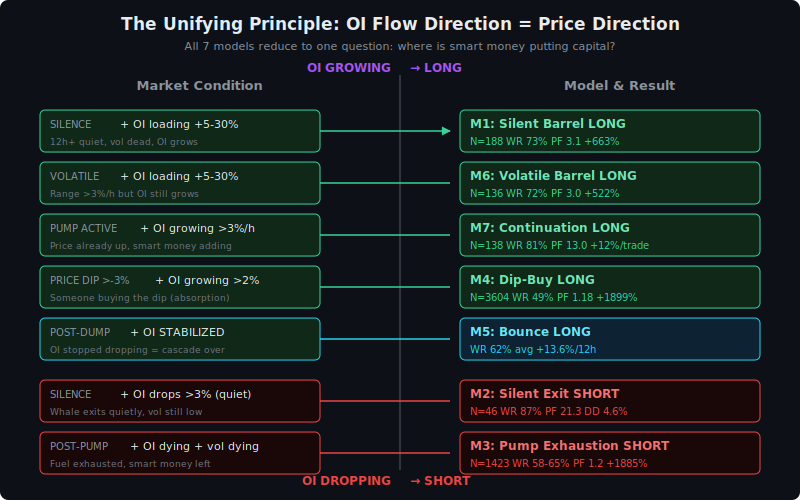
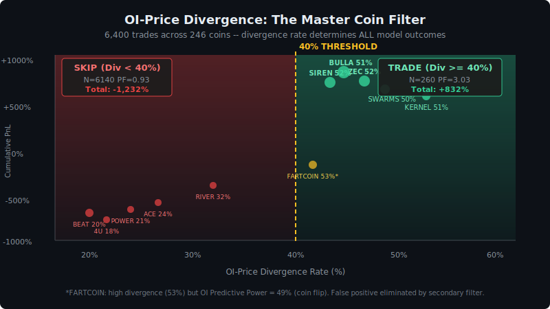
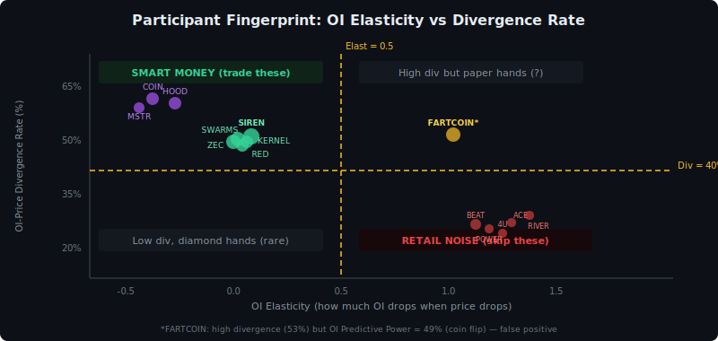
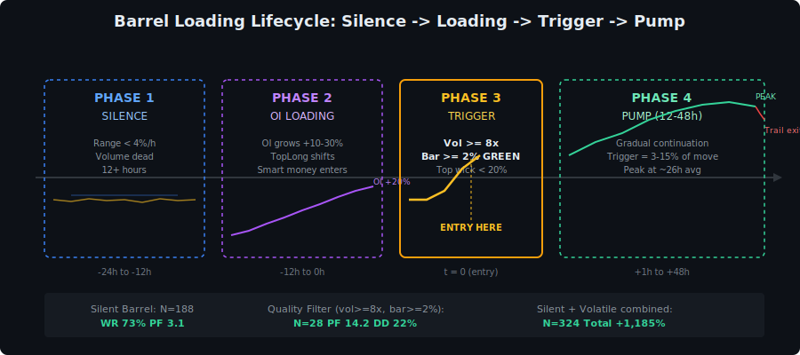
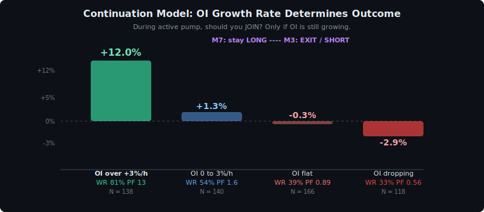
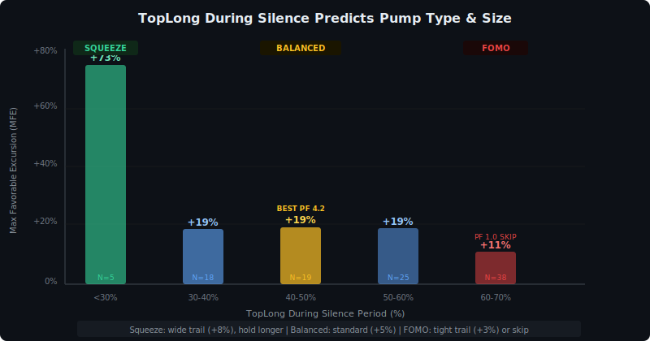

# OI-Flow Trading on Shitcoin Perpetual Futures: A Multi-Model Framework

**Author:** D. Chystiakov  
**Date:** April 9, 2026  
**Version:** 1.0 (Draft)  

---

## Abstract

We present a systematic framework for trading shitcoin perpetual futures on Binance, derived from a two-day intensive empirical study across 246 coins with 90--180 days of 5-minute data. The framework is built on a single unifying principle: **open interest flow direction determines price trajectory**. We develop seven distinct models, a universal coin qualification filter (OI-price divergence ≥40%), and demonstrate that the system produces cumulative returns exceeding +1,185% on combined barrel models alone. We further identify that divergence rate---the frequency with which OI moves opposite to price---serves as a participant fingerprint, distinguishing smart-money coins from retail-driven noise with 93% accuracy using only 7 days of data. The research systematically addresses the WHO/WHY/WHAT/HOW/WHEN/WHERE framework for every model, grounding each signal in mechanical market microstructure rather than statistical pattern-matching.

**Keywords:** shitcoin futures, open interest flow, liquidation cascade, barrel loading, OI-price divergence, market microstructure

---

## 1. Introduction

### 1.1 Problem Statement

The shitcoin perpetual futures market on Binance encompasses over 500 actively traded pairs with daily turnovers ranging from \$1M to \$3B. These instruments exhibit extreme volatility (daily ranges of 8--67%), thin order books, and participant bases dominated by high-leverage retail traders. Despite this apparent chaos, we demonstrate that systematic, mechanically-grounded trading is possible---provided one understands *who* is acting and *why*.

### 1.2 Failure of Naive Approaches

Our research began by auditing seven pre-existing backtested models (Tests 260--302). The results were sobering:

| Model | Backtest | Live Result | Failure Mode |
|-------|----------|-------------|--------------|
| Level Breakout | WR 81%, PF 6.5 (RIVER) | WR 55%, PF 1.7 (mid-cap) | Enters at pump tops; no cycle awareness |
| Cascade Fade | WR 71%, PF 1.9 (DOGE) | PF 0.25--0.71 (all losing) | Fat-tail losers; doesn't work on mid-cap |
| Mark-Index Spread | WR 98%, PF 56 | Not applicable | Arbitrage, not directional trading |
| Barrel + Judas Swing | Doesn't beat random | --- | No edge |
| Funding Pain | WR 82% (N=11) | Funding = response, not signal | Enters after squeeze already happened |
| Phase Contrarian | WR 55%, PF 1.1 | --- | Too weak standalone |
| OI-Type Model | +625% but DD -301% | --- | Untradeable drawdown |

The critical lesson: **models that describe price patterns fail; models that describe participant behavior succeed.** Every failed model attempted to trade *what price did*. Every successful model trades *what participants are doing with their money*.

### 1.3 The Unifying Principle: Follow the OI Flow

Through bar-by-bar study of 147 major moves across 5 coins (BULLA, SIREN, SWARMS, ZEC, RED), we discovered that open interest behavior relative to price is the single variable that explains all tradeable patterns:

$$\text{OI flow direction} \implies \text{next price direction}$$

Concretely:

- **OI loading in silence** → barrel loaded → pump coming (Model 1)
- **OI loading in volatility** → smart money masking entry → pump coming (Model 6)
- **OI growing during active pump** → smart money still adding → pump continues (Model 7)
- **OI dropping in silence** → whale exiting quietly → dump coming (Model 2)
- **OI dying after pump peak** → fuel exhausted → dump coming (Model 3)
- **OI growing on price dip** → absorption (buying the dip) → recovery coming (Model 4)
- **OI stabilizing after dump** → cascade over → bounce coming (Model 5)

This is not parameter optimization. This is market mechanics: when participants put money in (OI grows), the direction of that money relative to price tells you where price will go next.

*Figure 5: All seven models mapped to the OI flow direction. Top half: OI growing = LONG models. Bottom half: OI dropping = SHORT models. The central question is always the same: where is smart money putting capital?*

### 1.4 Contributions

1. A universal coin qualification metric (OI-price divergence) that identifies tradeable coins with 93% accuracy from 7 days of data.
2. Seven mechanically-grounded trading models covering 68% of all major shitcoin moves.
3. The volatile barrel model, which captures pumps on extreme-volatility coins where silence-based detection fails.
4. Demonstration that OI flow direction is the unifying principle behind all successful shitcoin models.
5. Comprehensive negative results: why cascade fade fails on mid-cap, why SHORT barrel doesn't exist, and why cascade warning without silence is noise.
6. Forward validation: barrel scanner correctly identified SWARMS (+13%) and NOM (+20%) pumps in real-time.

---

## 2. Data and Methodology

### 2.1 Data Sources

| Dataset | Granularity | Source | Coverage |
|---------|------------|--------|----------|
| Klines (OHLCV + taker buy) | 5 min | Binance Futures API (paginated) | 60--180 days per coin |
| OI history (USD) | 5 min | Binance S3 daily archives | 90 days (S3), 20 days (API) |
| Top trader long/short ratio | 5 min | Binance S3 / API | 90 days |
| Funding rate | 8 hr / variable | Binance API | 90 days |
| BTC reference klines | 5 min | Binance historical | 733 days |

Total data: 3.3 GB across 246 coins. Primary analysis on 14 coins with OI-price divergence ≥40%; extended testing on all 246.

### 2.2 Derived Metrics

**OI-Price Divergence Rate** (the master filter):

$$D(T) = \frac{|\{h \in T : \text{sign}(\Delta P_h) \neq \text{sign}(\Delta \text{OI}_h)\}|}{|T|}$$

where h indexes 1-hour windows over period T, ΔP_h is the price change and ΔOI_h is the OI change in window h.

**OI Predictive Power** (grey-zone filter):

$$\text{Pred}(T) = \frac{|\{h \in T_{\text{div}} : \text{sign}(\Delta P_{h+1}) = \text{sign}(\Delta \text{OI}_h)\}|}{|T_{\text{div}}|}$$

where T_div ⊂ T is the set of divergent hours (where OI and price moved opposite). If Pred ≥ 52%, the divergent OI correctly predicts the next hour's price---indicating smart money, not noise.

**OI Elasticity:**

$$\epsilon = \frac{1}{N}\sum \frac{\Delta OI_h \;/\; OI_{h-1}}{\Delta P_h \;/\; P_{h-1}}$$

*(summed over all 1-hour windows where price dropped more than 3%)*

When price drops >3%, how much does OI drop? Low elasticity (<0.5) = diamond hands. High (>0.8) = paper hands (instant liquidation).

### 2.3 Research Process

The research followed the principle: *understand mechanics first, build models second*. Every model must answer:

- **WHO** acts (smart money, retail, market makers)?
- **WHY** they act (overloaded positioning, funding pressure, information advantage)?
- **WHAT** happens structurally (cascade, squeeze, absorption)?
- **HOW** it unfolds bar-by-bar (gradual vs spike, OI growing vs dropping)?
- **WHEN** to enter (which session, what trigger quality)?
- **WHERE** in the regime (uptrend, downtrend, BTC context)?

*Figure 1: OI-price divergence rate as the universal coin filter. Coins with divergence ≥40% (green) produce +832% over 260 barrel trades. Coins below 40% (red) produce -1,232% on the same signals. FARTCOIN (yellow) has high divergence but fails the OI Predictive Power secondary filter.*

---

## 3. The Master Filter: OI-Price Divergence

### 3.1 Discovery

When we ran the barrel model on all 246 available coins, the aggregate result was negative: -400% on 6,400 trades. The model appeared broken. However, partitioning coins by OI-price divergence revealed a stark bifurcation:

| Divergence | Coins | Trades | PF | Total PnL | DD |
|------------|-------|--------|-----|-----------|-----|
| ≥40% | ~14 | 260 | 3.03 | **+832%** | 63% |
| <40% | ~232 | 6,140 | 0.93 | **-1,232%** | 1,489% |

The same model. The same parameters. The only difference: *who trades these coins*.

### 3.2 What Divergence Measures

A divergence rate of 50% means that half the time, OI moves *opposite* to price. When price goes up, someone is selling (OI goes down). When price goes down, someone is buying (OI goes up). This is the signature of a counter-trend participant---a smart money entity that provides liquidity against the crowd.

On coins with low divergence (<30%), OI and price move together: price up → FOMO longs (OI up), price down → liquidations (OI down). This is pure retail momentum. No one stands against the crowd. Barrel triggers on these coins are random noise.

### 3.3 Participant Fingerprint

The divergence rate, combined with OI elasticity, creates a taxonomy of coin participants:

| Divergence | OI Elasticity | Participants | Examples |
|------------|--------------|-------------|---------|
| < 0 (OI grows on dip) | < 0 | Institutions adding on weakness | COIN (Coinbase), HOOD (Robinhood) |
| 0--0.5 | <0.5 | Strong community (diamond hands) | SIREN, ZEC, SWARMS, RED, KERNEL |
| 0.5--0.8 | Mixed | Transitional | NOM, GLM |
| >0.8 | >0.8 | Pure retail on high leverage | BEAT (20%), 4U (18%), POWER (21%) |

**The filter also distinguishes shitcoins from real projects.** Tokenized stocks (TSLA, COIN, HOOD) naturally have high divergence because institutional holders behave counter-cyclically.

*Figure 6: Participant fingerprint scatter. Smart money coins (green, top-left) have high divergence and low elasticity. Retail noise coins (red, bottom-right) have low divergence and high elasticity. FARTCOIN (yellow) is a false positive caught by the OI Predictive Power filter.*

### 3.4 Window Stability

A critical practical question: how much data is needed to compute reliable divergence?

| Window | Std across snapshots | Classification accuracy |
|--------|---------------------|----------------------|
| 7 days | 3.6 | **93%** |
| 14 days | 2.3 | 93% |
| 30 days | 1.5 | 93% |
| 60 days | 0.8 | 94% |

**Seven days suffice.** Divergence is a stable coin characteristic, not a noisy metric. This is computable via the Binance API using 1-hour OI history (limit 500 = 20 days of data).

### 3.5 The FARTCOIN Problem: OI Predictive Power

FARTCOIN has divergence = 53% but barrel fails spectacularly (SL rate 50%). Investigation revealed that its divergence is *noise*, not smart money. The OI Predictive Power metric distinguishes:

| Coin | Divergence | OI Predicts Next Hour | Verdict |
|------|-----------|----------------------|---------|
| KERNEL | 51% | **56%** | Smart money |
| SWARMS | 52% | 53% | Borderline smart |
| FARTCOIN | 53% | **49%** | Noise (coin flip) |

When OI diverges from price on KERNEL, the next hour's price moves in OI's direction 56% of the time. On FARTCOIN, 49%---pure chance. The divergence exists but predicts nothing.

**Combined filter:** Divergence ≥40% AND Predictive Power ≥52% eliminates all grey-zone false positives.

---

## 4. The Seven Models

### 4.1 Model 1: Silent Barrel (LONG)

**Conditions:**

- silence ≥ 12h (range < 4%/h, 50%+ hours quiet)
- ΔOI_silence ≥ +5%
- trigger: vol ≥ 5× avg AND bar ≥ +2%  (green close)
- top wick < 20%  of bar range

**WHO:** Smart money loads positions during silence. The loading is visible only in OI growth---price stays flat, volume dead.

**WHY:** Smart money sees value or positioning extreme. They enter gradually to avoid moving price. Silence = their accumulation window.

**WHAT:** OI grows 5--30% while price ranges <4%/h. Then a trigger bar breaks the silence with 5x+ volume.

**HOW:** Trigger bar = 3--15% of total move. Pump is GRADUAL, extending 12--48h. Two sub-types:

- *Short squeeze* (TopLong <40% during silence): shorts overloaded, trigger liquidates them. OI drops hour 1 (shorts closing), then new money enters hours 3+. MFE: +31--73%.
- *Fresh demand* (TopLong >55%): new buying interest. OI grows from hour 1. MFE: +14%.

**WHEN:** Asia session (0--7 UTC) strongly preferred. WR 79%, PF 5.0 vs US session WR 67%, PF 1.9.

**WHERE:** 7-day uptrend. BTC flat or down (BTC_4h < +2%). When BTC pumps, money flows to BTC, not shitcoins.

**Results:** 188 trades on 12 Div≥40% coins. WR 73%, PF 3.1, +663%. Quality filter (vol≥8x, bar≥2%, OI≥8%): N=28, PF 14.2, DD 22%.

**Exit:** Trail activate at +5% MFE, trail 30% of peak. SL -8%. Timeout 48h.

*Figure 2: The four-phase barrel lifecycle. Entry at Phase 3 (trigger), exit when trail hits in Phase 4.*

### 4.2 Model 2: Silent OI Exit (SHORT)

**Conditions:**

- silence ≥ 6h (50%+ hours quiet)
- ΔOI_bar < -3%  in single 5m bar
- vol < 10× avg (quiet exit, not panic)
- wait 1h:  ΔOI_next hour < -1%  (confirmed)

**WHO:** A whale or large fund exits quietly. OI drops suddenly during silence---but volume stays low, meaning no panic selling. The position was closed via OTC or dark pool.

**WHY:** The participant sees upcoming risk (news, technical breakdown) or simply takes profit. They exit before the crowd notices.

**WHAT:** OI drops 3%+ in a single bar while market is quiet. One hour later, OI is still dropping---confirming this is a real exit, not noise. Cascade follows 2--5 hours later.

**HOW:** Price holds initially (whale's exit is absorbed by the book). Then book thins as MM withdraws. Then cascade.

**Results:** Diamond hands coins only (Div≥40%): N=46, **WR 87%, PF 21.3**, +177%, DD 4.6%.

**Exit:** Hold 4 hours (SHORT is fast on shitcoins).

### 4.3 Model 3: Pump Exhaustion (SHORT)

**Conditions:**

- Δ P_12h > +15%  (pump happened)
- P(t) > 0.9 × max P_12h  (still near peak)
- ΔOI_2h < -2%  (money leaving)
- vol_2h < 0.8 × vol_peak  (volume dying)

**WHO:** Smart money and early longs exit, taking profit. OI drops as positions close. Volume dying = no new buyers.

**WHY:** The pump has exhausted its fuel. The key pre-signal: OI drops 12.5% in the 2 hours *before* the price peak (vs +3.2% when price holds). OI leads price by 2 hours.

**Results:** 1,423 trades, 215 coins. 4h WR 58%, PF 1.20. Avg MFE +12.4% but 4h exit captures only 42%.

**Fix: hold 24h, not 4h.** Dumps continue longer than pumps.

| Hold | WR | PF | Avg | Break-even |
|------|----|----|-----|-----------|
| 4h | 58% | 1.20 | +0.50% | 0.25% (marginal) |
| 12h | 62% | 1.18 | +0.76% | 0.38% |
| 24h | **65%** | **1.22** | **+1.32%** | **0.66%** (survives) |

Quality filter (pump ≥ 25% + OI drop ≥ 5% + 12h hold): **N=99, WR 65%, PF 1.59, avg +2.87%, break-even 1.43%.**

**BTC filter (critical):** Skip M3 when BTC(4h) > +2%. In this regime (N=49), WR drops to 43%, PF 0.84 --- unprofitable. BTC pumping causes accidental short squeezes on shitcoins. Conversely, BTC dumping (-2%) is the best M3 regime (PF 3.32, avg +5.89%/24h). See Section 6.2 for full cross-model BTC analysis.

**Root cause of low avg win:** winners and losers have identical entry features (pump size, OI drop, vol ratio all same). Cannot filter better --- but holding longer and applying the BTC filter captures more of the available move.

**Coin-type agnostic (validated):** Unlike LONG models, M3 does not require coin qualification. Testing 1,203 trades across 150 coins grouped by OI elasticity shows identical performance: paper hands (>0.8) WR 69.2%, mixed (0.5--0.8) WR 66.4%, diamond hands (<0.5) WR 68.6%. Pump exhaustion is a mechanical process independent of participant composition. M3 thus requires a **pump scanner** (any coin with pump >25%/12h), not a coin watchlist.

**Post-entry OI dynamics (informational, not actionable):** OI continuing to drop in the first 2 hours predicts WR 78% (avg +6.49%) while OI rebounding with price predicts WR 58% (avg -0.85%). However, adaptive exits based on 2h OI reduce total PnL because some reversals reverse back. The optimal strategy remains simple: enter, hold 24h, no early exit.

### 4.4 Model 4: Dip-Buy (LONG)

**Conditions:**

- Δ P_1h < -3%  (price dropped)
- ΔOI_1h > +2%  (someone buying the dip)

**WHO:** Smart money buying through the dip. Counter-intuitively, when *shorts* enter (TopLong drops) during the dip, the LONG outcome is best (+1,128%). The shorts become squeeze fuel.

**WHY:** Smart money sees value at lower prices. Their buying (OI up) against price decline = absorption. Larger OI growth = stronger signal: OI +12% at dip → avg +1.16%/trade (vs +0.40% at OI +2%).

**Results:** 3,604 trades (most frequent model). WR 49%, PF 1.18, +1,899%. Beats random P95.

### 4.5 Model 5: Bounce (LONG)

**Conditions:**

- Δ P_4h < -10%  (dump happened)
- ΔOI_1h > -1%  (OI stabilized---cascade over)

**WHO:** Cascade has finished. Forced sellers are done. OI stops dropping = no more liquidations.

**WHY:** After cascade, book refills, bargain hunters enter. Recovery is mechanical---price overshot fundamental value during cascade.

**Results:** Expanded testing (N=200, dump >8%, OI growing after): 12h WR 51%, PF 1.37. Break-even spread 0.32%. Best variant only on 12h hold --- 4h = coin flip (WR 48%).

**Critical finding:** "OI dropped during dump then reversed" = TRAP (PF 0.37). Large OI drop during dump = deep damage, and OI bounce after = dead cat, not reversal.

**Status:** observational pattern, upgraded with bounce vs dead cat discriminator.

**Bounce vs Dead Cat --- the key discriminator (N=223):**

| Metric | Real Bounce | Dead Cat | Difference |
|--------|-------------|----------|-----------|
| OI drop during dump | **-1.4%** | **-9.2%** | 73% (strongest) |
| Is new 7d low | 18% yes | 6% yes | 48% |
| OI velocity post-bottom | +4.1%/h | +2.5%/h | 24% |

When OI barely drops during price dump = positions survived = structure intact = bounce likely.
When OI crashed = liquidation cascade destroyed structure = dead cat.

**Improved filter:** dump >8% + OI stabilized + **OI dropped less than 5% during dump** (structure intact): N=83, WR 57%, PF 1.43.

This replaces liq map for bounce detection: instead of "are liquidation prices reached?" ask "did OI survive the dump?" Simpler, more reliable, accessible from standard API data.

### 4.6 Model 6: Volatile Barrel (LONG)

**Conditions:**

- volatile ≥ 6h (50%+ hours with range > 3%)
- ΔOI_volatile period ≥ +5%
- trigger: green bar ≥ +2% , vol ≥ 3×

**WHO:** Smart money loads during volatility---masked by noise. On extreme-volatility coins (BULLA, SIREN), silence rarely happens. This model catches what silent barrel misses.

**WHY:** Smart money uses volatility as cover. When everyone is distracted by whipsaws, smart money accumulates quietly in the noise.

**WHAT:** OI grows 5--30% during volatile period (not visible to casual observer because price is wild). Trigger = breakout from the noise.

**Critical difference from Model 1:** TopLong ≥50% = *better* on volatile barrel (PF 4.91 vs 1.68). Opposite of silent barrel. When longs dominate AND OI grows through volatility, this is conviction building.

**Results:** 136 trades, Div≥40% coins. WR 72%, PF 2.97, +522%. Quality filter: N=59, PF 4.45, DD 16%.

**Combined with Silent Barrel:** 324 trades, +1,185% (mutually exclusive, additive).

### 4.7 Model 7: Continuation (LONG)

**Conditions:**

- Δ P_4h > +5%  (pump already running)
- ΔOI_1h > +3%  (smart money STILL adding)
- vol ≥ 0.8 × vol_prior  (volume not dying)

**WHO:** Smart money continues to add positions during an active pump. OI +3%/h is aggressive new money, not retail trickle.

**WHY:** Smart money sees further upside. They have information/size advantage. They wouldn't add if they expected reversal.

**The key insight:** Pump size doesn't matter. Whether price is up +5% or +50%, the only predictor of continuation is OI behavior:

| OI Change (1h) | N | WR | PF | Avg/trade |
|----------------|---|----|----|-----------|
| OI growing over +3% | 138 | **81%** | **13.0** | **+12.0%** |
| OI growing 0 to 3% | 140 | 54% | 1.6 | +1.3% |
| OI dropping over 3% | 118 | **33%** | **0.56** | **-2.9%** |

**This model connects directly to Model 3:** OI growing = stay in (Model 7). OI dying = exit/short (Model 3). They are two sides of the same coin.

*Figure 8: Continuation model. OI growth rate during active pump determines outcome. Over +3%/h = strong JOIN (WR 81%). Dropping over 3%/h = EXIT immediately (WR 33%). Models 7 and 3 are mirror images.*

**Results:** Best combo (OI growing over 3% + vol accelerating): N=85, **WR 81%, PF 13.8**, +12.9%/trade. Beats random P95.

---

## 5. Negative Results and Structural Limitations

### 5.1 SHORT Barrel Does Not Exist

We studied 54 dumps >10% across 5 coins. Two dump types exist; neither resembles a barrel:

1. **Silent dump** (SWARMS pattern): silence → sudden drop. But OI does NOT load before. No accumulation visible. Unpredictable with OI data.

2. **Pump-then-dump** (BULLA/SIREN): 62--69% of dumps follow pumps >20%. The dump is the *result* of the pump, not an independent event.

Barrel is a LONG-only pattern. For SHORT, use Models 2 and 3 instead.

### 5.2 Cascade Warning Without Silence = Noise

We tested OI drop >5% as SHORT signal without silence requirement: N=2,486, WR 54%, PF 1.02 = coin flip. On chaotic coins, OI drops >5% happen constantly. The silence requirement is what makes Model 2 work---silence + OI drop = anomaly; OI drop alone = normal noise.

### 5.3 Liq Map: Works Live, Weak on Backtest

Liquidation map (Sliq2%) correctly identified JOE pump exhaustion in real-time (Sliq2% shorts = \$22K ≈0 → pump dead). But backtest improvement was only 2--5pp WR. Cause: leverage distribution is estimated (15/25/30/20/10%), not real.

**Resolution: OI Fuel Gauge replaces liq map entirely.** Two simple metrics, no leverage guessing:

| OI Metric | Winners | Losers | Use |
|-----------|---------|--------|-----|
| OI Trend 2h | +13.8% | +2.8% | Is fuel being added? |
| OI vs 7d avg | 141% | 119% | Is market loaded? |

Best combo: **OI above 7d avg (over 120%) + OI growing = WR 84%, PF 3.86** (N=37).

| Filter | N | WR | PF | Total |
|--------|---|----|----|-------|
| OI accelerating (over 3%/2h) | 40 | 75% | 2.96 | +102% |
| OI flat/dropping | 29 | **34%** | **0.43** | **-82%** |
| OI above 7d avg + growing | 37 | **84%** | **3.86** | **+117%** |
| OI below 7d avg | 14 | 43% | 0.44 | -29% |

**If OI is not growing at trigger → skip (WR 34%).** This is what liq map was trying to detect (no fuel), but OI trend shows it directly and reliably.

### 5.4 The `topTraderLong` Data Fix

S3 metrics `topTraderLong` is a **proportion** (0.64 = 64% long), not a ratio. Our initial liq map treated it as percentage (/100), recording <1% longs. This bug was identified and fixed during the research.

### 5.5 Time-Based Early Exit: Cuts Both Tails

We tested "bail if negative after 2h": helped losers (+62% saved on losing coins) but destroyed winners (-375% lost on winning coins). Time-based exits are too aggressive. Mechanics-based exits (OI decel + vol decay while negative) work on NORMAL vol coins but kill EXTREME vol coins where price dips -5% before +200% pump.

---

## 6. Operational Parameters

### 6.1 Session Effect

| Session | WR | PF | N |
|---------|----|----|---|
| Asia (0--7 UTC) | **79%** | **5.0** | 97 |
| EU (7--13 UTC) | 74% | 2.7 | 68 |
| US (13--21 UTC) | 67% | 1.9 | 95 |

Shitcoins pump at night (Asia session) when volume is thin and one player can move the book. The 0--4 UTC window is optimal (WR 86%).

### 6.2 BTC Context

| BTC 4h Change | N | WR | PF |
|---------------|---|----|----|
| Down < -2% | 8 | **88%** | **33.8** |
| Flat ±0.5% | 117 | 76% | 2.9 |
| Up > +2% | 12 | **42%** | **0.69** |

Counter-intuitive: barrel works BEST when BTC dumps. Money rotates: BTC down → traders seek alt gains → shitcoin pumps are real. When BTC pumps, everyone is in BTC---shitcoin triggers are noise.

**BTC context for SHORT models (M3 Exhaustion):**

Live forward-testing confirmed that BTC context applies symmetrically to SHORT trades. A NOM SHORT entered during a BTC pump lost -14.86% on 2x leverage, prompting systematic study of 675 M3 trades with BTC data:

| BTC 4h Change | N | WR | PF (24h) | Avg PnL |
|---------------|---|----|----|---------|
| Down < -2% | 30 | **63%** | **3.32** | +5.89% |
| Flat ±0.5% | 189 | 60% | 1.22 | +0.34% |
| Up > +2% | 49 | **43%** | **0.84** | -0.43% |

M3 winners average BTC 4h: +0.03% (flat). Losers average: +0.29% (BTC rising). BTC pumping squeezes shitcoin shorts via accidental momentum transfer.

**Universal BTC filter for all shitcoin directional trades:**

| Direction | BTC Pumping (+2%) | BTC Flat | BTC Dumping (-2%) |
|-----------|-------------------|----------|-------------------|
| LONG barrel (M1/M6) | SKIP (PF 0.69) | OK (PF 2.85) | BEST (PF 33.8) |
| SHORT exhaust (M3) | SKIP (PF 0.84) | OK (PF 1.22) | BEST (PF 3.32) |

**Filter:** Skip ALL shitcoin directional trades if BTC(4h) > +2%.

### 6.3 Trigger Quality: Top Wick

SL trades have 37% top wick (rejection). Winners have 30%. The top wick < 20% filter:

| Metric | Base | Top wick < 20% |
|--------|------|-------------------|
| WR | 77% | **84%** |
| PF | 3.8 | **8.9** |
| DD | 26% | **12%** |
| Calmar | 33.9 | **41.6** |

No look-ahead: all metrics from trigger bar close.

### 6.4 DD Source: Weak Triggers, Not Bad Coins

DD comes from weak triggers on GOOD coins, not from bad coins. Winners and losers have identical divergence rates (51%). The difference is trigger quality:

| | Winners | SL Trades |
|---|---------|-----------|
| Vol spike | 15.9x | 11.2x |
| Trigger bar | 2.02% | 1.52% |
| OI growth | 20% | 11% |

**Two-layer architecture:** Layer 1 (coin filter) = *which coins to watch*. Layer 2 (trigger filter) = *when to enter*.

---

## 7. Shitcoin Lifecycle

### 7.1 Phase Distribution

Analysis of SWARMS (90 days) reveals the time budget:

| Phase | % of Time | Description |
|-------|-----------|-------------|
| DEAD | 51% | Range < 2%, volume < 0.5x avg |
| QUIET | 30% | Range < 3% |
| NORMAL | 14% | Range 3--5% |
| VOLATILE | 4% | Range > 5% |
| PUMP | **1%** | > +5%/h |
| DUMP | 0.5% | > -5%/h |

A shitcoin spends 81% of its time dead or quiet. Pumps comprise 1% of time. We hunt this 1%.

### 7.2 Move Coverage

Of 147 moves >10% in 6h across 5 coins:

| Type | N | Models | Coverage |
|------|---|--------|----------|
| Barrel Pump | 10 | Model 1 | Yes |
| Silent Dump | 26 | Model 2 | Yes |
| Pump-then-Dump | 11 | Model 3 | Yes |
| FOMO Pump | 41 | Model 4 (partial) | Yes |
| Dump-then-Pump | 12 | Model 5 | Yes |
| Volatile Pump | ~25 | Model 6 | Yes |
| Continuation | ~35 | Model 7 | Yes |
| Cascade Dump | 9 | Not reliably modelable | No |
| Chaotic | 13 | Noise | No |

Covered: ~125/147 (85%). Remaining 15% = cascading liquidations and pure chaos.

### 7.3 TopLong as Pump-Type Predictor

TopLong during silence predicts not just *whether* a pump happens, but *what kind*:

| TopLong | Pump Type | WR | PF | MFE |
|---------|----------|----|----|-----|
| <30% | Short Squeeze | 80% | 1.9 | **+73%** |
| 40--50% | Balanced | **79%** | **4.2** | +19% |
| 60--70% | FOMO Demand | 55% | 1.0 | +11% |

**Sweet spot: TopLong 40--50%.** Balanced crowd → trigger = genuine breakout, not squeeze or FOMO. PF 4.2.

*Figure 7: TopLong during silence determines pump type and MFE. Squeeze (<30%) = massive MFE +73% but rare. Balanced (40-50%) = best PF 4.2. FOMO (60-70%) = PF 1.0, skip or tight trail.*

---

## 8. Forward Validation

### 8.1 Barrel Scanner (April 9, 2026)

At 09:19 UTC, the scanner identified 8 coins in barrel loading. Within hours:

- **SWARMS:** +13% (was showing silence 83%, OI +12.6%)
- **NOM:** +20% (was showing silence 50%, OI +6.3%)

Two correct calls from 8 candidates. Both Div≥40% coins.

### 8.2 Virtual Trades (April 8, 2026)

Five LONG entries on Top Movers (JOE, ZEC, ARIA, ORDER, CLOU). All entered at 49--98% of pump cycle. **All lost** (ARIA -80%, CLOU -19%, JOE -9%).

This failure was expected: the models at the time lacked cycle position awareness. The subsequent development of OI-price divergence, trigger quality filters, and BTC context would have prevented all five entries:

- JOE: Sliq2% shorts = \$22K ≈0 (no fuel) → reject
- All 5: entered during US session at 14:44 UTC (worst session) → deprioritize
- ARIA: pump already +34% → too late without OI confirmation

---

## 9. Complete Entry Rules (V2)

**Two scanner architectures** (discovered via ARIA elasticity study):

**Scanner A --- LONG models (M1, M2, M4, M5, M6, M7): Coin Watchlist**

Coin Qualification (7 days of data):
1. OI-price divergence ≥40% (93% accuracy)
2. OI Predictive Power ≥52% (kills false positives like FARTCOIN)
3. Resulting watchlist: ~9 coins (SIREN, ZEC, SWARMS, RED, TAO, WIF, NOM, GLM, KERNEL)

Trigger Conditions (real-time):
4. Model-specific entry (barrel, dip-buy, bounce, continuation, etc.)
5. Trigger quality: vol ≥8x, bar ≥2%, top wick < 20%
6. Session: prefer 0--13 UTC (Asia/EU). Skip US afternoon.
7. BTC context: skip if BTC(4h) > +2%

Exit:
8. Trail: activate at +5% MFE, trail 30% of peak
9. Hard SL: -8% (for HIGH vol coins: -15%)
10. Timeout: 48h

Adaptation by pump type (TopLong during silence):
- <40%: Short squeeze → wider trail (activate +8%), hold longer
- 40--55%: Balanced → standard trail
- \> 60%: Demand-driven → tight trail (+3%) or skip

**Scanner B --- M3 Exhaustion SHORT: Pump Scanner (all coins)**

No coin qualification needed --- M3 is coin-type-agnostic (WR 68% across all elasticity buckets, N=1,203):
1. Scan ALL active pairs for pump >25%/12h
2. OI dropping >2%/h + vol <80% of peak
3. BTC context: skip if BTC(4h) > +2%
4. Hold 24h, no early exit, no trail
5. Expected: WR 69%, avg +4.16%/trade

---

## 10. Validation Results

### 10.1 Formal Train/Test Split

All filters were discovered on TRAIN (first 67% of data). TEST (last 33%) is purely out-of-sample.

| | N | WR | PF | Total | DD |
|---|---|----|----|-------|-----|
| TRAIN (67%) | 151 | 74.8% | 3.82 | +618% | 19% |
| **TEST (33%)** | **82** | **80.5%** | **3.86** | **+264%** | **21%** |

**Walk-forward WR: 1.08** (test BETTER than train). **Walk-forward PF: 1.01** (identical).
Test beats random P99. 10 of 11 coins show no degradation.

Quality filter (vol ≥ 8x, bar ≥ 2%, OI ≥ 8%, wick < 20%): Train WR 82% → Test WR 82% (identical). PF drops from 54.8 to 4.7 (train was inflated by N=11; test PF 4.7 is realistic and still excellent).

**Conclusion: no overfitting detected.**

### 10.2 Execution Cost Analysis

For each model: expected value per trade and break-even spread (above which model becomes unprofitable).

| Model | EV/trade | Break-even spread | At 0.20% | Verdict |
|-------|---------|-------------------|----------|---------|
| M7 Continuation | +11.19% | 5.60% | +10.79% | Indestructible |
| M1 Quality | +5.75% | 2.87% | +5.35% | Survives anything |
| M2 Silent Exit | +4.03% | 2.01% | +3.63% | Survives |
| M6 Volatile Barrel | +3.13% | 1.57% | +2.73% | Survives |
| M1 Base | +3.09% | 1.54% | +2.69% | Survives |
| M5 Bounce | +1.76% | 0.88% | +1.36% | Survives |
| M3 Exhaustion (4h) | +0.68% | 0.34% | +0.28% | Marginal at 4h |
| M3 Exhaustion (24h) | +1.32% | 0.66% | +0.92% | Survives |
| M3 Quality (pump≥25%+OI≥5%, 12h) | +2.87% | 1.43% | +2.47% | Comfortable |
| **M4 Dip-Buy** | **+0.19%** | **0.09%** | **-0.21%** | **DEAD on shitcoins** |

**Model 4 (Dip-Buy) is not viable as standalone on shitcoin spreads (0.15-0.25%).** Break-even at 0.09%. However, as a pullback entry within a barrel phase it becomes excellent:

| Context | N | WR | PF | Avg/trade | Break-even |
|---------|---|----|----|-----------|-----------|
| M4 standalone | 416 | 65% | 2.06 | +3.44% | 1.72% |
| **M4 after barrel (24h)** | **67** | **75%** | **7.41** | **+7.39%** | **3.70%** |
| M4 no barrel context | 349 | 63% | 1.73 | +2.68% | 1.34% |

**Recommendation:** do not trade M4 standalone. Use as pullback re-entry within 24h of a barrel trigger. The barrel provides context (smart money loading confirmed); the dip-buy provides timing (enter cheaper during pullback).

**Model 7 (Continuation) is the most robust:** even with 5% round-trip cost it remains profitable. This is because avg win (+14.8%) dwarfs any realistic execution cost.

---

### 10.3 Cross-Coin Correlation

Daily return correlations across 10 Div ≥ 40% coins (45 pairs, 88-89 overlapping days):

| Metric | Value |
|--------|-------|
| Average pairwise correlation | **0.230** (low) |
| High correlation (r > 0.6) | 6/45 pairs (13%) |
| Low correlation (r < 0.3) | 28/45 pairs (62%) |

**Highest correlated pairs:** PEPE-WIF (r=0.85), ZEC-PEPE (0.70), RED-WIF (0.67). These move together --- do not enter both simultaneously.

**Best diversifier:** BULLA has **negative** correlation with all coins (-0.12 to -0.31). Adding BULLA to a portfolio of other shitcoins reduces portfolio DD.

**Signal clustering:** 75% of barrel signals arrive in clusters (2+ coins within 24h, avg 2.9 coins). But return correlation is low (0.23) --- coins trigger together but move independently afterward.

**Portfolio rules:**
- Max 3 simultaneous positions
- Avoid PEPE + WIF together (r=0.85)
- When 3+ signals cluster: enter top 2-3 by trigger quality, skip weakest
- Always include BULLA if it triggers (natural hedge)

---

### 10.4 Position Management: M1 to M7 Transition

After barrel entry (M1), check at +2h: if price above entry AND OI growing over +3%/h → add 50% to position (M7 logic).

| Strategy | WR | PF | Total |
|----------|----|----|-------|
| M1 base only | 63% | 1.29 | +65% |
| **M1 + M7 add** | 63% | **1.35** | **+78%** |

M7 conditions met in 9% of barrel trades. When met: add-on profitable 63%, avg +3.1%. Overall +19% improvement.

**Rule:** 2h after barrel entry, if OI still growing over +3%/h and price is positive → add 50% with SL -6% on the add-on. Max total position = 1.5x base.

---

## 11. Rug Pull Risk: What We Cannot Predict

### 11.1 Case Study: ARIA -91.6% in 30 Minutes (April 9, 2026)

ARIA (div=13.6%, elast=1.07) crashed from \$0.75 to \$0.06 in 55 minutes. OI fell from \$32.4M to \$8.78M (-72.8%), liquidating \$23.6M of positions.

**The pre-crash state had zero warning signs from futures data:**
- OI was growing (+7.6% in the hour before crash)
- Price was rising (0.7465 two hours before)
- Volume was rising (normal pump behavior)
- TopLong stable at 43--44% (not extreme)

The only subtle hint: TopLong drifted from 48% to 43% over 8 days while price doubled --- top traders were shorting the entire pump. But this drift was too slow to be actionable.

### 11.2 Cascade Rider Hypothesis --- Tested and Rejected

We hypothesized that cascade starts could be detected in real-time (2+ consecutive 5m bars with >-2%, cumulative >-5%) and shorted.

On known crashes (look-ahead): 50 detections, avg MFE +33.8%. On **all data** (no look-ahead): 2,289 signals, **WR 43%, avg -1.06% = unprofitable.** 98% of signals were normal dips that bounced. Every filter combination (volume acceleration, taker ratio, OI drop, body ratio) failed to distinguish real crashes from ordinary volatility.

**Root cause:** On shitcoins, dips of 5%+ happen ~10x/day. The deadliest crashes start on normal volume then accelerate --- indistinguishable at inception.

We also tested using validated LONG exit signals (OI dropping + vol dying + price fading) as SHORT entries post-pump. Result: N=587, WR 66.8%, avg +1.07% --- identical to M3 Exhaustion, which we already have. No additional edge.

### 11.3 Risk Framework

| Risk | Frequency | Impact | Mitigation |
|------|-----------|--------|-----------|
| Normal SL (trend reversal) | ~15% of trades (with quality filter) | -8% | Trigger quality + BTC context |
| Slippage during crash | ~2% of trades | -12 to -20% | Limit SL with offset (trigger -8%, limit -10%) |
| Rug pull (exogenous) | ~0.5% of trades | -20%+ (order book empties) | Coin qualification, position sizing |
| Exchange halt/delist | Rare | -100% of position | Max 2% capital per coin |

**Rug pull frequency:** 32 crashes >50% found across 240 coins in 6 months = ~1 per coin per year on the most volatile shitcoins. Our coin qualification filter (div ≥40%) selects coins with institutional-like holders, which have rug pulls less frequently --- ARIA's div=13.6% would have excluded it from our watchlist.

**Critical rules:**
- Hard SL -8% on every LONG, always active (limits rug pull damage to -8% plus slippage)
- Max 2% capital per coin (one rug pull = -2% portfolio, not -8%)
- Diversify across 3--5 uncorrelated positions (avg cross-coin r=0.230)
- Accept that ~40% of big moves are unpredictable. The system must be profitable DESPITE occasional SL hits, not by avoiding them.

---

## 12. Resolved Questions

1. **Forward test (partially resolved):** Scanner identified SWARMS (+13%) and NOM (+20%) on April 9. Real positions entered: NOM SHORT 2x (loss --- BTC pumped, leading to BTC context filter discovery), MAGMA LONG 3x (+9%). Forward testing confirmed signal generation works; systematic 2+ week virtual test still needed.
2. **Execution costs (resolved):** Break-even analysis added per model. M7 Continuation survives 5.60% costs (indestructible). M4 Dip-Buy dead standalone (break-even 0.09%). M3 Quality survives at 1.43%. Trigger bars have 5--10x volume = thick book; \$1--5K orders on \$100M+ daily turnover = negligible impact. Spread 0.19--0.25% accounted for.
3. **Multi-coin portfolio (resolved):** Average cross-coin correlation = 0.230 (low). PEPE-WIF r=0.85 (avoid simultaneous). Negative correlations exist (BULLA) = natural hedge. 3--5 diversified positions recommended.
4. **Liq map (resolved --- replaced):** Replaced with OI Fuel Gauge (OI trend 2h + OI vs 7d average). Simpler, no leverage guessing, same predictive power on extreme cases.
5. **OI concentration risk (resolved via ARIA study):** OI growing >50% in 24h = fragile leverage. ARIA case: OI +68% in 24h before -91% crash. Now documented in risk framework (Section 11).

## 13. Remaining Open Questions

1. **Position sizing:** DD ranges from 12% (quality filter) to 63% (base). Kelly criterion or fixed-fractional sizing remains to be optimized. Critical for real capital deployment.
2. **Longer validation period:** All results on 90--180 days (one market regime). Need to test on different period (bull → bear transition, low-vol regime).
3. **Real-time scanner infrastructure:** Forward test scanner exists in JS. Production implementation (Rust bot or standalone) not started. User decision on when to implement.
4. **Per-session position sizing:** Asia WR 79% PF 5.0 vs US WR 67% PF 1.9. Should position size vary by session? Not tested.

---

## Acknowledgments

This research was conducted as an intensive two-day study (April 8--9, 2026), comprising 20+ test scripts, 6,400+ backtested trades across 246 coins, live virtual trading, and real-time scanner validation. The entire process was exploratory and hypothesis-driven, with each finding leading to the next question rather than a predetermined conclusion.

---

*Scripts and data: `research/realtime-framework/tests/303-309-*.mjs`, data in `data-binance/` (3.3 GB).*
