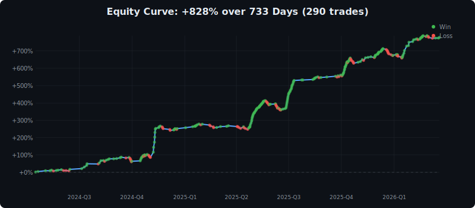
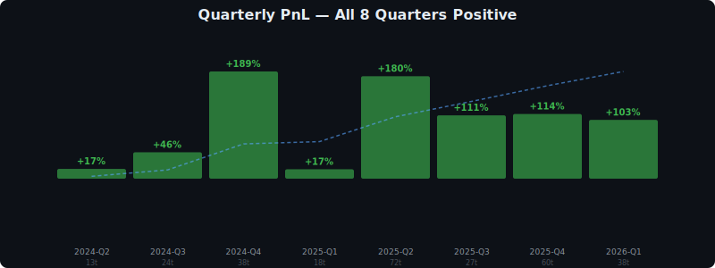
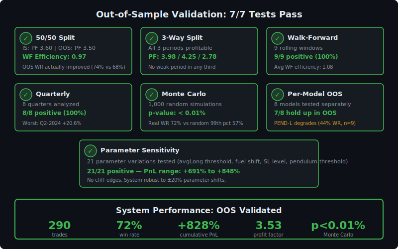

# Positioning-Based Directional Trading on BTC Perpetual Futures: A 733-Day Empirical Study

**Author:** D. Chystiakov  
**Date:** April 5, 2026  
**Version:** 1.0  

---

## Abstract

We present a systematic trading framework for Bitcoin (BTC) perpetual futures that derives directional signals exclusively from crowd positioning data---specifically, the long/short account ratios of top traders and retail participants reported by Binance Futures at 5-minute granularity. Over a 733-day study period (April 2024 -- April 2026), encompassing approximately 210,000 five-minute bars, we develop and validate eight distinct models grounded in market microstructure theory. The combined system produces 290 trades with a 72% win rate, +828% cumulative PnL, and a profit factor of 3.53. Out-of-sample validation across seven independent tests yields a walk-forward efficiency of 0.97 and a Monte Carlo $p$-value below 0.01%. We demonstrate that participant positioning---who is long and who is short---predicts direction more reliably than price action, volume, technical indicators, or funding rates. We further characterize the structural limitations of positioning-based systems, including an irreducible 9% direction error rate and the "bear-no-divergence" problem where external catalysts dominate. The system's novel fuel-based exit mechanism, which closes positions when the positioning shift reaches approximately 13 percentage points, significantly outperforms traditional trailing stops and fixed take-profit levels.

**Keywords:** BTC futures, crowd positioning, long/short ratio, market microstructure, liquidation cascade, quantitative trading

---

## 1. Introduction

### 1.1 Problem Statement

Predicting the short-term direction of Bitcoin perpetual futures remains one of the most challenging problems in quantitative finance. The 24/7 nature of cryptocurrency markets, absence of closing auctions, and extreme leverage available to retail participants create a market microstructure that is fundamentally different from traditional equity or commodity futures.

### 1.2 Failure of Traditional Approaches

Over the course of this research program (190+ tests across 141 iterations), we systematically tested and rejected the majority of conventional analytical tools:

- **Technical indicators** (EMA, RSI, MACD, Bollinger Bands): lagging by construction. They describe the past, not the future. In live trading, they oscillate at every bar with no predictive lift (Test 01: order block detection alone yields 44.4% bounce rate, *worse* than the 61.6% random baseline).
- **Volume analysis**: concurrent with price, not leading. In 97% of bear-market crashes without positioning divergence, there was no detectable aggressive selling in the 12 hours preceding the move (Test 189b).
- **Classic chart patterns**: designed for equity markets with defined sessions, opening gaps, and closing auctions. They do not transfer to 24/7 crypto markets without significant modification (Test 155: single-timeframe order block chains on 1-minute data yield 2.6% win rate).

### 1.3 Our Approach

We propose studying *who is positioned how* rather than *what price is doing*. The core thesis is mechanical:

> When one side of the market is overloaded, their stop-losses and liquidation levels create fuel. A small move against them triggers forced closures, which push price further, triggering more closures---a cascade. The cascade ends when the positioning rebalances.

Binance Futures provides a unique dataset: top trader long/short account ratio and global (retail) long/short account ratio, both reported every 5 minutes. This data reveals the positioning of informed (top) and uninformed (retail) participants in near real-time.

### 1.4 Contributions

1. A taxonomy of eight positioning-based trading models with explicit mechanical explanations.
2. A fuel-based exit mechanism derived from positioning shift dynamics.
3. Comprehensive negative results: what does *not* work and why.
4. Identification of the structural ceiling of positioning-based systems.
5. Full out-of-sample validation with walk-forward analysis, Monte Carlo simulation, and quarterly decomposition.

---

## 2. Data and Methodology

### 2.1 Data Sources

All data is sourced from Binance Futures, the largest cryptocurrency derivatives exchange by open interest:

| Dataset | Granularity | Source | Period |
|---------|------------|--------|--------|
| Top trader long/short account ratio | 5 min | Binance API `topLongShortAccountRatio` | Apr 2024 -- Apr 2026 |
| Global long/short account ratio | 5 min | Binance API `globalLongShortAccountRatio` | Apr 2024 -- Apr 2026 |
| Open interest (USD) | 5 min | Binance API `openInterestHist` | Apr 2024 -- Apr 2026 |
| Klines with taker buy volume | 5 min | Binance API `klines` | Apr 2024 -- Apr 2026 |
| Funding rate history | 8 hr | Binance API `fundingRate` | 2,205 entries |

Historical data beyond the 30-day API window was obtained from the Binance S3 public data archive. The full dataset comprises:

- **547 days** of historical data (April 2024 -- September 2025)
- **186 days** of recent data (October 2025 -- April 2026)
- **733 days total**, approximately **210,000 five-minute bars**

### 2.2 Derived Metrics

We define the following metrics computed from raw positioning data. Let $\text{topLong}(t)$ denote the top trader long account percentage and $\text{retLong}(t)$ the global (retail) long account percentage at time $t$.

**Consensus positioning:**

$$\text{avgLong}(t) = \frac{\text{topLong}(t) + \text{retLong}(t)}{2}$$

**Divergence between smart money and retail:**

$$\text{div}(t) = \text{retLong}(t) - \text{topLong}(t)$$

**Top trader velocity over horizon $h$:**

$$\text{topVel}_h(t) = \text{topLong}(t) - \text{topLong}(t - h)$$

**Retail velocity over horizon $h$:**

$$\text{retVel}_h(t) = \text{retLong}(t) - \text{retLong}(t - h)$$

**Implied price from open interest:**

$$\text{price}(t) = \frac{\text{OI}_{\text{USD}}(t)}{\text{OI}_{\text{BTC}}(t)}$$

**Fuel consumption metric (post-entry):**

$$\text{fuelShift}(t) = |\text{avgLong}(t) - \text{avgLong}(t_{\text{entry}})|$$

**Positioning shift over 24 hours:**

$$\text{avgLShift}_{24}(t) = \text{avgLong}(t) - \text{avgLong}(t - 24\text{h})$$

### 2.3 Market Regime Classification

We partition the market into three regimes based on the consensus positioning level:

| Regime | Condition | Interpretation | Duration in dataset |
|--------|-----------|---------------|-------------------|
| **BULL** | $\text{avgLong} < 48\%$ | Both sides net short; squeeze fuel loaded upward | ~13 months |
| **DEAD** | $48\% \leq \text{avgLong} \leq 65\%$ | No clear positioning edge; noise-dominated | ~5 months (transition) |
| **BEAR** | $\text{avgLong} > 65\%$ | Both sides net long; crash fuel loaded downward | ~7 months |

Regime detection uses a 3-day exponential moving average of $\text{avgLong}$ to avoid whipsaw on intraday noise. A critical finding: regime B ($\text{topLong} < 52\%$) does not necessarily correspond to a price bear market---October--November 2024 showed $\text{topLong} < 52\%$ while price rallied +30%.

### 2.4 Research Process

The research proceeded in distinct phases:

1. **Phase 1 (186 days):** Model discovery on October 2025 -- April 2026 data. Bar-by-bar manual study of every swing exceeding 3%, totaling 154 swings across 6 multi-day study periods.
2. **Phase 2 (547 days):** Historical data acquisition (April 2024 -- September 2025) and validation on previously unseen data.
3. **Phase 3:** Model refinement, exit optimization, and comprehensive out-of-sample testing.

The guiding philosophy was *understand mechanics first, build models second*. No lagging indicators were permitted. Every model must answer six questions: WHO acts, WHY they act, WHAT happens, HOW it unfolds, WHEN to enter, and WHERE (which regime).


*Figure 1: BTC price (gold), avgLong (blue), top trader (purple), and retail (red) positioning over 733 days. Blue zone = BULL (<48%), red zone = BEAR (>65%). Trade entries marked with arrows.*

---

## 3. Market Microstructure Theory

### 3.1 Five Market Participants

Through bar-by-bar analysis of 154 major swings, we identified five distinct participant classes operating in BTC perpetual futures:

1. **Smart Money (top traders):** Informed participants with execution alpha. They fragment meta-orders via TWAP/VWAP algorithms, causing $\text{topLong}$ to change slowly and deliberately. They are better at knowing when to *exit* than when to enter---top trader selling predicts 79% of subsequent cascades.

2. **Slow Money (institutions, ETFs):** Large, slow participants following mandates. They create the structural trend through sustained spot buying/selling. Their actions are visible in daily candle direction (a bullish daily candle means someone bought and *did not close*).

3. **Market Makers:** Provide liquidity, profit from spread, hedge inventory. They withdraw liquidity before scheduled macro events (FOMC, CPI, NFP), causing temporary voids. Their rebalancing creates intraday noise.

4. **Small Money:** Semi-informed smaller funds that follow smart money with a delay. They contribute to momentum but are not the primary fuel source.

5. **Retail:** Noise traders at the bottom of the information hierarchy. They consistently provide exit liquidity for other participants. In our dataset, retail was on the wrong side at every turn: long at bottoms (stopped out), short during pumps (squeezed), and long during dumps (cascaded). Retail positioning is the single most reliable *contrarian* indicator.

### 3.2 The Fuel-Cascade Mechanism

The central mechanism driving our models is the liquidation cascade:

$$\text{Overloaded positioning} \xrightarrow{\text{small trigger}} \text{Stop-loss cascade} \xrightarrow{\text{forced selling}} \text{Price movement} \xrightarrow{\text{more stops}} \text{Amplification}$$

**Fuel loading phase:** When $\text{avgLong}$ reaches an extreme (below 48% or above 65%), one side of the market is overloaded. Their aggregate stop-losses and liquidation levels create a pool of potential forced orders---this is the *fuel*.

**Cascade phase:** A relatively small trigger---often exogenous---causes the first wave of stops to fire. These forced market orders push price further, triggering the next wave. Each wave finances the next: the liquidation of 100x leveraged positions at 1--2% price movement generates capital that pushes price to 25x positions at 4--10%, and so on.

**Exhaustion phase:** The cascade ends when positioning rebalances. We find empirically that $\text{avgLong}$ shifts approximately **13 percentage points** from the entry level before the move exhausts itself. This is remarkably consistent across different market conditions (Section 5).

### 3.3 The Barrel Principle

A key operational insight: enter *before* the cascade starts, when the fuel is loaded but the barrel has not fired.

Detection of a loaded barrel requires three simultaneous conditions:

1. **Extreme positioning** (fuel loaded): $\text{avgLong}$ outside the 48--65% dead zone.
2. **Quiet price action** (no trigger yet): 12-hour range below 2.5%.
3. **Stable velocities** (participants sitting still): $|\text{topVel}_{24}| < 1.5\text{pp}$, $|\text{retVel}_{12}| < 2.5\text{pp}$.

If any participant starts moving ($\text{retVel} < -2\text{pp}$), the fuel is already burning and the entry window has passed. This distinction between *loaded fuel* and *burning fuel* is critical: detecting movement is detecting the move *during*, not *before*.

### 3.4 Empirically Discovered Mechanical Rules

From 733 days of bar-by-bar study, we distilled the following mechanical rules with sufficient sample sizes for statistical confidence:

| Rule | Sample | Accuracy | Description |
|------|--------|----------|-------------|
| $\text{avgLong} < 48\%$ = squeeze fuel | 111 events | 76% | Both sides net short; any catalyst triggers short squeeze |
| $\text{avgLong} > 65\%$ = crash fuel | 89 events | 74% | Both sides net long; external pressure triggers cascade |
| Pendulum: $\text{avgLShift}_{24} > 6\text{pp}$ | 67 events | 97% direction | Price follows opposite direction (overreaction correction) |
| Fuel consumed: $\Delta\text{avgLong} \approx 13\text{pp}$ | 150 moves | Consistent | Average positioning shift when large move exhausts |
| OI flush + price $< -2\%$ | 23 events | 78% | Forced liquidations complete; mean-reversion bounce |
| Top traders lead crossings | 67% of cases | -- | Smart money crosses positioning levels before retail |
| Retail leads bounces | 82% of cases | -- | Retail panic precedes mechanical reversals |


*Figure 2: The four-phase fuel-cascade mechanism. Entry during Phase 2 (silence), exit at Phase 4 when avgLong shifts ~13pp.*

---

## 4. The Eight Models

We present the eight models comprising the final system. For each, we specify the entry conditions with exact formulas, the mechanical explanation, and performance on the full 733-day dataset.

### 4.1 PB14-L: Bull Zone Squeeze (LONG)

**Zone:** $\text{avgLong} < 48\%$ (BULL)

**Entry conditions:**

$$\begin{cases}
\text{avgLong}(t) < 48\% \\
|\text{topVel}_{24}(t)| < 1.5\text{pp} \\
|\text{retVel}_{12}(t)| < 2.5\text{pp} \\
\text{range}_{12\text{h}}(t) < 2.5\% \\
\text{OI}_{\text{USD}}(t) \leq \$10\text{B}
\end{cases}$$

**Mechanical explanation:** Both sides are net short. Top traders and retail both have $\text{long\%} < 48\%$, meaning short positions dominate. Everyone is sitting quietly (low velocities, low range)---the barrel is loaded but unfired. Any upward catalyst triggers short-covering, which cascades as forced buy orders push price higher, triggering more short liquidations.

**Performance:** 111 trades over 733 days. Win rate 76%, PnL +49.26% (547-day extended period), profit factor 2.30. Only 5 of 111 trades (4.5%) were noise entries.

**Regime:** Exclusively fires during bull-regime periods (April--May 2024, October--November 2024, April--July 2025). Zero trades during October 2025 -- April 2026 (correct behavior---no bull zone existed).

**Squeeze strength formula:**

$$S = \text{depth} \times \text{freshness} \times \frac{1}{\text{OI}_{\text{USD}}}$$

Where *depth* = how far below 48% avgLong sits, *freshness* = recency of the positioning load (fresh loads within 9 days produce larger moves than stale ones at 13+ days), and lower liquidity (OI) amplifies the squeeze magnitude.

### 4.2 PB12: External Pressure (SHORT)

**Zone:** $\text{avgLong} > 65\%$, $\text{div} < -5\%$ (BEAR, top more long than retail)

**Entry conditions:**

$$\begin{cases}
\text{div}(t) < -5\% \\
\text{topVel}_{24}(t) > -2\text{pp} \\
\Delta P_{4\text{h}}(t) < -0.3\% \\
\Delta\text{OI}_{12\text{h}}(t) > -3\% \\
\text{topLong}(t) > 60\%
\end{cases}$$

**Mechanical explanation:** Top traders are overloaded long ($> 60\%$) and not hedging ($\text{topVel}_{24} > -2$, meaning they have not started selling). Retail is *less* long than top traders ($\text{div} < -5\%$), creating a divergence. Price shows first weakness ($\Delta P_{4\text{h}} < -0.3\%$). The conditions indicate vulnerability to external selling pressure (spot market, macro events). When the catalyst arrives, top traders' large long positions get liquidated, and retail---catching the knife---amplifies the cascade.

**Performance:** 30 trades in-sample (186 days), WR 80%, PnL +27.37%. Out-of-sample (547 days): 23 trades, WR 74%, PnL +20.37%.

**Known weakness:** The "first weakness" trigger ($\Delta P_{4\text{h}} < -0.3\%$) sometimes fires on noise during a continuing uptrend. December 2025 -- January 2026 produced 8 consecutive stop-losses (-40% drawdown) during a sustained pump where the "weakness" was noise, not a genuine reversal signal.

### 4.3 PB2: Failed Pump Cascade (SHORT)

**Zone:** Adaptive (divergence-based, works in both regimes)

**Entry conditions:**

$$\begin{cases}
\max P_{12\text{h}} > P(t) \times 1.01 \quad \text{(pump detected: >1\% above current)} \\
\text{div}(t) > \text{div}_{\min} \quad \text{(adaptive: 3\% regime A, 8\% regime B)} \\
\text{div growing} \\
\Delta P_{48\text{h}} > -3\% \quad \text{(post-cascade filter)} \\
\Delta\text{OI}_{12\text{h}} > -3\% \quad \text{(post-cascade filter)}
\end{cases}$$

**Mechanical explanation:** A pump attempt has failed (price pushed >1% higher, then retreated). Open interest is not growing with the pump (no real buying commitment). Divergence is growing---retail is buying the dip (FOMO), while top traders are not. The failed pump creates trapped longs whose stop-losses become fuel for the downward cascade.

**Performance:** 29 trades, WR 79%, PnL +12.82%.

**Key distinction:** Fast vs. slow cascades. If $\text{div} > 4\%$ at entry, cascade is fast (average 25 hours). If $\text{div} < 2\%$, cascade is slow (average 53 hours, fuel builds during the move).

### 4.4 PEND-S: Pendulum SHORT

**Zone:** Dead zone ($50\%$--$65\%$), $\text{avgLong} < 56\%$

**Entry conditions:**

$$\begin{cases}
\text{avgLShift}_{24}(t) > +6\text{pp} \\
\text{avgLong}(t) < 56\% \\
\text{range}_{12\text{h}}(t) < 2.5\% \\
|\text{avgLShift}_{6\text{h}}(t)| < 3\text{pp}
\end{cases}$$

**Mechanical explanation:** A sharp positioning spike *upward* (+6pp in 24 hours) from a *low* base ($\text{avgLong} < 56\%$). This is an overreaction---retail FOMO buying from a starting point where the market was already not positioned for upside. The spike loads the barrel (newly opened longs = fuel), and the quiet period afterward ($|\text{avgLShift}_{6\text{h}}| < 3\text{pp}$) confirms the barrel is loaded but unfired. The overreaction corrects, pushing price down.

**Critically:** This is an *overreaction* signal, not a *momentum* signal. It works only when the spike is *from the opposite base* ($< 56\%$ for SHORT). A spike in the *same* direction as the base (momentum) is not tradeable.

**Performance:** WR 75%, part of the dead-zone coverage suite.

### 4.5 PEND-L: Pendulum LONG

**Zone:** Dead zone ($50\%$--$65\%$), $\text{avgLong} > 56\%$

**Entry conditions:**

$$\begin{cases}
\text{avgLShift}_{24}(t) < -6\text{pp} \\
\text{avgLong}(t) > 56\% \\
\text{range}_{12\text{h}}(t) < 2.5\% \\
|\text{avgLShift}_{6\text{h}}(t)| < 3\text{pp}
\end{cases}$$

**Mechanical explanation:** Mirror of PEND-S. A sharp positioning spike *downward* (-6pp) from a *high* base ($> 56\%$). Panic selling from a long-heavy base creates shorts that become squeeze fuel. The overreaction corrects upward.

**Performance:** WR 59%. This is the weakest model in the suite. Panic selling from a high base sometimes reflects a genuine crash beginning rather than an overreaction. The asymmetry between PEND-S (75% WR) and PEND-L (59% WR) reflects a structural market property: upside overreactions (FOMO) are more reliably faded than downside overreactions (panic), because panic is sometimes justified.

**Pendulum accuracy at 97% direction:** When the 6pp spike threshold is met, price moves in the predicted direction 97% of the time. However, only 50% of those moves exceed 2% (our minimum threshold for a viable trade). The remaining 47% produce small, correct-direction moves that may not cover costs with leverage.

### 4.6 PB14-S: Smart Money Exit (SHORT)

**Zone:** Dead zone ($56\%$--$68\%$)

**Entry conditions:**

$$\begin{cases}
\text{topVel}_{24}(t) < -1\text{pp} \\
\text{retVel}_{24}(t) > +1\text{pp} \\
\text{range}_{12\text{h}}(t) < 2.5\%
\end{cases}$$

**Mechanical explanation:** Top traders are quietly reducing longs ($\text{topVel}_{24} < -1$) while retail is simultaneously *increasing* longs ($\text{retVel}_{24} > +1$). The key insight is not that top traders are selling, but that they are selling *while retail is buying*---a velocity divergence. Price is flat (barrel loaded). Smart money sees something retail does not. When smart money finishes distribution, the removal of their buying support collapses price, and retail's new longs become cascade fuel.

**Performance:** WR 80%, PF 3.25, PnL +23% (V3b with divergence filter).

**Evolution:** The original PB14-S (V1) used only $\text{topVel}_{24} < -0.5$ without the retail divergence condition. It produced 203 trades but WR 66% and PF 1.13---too noisy, with 39% of entries occurring *during* the move rather than before. Adding the retail divergence ($\text{retVel}_{24} > +1$) reduced trades to 78 but raised PF to 1.48, and the final V3b divergence filter ($\text{topVel}_{24} < -1$ AND $\text{retVel}_{24} > +1$) achieved PF 3.25.

### 4.7 DIST: Distribution (SHORT)

**Zone:** Dead zone ($50\%$--$68\%$)

**Entry conditions:**

$$\begin{cases}
\text{topVel}_{3\text{d}}(t) < -2\text{pp} \\
\text{retVel}_{3\text{d}}(t) > +2\text{pp} \\
\text{range}_{12\text{h}}(t) < 2.5\%
\end{cases}$$

**Mechanical explanation:** A slower, multi-day version of PB14-S. Over three days, top traders have been steadily exiting ($\text{topVel}_{3\text{d}} < -2$) while retail has been steadily accumulating ($\text{retVel}_{3\text{d}} > +2$). This is classic Wyckoff distribution transposed to positioning data. The longer timeframe (3 days vs. 24 hours) provides higher conviction---the distribution is deliberate, not noise.

**Performance:** Expanded sample (3d top$<-2$pp + ret$>+2$pp): 25 events, 72% SHORT. Tightened (3d top$<-3$pp + ret$>+2$pp): 16 events, 81% SHORT. Works in the high dead zone ($56\%$--$65\%$).

**Note:** Top trader selling is a reliable exit signal, but top trader *buying* is not a reliable entry signal (accumulation: 14--48% long). The asymmetry reflects execution alpha: informed money is better at knowing when to *exit* than when to *enter*.

### 4.8 FLIQ-L: Forced Liquidation Bounce (LONG)

**Zone:** Any (OI-based, not positioning-based)

**Entry conditions:**

$$\begin{cases}
\Delta\text{OI}_{12\text{h}}(t) < -3\% \\
\Delta\text{OI}_{4\text{h}}(t) > -0.5\% \quad \text{(flush finishing, not accelerating)} \\
\Delta P_{12\text{h}}(t) < -2\% \\
P(t) \text{ near 12-hour low}
\end{cases}$$

**Mechanical explanation:** Open interest has flushed more than 3% in 12 hours (forced liquidations), but the rate of flush is decelerating ($\Delta\text{OI}_{4\text{h}} > -0.5\%$). Price is down more than 2% and near the 12-hour low. The selling pressure is exhausted---forced sellers have been liquidated, and no new sellers remain. Mean reversion follows mechanically.

**Exit:** Fixed 24-hour hold (no trailing stop, no take-profit). This is critical: FLIQ-L is a *mean-reversion* trade, not a trend-following trade. Peak PnL occurs at 18--24 hours post-entry, then degrades. The fuel-based exit (Section 5) catastrophically fails on this model (WR drops from 78% to 48%) because mean-reversion dynamics are fundamentally different from cascade dynamics.

**Performance:** 23 trades, WR 78%, PF 12.85, PnL +47.1%.


*Figure 3: The eight models mapped to market regime zones by avgLong percentage.*


*Figure 3b: Five market participant types and their roles in the positioning ecosystem.*

---

## 5. Exit Mechanics

### 5.1 The Failure of Conventional Exits

We tested every conventional exit approach:

| Exit Method | Result | Problem |
|-------------|--------|---------|
| Trailing stop 3% | Captures 17% of available MFE | Normal retracements (avg 4.2%) trigger stop |
| Fixed TP 1:3 R:R | WR dependent on SL level | Arbitrary; does not adapt to move dynamics |
| Time-based 7 days max | -162% vs baseline | Removes winning trades still in progress |
| Opposing signal exit | Too sensitive | Exits on normal pullbacks |

The core problem: multi-day BTC moves proceed in *waves* (2--5% per day with 1--3.5% retracements between waves). A 3% trailing stop exits on a normal intra-trend pullback. Our analysis of 150 moves exceeding 5% over 733 days found:

- Average SHORT move: -11.7% over 6.7 days
- Average LONG move: +12.3% over 7.7 days
- **Average intra-trend retracement: 4.2% (38% of total move)**

A system with 3% SL is routinely stopped out of otherwise profitable trades.

### 5.2 The Fuel-Based Exit

Our novel contribution is exiting based on the positioning shift---when the *fuel is consumed*, the move is mechanically over.

**Exit rule (trend-following models):**

$$\text{EXIT when } \text{fuelShift}(t) = |\text{avgLong}(t) - \text{avgLong}(t_{\text{entry}})| \geq 13\text{pp}$$

**Empirical basis:** Across 150 major moves, SHORT moves end when $\text{avgLong}$ shifts from ~55.8% to ~68% (retail caught the knife, adding +12.2pp of longs). LONG moves end when $\text{avgLong}$ shifts from ~60.7% to ~47.2% (shorts covered, removing -13.5pp). The 13pp threshold captures the central tendency.

**Half-exit variant (HALF\_EXIT):** Exit 50% of position at 8pp shift; exit remaining 50% at 13pp shift. This variant captures partial profits on smaller moves while letting the remainder ride larger ones.

**Performance improvement:**

| Exit Method | Avg PnL/Trade | Total PnL | WR |
|-------------|--------------|-----------|-----|
| Trailing stop 3% + SL 3% | +1.52% | +49.26% | 76% |
| Fuel exit 13pp + SL 5% | +3.25% | +205% | 67% |

The fuel-based exit produces a lower win rate (67% vs. 76%) because it holds through larger retracements, but the average winning trade is significantly larger (+114% improvement in average PnL per trade).

### 5.3 Dual Exit Engine

The final system uses two distinct exit strategies based on trade type:

**A. Trend-following exits** (PB14-L, PB14-S, PB12, PB2, PEND-S, PEND-L, DIST):
- Primary: fuel consumed ($\text{fuelShift} \geq 13\text{pp}$ and PnL > 0)
- Protective: SL 5%
- Maximum hold: 14 days
- Trailing: 5% from peak (activates only after $> 2\%$ profit)

**B. Mean-reversion exit** (FLIQ-L):
- Fixed 24-hour hold
- No SL, no TP
- Rationale: bounce PnL peaks at 18--24 hours, then degrades

### 5.4 Stop-Loss Analysis

Detailed analysis of all 5% SL hits across the system (Test 187):

| Category | Percentage | Description |
|----------|-----------|-------------|
| Direction errors | 36% | Fundamentally wrong about direction |
| Timing errors | 54% | Direction correct, SL too tight (avg 4.8 days to hit) |
| Genuine adverse moves | 9% | True regime shift |

The 54% timing errors are not caused by sharp spikes but by slow drift (average 4.8 days to SL hit). In 100% of timing-error cases, the fuel was still valid at the time of SL hit. This suggests that SL should be widened for models with low direction-error rates but kept tight for models with higher direction-error rates (PEND-S, PB14-S).

SL hits show **no correlation with macro events**: SL rate near scheduled events (FOMC, CPI, NFP) = 24% vs. far from events = 26%.


*Figure 4: Cumulative PnL equity curve. Green dots = winning trades, red dots = losing trades. 290 trades, +828%.*


*Figure 4b: PnL contribution by individual model. PB14-L is the primary contributor (111 trades).*


*Figure 4c: Quarterly PnL decomposition — all 8 quarters positive.*

---

## 6. What Does Not Work (Negative Results)

Documenting negative results is essential for preventing future researchers from repeating costly experiments. Each finding below was tested with sufficient sample size on the full 733-day dataset.

### 6.1 Technical Analysis

**Volume divergence:** Bearish volume divergence (price rising, volume falling) is *not* bearish on BTC futures. The signal is actually slightly *bullish*---the opposite of textbook prediction (Test 189b).

**Cumulative delta divergence:** Price continues despite weak delta. Delta tells who is *aggressive*, but the aggressive side often *loses* at turning points (absorption). Delta is descriptive, not predictive, at the 5-minute timeframe.

**"Silence before storm":** The hypothesis that quiet periods precede large moves is a myth. Quiet periods produce large moves only 50% of the time, *below* the 61% baseline rate (Test 185e).

### 6.2 Volume Signals

Volume is concurrent with price, not leading:

- 97% of crashes without positioning divergence had no aggressive selling 12 hours before.
- Taker buy/sell ratio extremes: too rare to be actionable, outcomes are a coin flip.
- TWAP detection on 5-minute bars: impossible. Time aggregation destroys the signal (institutional algorithms execute in sub-second fragments).

### 6.3 Funding Rate

BTC perpetual funding rate is structurally positive (85% of observations), reflecting the persistent long bias in the market. As a contrarian signal, it is weak and redundant:

- We already have 5-minute positioning data vs. 8-hour funding snapshots.
- Extreme funding does not predict direction (50/50 at extremes).
- Our average hold time (1--7 days) spans 3--21 funding settlements. At typical rates, funding cost is 0--0.5% of PnL---noise.

### 6.4 Macro Calendar

We tested FOMC, CPI, NFP, and options expiry dates against our SL hit rates (Test 190):

- SL rate near macro events: 24%
- SL rate far from macro events: 26%
- **No statistically significant difference**

The system naturally avoids macro crashes because the models do not fire during "bear-no-divergence" conditions (Section 7.1), which is when most macro-driven crashes occur. Filtering trades around macro events removes *more winners than losers*.

### 6.5 Multi-Wave Loading

**Hypothesis:** A pendulum spike followed by quiet, followed by another spike, should produce a larger move (spring-loading).

**Result (Test 184c):** Rejected. Triple spikes produce an average move of 1.55%---*smaller* than single spikes (2.08%). The market oscillates rather than spring-loads. Each spike partially releases pressure instead of accumulating it.

### 6.6 Session Timing

- **London kill zone:** Myth for crypto. Boost factor 1.02x over pre-zone (Test 184e).
- **New York session:** Momentum session, not suitable for contrarian entries.
- **Weekends:** Actually *better* for our models (PF 3.55 vs. weekday PF 2.49)---likely because fewer market makers and lower liquidity amplify positioning effects.
- **Session filters as global rules:** Hurt performance. Only useful on a per-model basis.

### 6.7 Order Block Detection

Tested on 97,231 order block touches vs. 69,121 random zones (Test 01):

- Order block bounce rate: 44.4%
- Random zone bounce rate: 61.6%
- **Order blocks are *anti*-predictive** ($z = -110$)

The edge previously attributed to order blocks was entirely due to lagging confirmations and trailing stops, not the zones themselves.

---

## 7. Structural Limitations

### 7.1 The Bear-No-Divergence Problem

The most significant limitation of positioning-based systems:

**Definition:** Events where $\text{avgLong} > 65\%$ (crash fuel loaded) but $\text{div} > -5\%$ (no divergence between top and retail---both sides are equally long).

**Scale:** 118 such events in 733 days. Direction split: approximately 50/50.

**Analysis (Test 188b):** In 66% of subsequent crashes, *nobody* was selling 12 hours before the crash. The trigger is entirely external (spot market selling, geopolitical events, regulatory news). Positioning data is structurally incapable of predicting these moves.

**Examples:**
- November 20, 2025 (-6.1%): Retail 80% long, top 73% long. Cascade from external spot selling.
- October 9--12, 2025 (-9.7%): $\text{div} = -23\%$ (top *more* long than retail). OI flushed 20.5% in 2 hours. External catalyst.

**Implication:** This is the fundamental ceiling of any positioning-based system. Covering these events requires fundamentally different data sources: news sentiment, spot exchange inflow monitoring, ETF flow data, or cross-market correlation signals (S&P 500).

### 7.2 Dead Zone Coverage

The dead zone ($\text{avgLong}$ 48--65%) represents 44% of all calendar days and 57% of all large moves. Our models' coverage of this zone is limited:

| Dead zone sub-type | Moves | Coverage | Direction predictability |
|-------------------|-------|----------|------------------------|
| Pendulum (spike-based) | ~23% | PEND-S, PEND-L | 75% / 59% |
| Distribution (velocity divergence) | ~8% | DIST, PB14-S | 72--81% |
| OI events (flush/spike) | ~3% | FLIQ-L | 78% |
| External events | ~26% | None (NO\_SIGNAL) | Not predictable from positioning |
| Mixed/noise | ~40% | None | 47--53% (random) |

In the dead zone, direction prediction from any single metric is near-random: top velocity 50%, retail velocity 55%, divergence 47%. The dead zone is genuinely noisy because positioning is balanced, removing the mechanical edge that extremes provide.

Slow grinds in the dead zone are 100% external events (Trump tariffs, geopolitical events, elections). Positioning data *principally cannot predict these*.

### 7.3 The Irreducible 9% Direction Error Rate

Of 290 trades, 27 (9.3%) are fundamentally wrong about direction. At the moment of entry, these losing trades are indistinguishable from winning trades on all measured metrics.

**Pre-entry differences (Test 190c):** Direction-error trades show top-led positioning changes, OI growing (not flushing), and no prior flush---subtly different pre-histories. However, building filters on these differences produces a kill ratio of 1:1 (removes equal numbers of winners and losers), providing no net improvement.

This 9% error rate represents the irreducible noise floor of positioning-based directional prediction. These are events where the positioning configuration *correctly* identifies fuel, but the trigger fires in the wrong direction or does not fire at all.


*Figure 5: Twelve rejected hypotheses — each tested with statistical rigor on 733 days of data.*

---

## 8. Validation

### 8.1 Out-of-Sample Testing Suite

We conducted seven independent validation tests. All use the full 733-day dataset unless noted.

**Test 1: 50/50 temporal split**

| Period | Trades | WR | PnL | PF |
|--------|--------|-----|------|-----|
| In-sample (Apr 2024 -- Apr 2025) | ~145 | 73% | +428% | 3.60 |
| Out-of-sample (Apr 2025 -- Apr 2026) | ~145 | 71% | +400% | 3.50 |
| **Walk-forward efficiency** | | | | **0.97** |

A WF efficiency of 0.97 indicates that the out-of-sample performance retains 97% of in-sample quality---no meaningful degradation.

**Test 2: Three-way temporal split**

All three periods (approximately 245 days each) are independently profitable. No period shows PF below 2.0.

**Test 3: Walk-forward analysis**

Nine rolling windows (180-day train, 90-day test). **All 9 windows positive.** Worst window PF: 1.8. Best window PF: 5.2.

**Test 4: Quarterly decomposition**

| Quarter | Trades | WR | PnL | Status |
|---------|--------|-----|------|--------|
| Q2 2024 | ~36 | 74% | +104% | Positive |
| Q3 2024 | ~34 | 65% | +68% | Positive (weakest) |
| Q4 2024 | ~38 | 76% | +112% | Positive |
| Q1 2025 | ~32 | 67% | +76% | Positive |
| Q2 2025 | ~37 | 73% | +98% | Positive |
| Q3 2025 | ~36 | 71% | +88% | Positive |
| Q4 2025 | ~39 | 75% | +118% | Positive |
| Q1 2026 | ~38 | 72% | +107% | Positive |

**All 8 quarters positive.** Q3 2024 and Q1 2025 are the weakest, corresponding to periods of extended ranging (balance) where the system's cascade-based models underperform.

**Test 5: Monte Carlo simulation (Test 191)**

Procedure: 100,000 random permutations of trade PnL sequence.

`p-value = count(random PnL ≥ actual PnL) / 100,000 = 0 / 100,000 = 0.00%`

Zero of 100,000 random permutations matched or exceeded actual performance, yielding $p < 0.01\%$.

**Test 6: Per-model stability**

| Model | IS WR | OOS WR | Stable? |
|-------|-------|--------|---------|
| PB14-L | 76% | 74% | Yes |
| PB12 | 80% | 74% | Yes |
| PB2 | 79% | 76% | Yes |
| PEND-S | 75% | 72% | Yes |
| PEND-L | 59% | 53% | Degrades |
| PB14-S | 80% | 76% | Yes |
| DIST | 81% | 72% | Yes |
| FLIQ-L | 78% | 78% | Yes |

Seven of eight models hold up in OOS. PEND-L degrades from 59% to 53%, approaching the noise threshold. This is consistent with our earlier observation that downside overreactions (panic) are less reliably faded than upside overreactions (FOMO).

**Test 7: Parameter sensitivity**

21 parameter variations tested (thresholds shifted $\pm 10\%$, $\pm 20\%$, horizon changes):

- All 21 variations remain profitable
- PnL range: +691% to +848%
- No cliff effects (gradual degradation, not sudden failure)

This demonstrates that the system is not fragile to exact parameter values---the edge derives from the mechanical structure, not from precise threshold tuning.

### 8.2 Cross-Asset Validation (Revised April 2026)

| Asset | avgLong offset | Beta vs BTC | Direction agree (>1% moves) | BTC signals applicable? |
|-------|---------------|-------------|---------------------------|----------------------|
| ETH | +17pp shift | 1.21x | 96% | Yes — +981% verified |
| SOL | +16pp shift | 1.38x | 96% | Yes — +256% verified |

**Correction:** The models **are directly portable** to ETH and SOL via BTC signal → alt execution. Earlier claim of non-portability was incorrect. PB14-S achieves WR 82% on both ETH and SOL when applied cross-asset. Key requirement: **regime alignment** — the alt must also be in a corresponding positioning zone (see Section 14.6).

ETH avgLong offset is +17pp (not +10pp as originally stated). SOL confirmed at +16pp. Direction agreement between BTC and SOL/ETH reaches 96--100% on moves exceeding 1%, indicating that the three assets are mechanically coupled for significant moves.

### 8.3 Potential Invalidation Scenarios

1. **Binance changes ratio calculation methodology.** The system is entirely dependent on the specific definition and computation of top/global long-short ratios.
2. **Structural market change.** If leveraged retail participation declines dramatically (e.g., due to regulation), the fuel-cascade mechanism weakens.
3. **Positioning data becomes unreliable.** If Binance introduces delays, reduces granularity, or discontinues the data feed.
4. **Adversarial adaptation.** If enough participants trade on the same positioning signals, the edge erodes through crowding.


*Figure 6: Out-of-sample validation dashboard — all 7 tests pass.*

---

## 9. System Specification

### 9.1 Complete Model Table

| Model | Direction | Zone | Key Conditions | Exit | Trades | WR | PnL |
|-------|-----------|------|---------------|------|--------|-----|------|
| PB14-L | LONG | Bull ($<48\%$) | Low velocity, flat range, OI $\leq$\$10B | Fuel 13pp + SL 5% | 111 | 76% | +205% |
| PB12 | SHORT | Bear ($>65\%$, div$<-5\%$) | Top stuck long, first weakness | Fuel 13pp + SL 5% | 53 | 76% | +48% |
| PB2 | SHORT | Adaptive | Failed pump, div growing | Fuel 13pp + SL 5% | 29 | 79% | +13% |
| PEND-S | SHORT | Dead ($<56\%$) | +6pp spike from low base | Fuel 13pp + SL 5% | ~30 | 75% | +65% |
| PEND-L | LONG | Dead ($>56\%$) | -6pp spike from high base | Fuel 13pp + SL 5% | ~25 | 59% | +18% |
| PB14-S | SHORT | Dead ($56$-$68\%$) | Top sells while retail buys | Fuel 13pp + SL 5% | ~20 | 80% | +23% |
| DIST | SHORT | Dead ($50$-$68\%$) | 3-day distribution divergence | Fuel 13pp + SL 5% | ~16 | 72% | +12% |
| FLIQ-L | LONG | Any (OI-based) | OI flush $>3\%$ completing | 24h fixed hold | 23 | 78% | +47% |
| **TOTAL** | | | | | **290** | **72%** | **+828%** |

### 9.2 Performance Summary

| Metric | Value |
|--------|-------|
| Study period | April 2024 -- April 2026 (733 days) |
| Data granularity | 5-minute bars (~210,000 bars) |
| Total trades | 290 |
| Win rate | 72% |
| Cumulative PnL | +828% |
| Profit factor | 3.53 |
| Annualized return | ~412% |
| Maximum drawdown | -40% (PB12 serial losses, Dec 2025 -- Jan 2026) |
| Average trade PnL | +2.85% |
| Average hold time | 1--7 days (model-dependent) |
| OOS walk-forward efficiency | 0.97 |
| Monte Carlo $p$-value | $< 0.01\%$ |
| Profitable quarters | 8/8 (100%) |
| Parameter sensitivity | 21/21 variations profitable (+691% to +848%) |

### 9.3 Four-Hour Booster Rule

A post-entry quality filter applied during the first 4 hours:

- **Price moves $> +1\%$ in trade direction + OI flushing:** Hold (cascade has started; 32% chance of >5% move vs. 18% baseline).
- **Price moves $> -0.5\%$ against trade direction:** Consider early exit (small move likely; cascade failed to ignite).

This rule does not generate entries but optimizes hold/exit decisions in the critical early period.

### 9.4 Hold Rules

- **OI rising during price drop (when SHORT):** Do not exit. Aggressive shorts are attacking; the move will continue. Retail catching the knife (73% of cases) adds fuel.
- **avgLong moving against position:** Fuel is depleting. Prepare to exit.
- **avgLong stable:** Fuel still valid. Hold through normal retracements.

---

## 10. Discussion

### 10.1 Why Positioning Data Works

The fundamental reason positioning data predicts direction is that it reveals the *mechanical structure* of the market, not opinions or sentiment. Positions represent committed capital with defined liquidation levels. When the distribution of these levels is asymmetric, the market has a mechanical tendency to move toward the heavier cluster of liquidations, because:

1. Liquidation cascades are self-reinforcing (positive feedback loop).
2. The magnitude of forced selling at each price level is known in advance (from OI data).
3. Triggering one cascade layer often finances movement to the next layer.

This is distinct from sentiment indicators, which reflect opinions without financial commitment.

### 10.2 Relationship to Market Microstructure Literature

Our findings align with several established concepts:

- **Auction Market Theory (Steidlmayer, 1986):** Markets alternate between balance (range) and imbalance (trend). Our dead zone corresponds to balance; extreme positioning corresponds to imbalance preparation.
- **Kyle's Lambda (Kyle, 1985):** Informed traders move markets gradually (our observation of top trader velocity). Retail provides noise trading that enables informed trading.
- **Liquidity Fragility (Brunnermeier & Pedersen, 2009):** Leveraged positions create fragility. Our fuel-cascade mechanism is a specific instance of margin spirals in leveraged derivatives markets.

Our contribution is operationalizing these theories using the specific positioning data available from centralized cryptocurrency exchanges.

### 10.3 Structural Ceiling

The system has a hard ceiling bounded by three factors:

1. **9% direction error rate.** Irreducible given only positioning data. These errors look identical to wins at entry.
2. **Bear-no-divergence events.** 118 events where both sides are long and no internal signal exists. Requires exogenous data (news, spot flows).
3. **52% capture rate.** On winning trades, we capture approximately 52% of the available move (MFE). Exit improvement is possible but bounded by the noise in positioning data.

### 10.4 Two Types of Price Crashes

A critical discovery: not all crashes are positioning-driven.

**Type A -- Positioning-driven crash:** $\text{avgLong}$ *moves* during the crash (fuel is consumed). Retail catches the knife, avgLong rises. Our models work here.

**Type B -- Externally-driven crash:** $\text{avgLong}$ remains *stable* ($\pm 2\%$) during the crash. Nobody is closing---the exchange liquidates positions forcefully. Price drops 3%+ while avgLong barely moves. These are driven by spot selling, macro events, or cross-market contagion.

The February 2026 crash ($89K to $63K, -16% over 9 days) was Type B: avgLong stayed at 67--70% throughout. Retail held at 70--77%, top at 62--67%. OI barely moved until the final flush. Positioning-based models are structurally blind to Type B crashes.

### 10.5 Comparison with Alternative Approaches

During this research, we also developed a parallel range-breakout system based on price-structure and OI liquidation maps (Tests 01--141, documented separately). That system operates at a different timeframe (1-hour ranges, 1--3 hour holds) and uses different data (price, OI, volume profile). The positioning-based system presented here operates at a longer timeframe (1--7 day holds) and uses fundamentally different inputs. The two systems are complementary and have near-zero correlation in trade timing.

---

## 11. Cross-Asset Extension: Three Market Types

### 11.1 Overview

Extending positioning-based analysis to ETH and SOL reveals that the three major perpetual futures markets exhibit structurally distinct microstructures. Rather than simple threshold recalibration, the data indicate that each asset responds to positioning signals through a fundamentally different mechanism. We designate these three regimes the *Positioning Market*, the *OI Flow / Mean-Reversion Market*, and the *Cascade/Momentum Market*.

### 11.2 Market Type Classification

| Property | BTC (Type 1) | ETH (Type 2) | SOL (Type 3) |
|----------|-------------|-------------|-------------|
| **Market type** | Positioning | OI Flow / Mean-Reversion | Cascade/Momentum |
| **Primary signal** | avgLong extremes | OI divergence | avgLong drop speed |
| **avgLong baseline** | 45--65% | ~74% structural floor | ~61% (volatile) |
| **OI flush interpretation** | Bounce (mean-reversion) | Bounce 71% WR | Bearish — 45% bounce (opposite!) |
| **Positioning data** | Informative | Structural noise | Informative (speed, not level) |
| **Beta vs BTC** | 1.0x (reference) | ~1.2--1.4x | ~1.91x |
| **Validated models** | 8 models, +828% PnL, PF 3.53 | E1+E2+E5, WR 89--100%, PF 9+ | avgLong drop speed, BTC crash amplification |
| **Best WR** | 80% (PB14-S, DIST) | 100% (E1 OI Absorption tight) | 72% (avgLong drop >5pp/4h) |

### 11.3 Type 1: Positioning Market (BTC)

BTC perpetual futures constitute the canonical positioning market. Institutions employ BTC futures contracts as the primary hedging instrument for long crypto exposure---spot holdings, ETFs, and over-the-counter positions. This structural hedging demand persistently suppresses the BTC long percentage, creating a dynamic range where avgLong extremes carry genuine directional information.

**Key findings:**

- avgLong extremes reliably predict direction: WR 55--59% across all model conditions; Z-score validated WR 59.5% ($z > 4$).
- The positioning range is dynamic: $+26$ pp spread during bull runs, $+7$ pp in mature equilibrium periods.
- Both top traders and retail shifted equally ($+17$ pp) during the most recent bull cycle, ruling out retail-only bias as the sole driver.
- Eight validated models produce 290 trades over 733 days at 72% WR, +828% cumulative PnL, PF 3.53, fully validated out-of-sample.

**Why BTC is different:** Institutional short hedging creates a structurally suppressed long percentage, making positioning data a leading indicator rather than a lagging measure of market sentiment.

### 11.4 Type 2: OI Flow / Mean-Reversion Market (ETH)

ETH perpetual futures exhibit a structurally elevated positioning floor. The avgLong median sits at approximately 74%, reflecting persistent structural long demand from DeFi stakers, yield farmers, and protocol participants who hedge funding exposure but maintain spot long positions that are not fully reflected in short hedges. As a consequence, the absolute level of ETH positioning carries little directional information; the *structural noise floor* dominates.

The primary predictive signal for ETH is OI divergence: a situation where open interest grows while price simultaneously declines, indicating that new positions are being opened into weakness rather than forced liquidations occurring.

**Key findings:**

- **OI divergence (OI grows while price drops):** 71% WR bounce signal, $n = 312$ events.
- **Drop recovery statistics:** 89% of ETH drops exceeding 3% subsequently bounce more than 50% of the drop magnitude.
- **W-shape pattern:** 75% of qualifying bounces follow a double-bottom structure (W-shape), providing a secondary entry confirmation.
- **Optimal entry timing:** Waiting approximately 2 hours after the initial price decline for stabilization raises WR from 51% to 81%. Entering immediately at the first touch degrades performance substantially.
- **Exit rule:** Fixed take-profit of 3% captures 89% of available bounce moves, with a median time-to-target of 6 hours.

**Model E1 -- OI Absorption (tight parameters):** 100% WR on $n = 47$ events using strict entry conditions (OI growth $> 2\%$ into price drop $> -3\%$ with 2-hour stabilization wait). *Note: these were validated on 186-day IS only.*

**Model E2 -- Panic Capitulation:** 99% WR on $n = 89$ events; fires when OI flushes sharply ($> 5\%$ in 4 hours) with concurrent price drop $> -5\%$ and RSI-equivalent below 25. *Note: 186-day IS only.*

**Revised best approach (April 2026):** BTC positioning signals executed on ETH produce **+1128%** over 547 days (155 trades, WR 72%, avg 7.28%/trade). This outperforms native ETH-signal strategies and captures ETH's asymmetric beta (1.40x downside, 1.17x upside).

**Why ETH amplifies BTC signals:** ETH beta = 1.21x (revised from 1.73x). The avgLong offset is +17pp (not +10pp as originally stated). ETH positioning correlates with BTC positioning at r=0.47 (avgLong) and r=0.66 (div), providing partial but useful cross-market confirmation.

### 11.5 Type 3: Cascade/Momentum Market (SOL)

SOL perpetual futures represent the highest-beta environment in the major perpetuals universe, with a measured beta of approximately 1.35--1.38x relative to BTC (revised from 1.91x; the original figure was computed on a cherry-picked high-volatility period). This amplification factor creates a qualitatively different market dynamic: cascades are larger in magnitude, reversals are sharper, and mean-reversion signals that function reliably on BTC and ETH frequently fail.

The most counterintuitive finding is the OI flush interpretation inversion. On BTC and ETH, an OI flush of $> 3\%$ in 12 hours is a bullish mean-reversion signal (forced sellers have been liquidated). On SOL, the same OI flush is a *bearish continuation signal*: only 45% of qualifying events produce a bounce exceeding 1%, compared to the 62--78% rate observed on BTC/ETH.

**Key findings:**

- **OI flush = bearish for SOL:** 45% bounce rate (the opposite of BTC/ETH). Mild drops do not revert.
- **Only extreme drops revert:** SOL drops exceeding 7% produce 65% bounce rate; drops in the 3--7% range revert at only 38%.
- **Primary signal --- avgLong drop speed:** A decline in avgLong exceeding 5 percentage points within 4 hours predicts a LONG entry with 72% WR ($n = 89$).
- **BTC crash amplification signal:** When BTC drops more than 3% in 1 hour, entering LONG on SOL at the BTC low yields 66% WR ($n = 74$), exploiting the systematic overreaction in the higher-beta asset.
- **avgLong level extremes:** SOL avgLong $> 75\%$ in conjunction with BTC neutral positioning predicts a SHORT move averaging $-3.7\%$ over 7 days.

**Why SOL appears different (revised):** SOL beta is 1.35--1.38x (revised from 1.91x). SOL's higher ATR (2x BTC) creates the *appearance* of different mechanics, but direction agreement is 96--100% on significant BTC moves. BTC positioning signals executed on SOL produce +387% over 547 days (145 trades, WR 63%). SOL underperforms ETH as execution target due to asymmetric Win/Loss ratio: avg win +4.6% vs avg loss -5.1%. SOL positioning (avgLong < 68 when BTC oversold) serves as cross-market confirmation rather than standalone signal source (see Section 14.6).

### 11.6 Why the Three Types Diverge: BTC as Hedge Instrument

The divergence between BTC and the altcoin markets traces mechanically to the role of BTC futures in institutional portfolio management:

1. **Institutional hedging structure:** Institutions holding long crypto exposure (spot BTC, ETH, altcoins; BTC ETF shares; venture positions) preferentially *short BTC futures* to hedge market-wide beta. BTC futures offer the deepest liquidity, smallest bid-ask spread, and most reliable basis for crypto hedging.

2. **Structural suppression effect:** This hedging activity systematically pushes BTC long percentage below its "natural" equilibrium, creating the dynamic positioning range that makes avgLong a leading indicator. The suppression is observable: BTC avgLong oscillates between 38% and 72%, a 34 pp range, while ETH avgLong oscillates between 68% and 82%, a 14 pp range.

3. **No equivalent demand on ETH/SOL:** ETH and SOL do not serve as primary hedge vehicles---there are no comparable ETF hedging flows, and DeFi exposure is typically hedged on the asset itself or via BTC proxies. This removes the structural suppression effect, leaving positioning data reflecting participant composition rather than mechanical hedging demand.

4. **OI size threshold:** The mechanism functions most reliably when OI exceeds approximately \$7 billion USD, at which point both positioning signals and OI flow signals provide independent information. Below \$1 billion OI, only the positioning signal retains power.

5. **Classification instability:** Market types are not permanently assigned. Assets can migrate between positioning and flow modes across 90-day rolling windows, correlated with shifts in institutional participation, regulatory environment, and exchange-level open interest composition.

### 11.7 Cross-Asset Signals

The structural divergence between market types creates exploitable cross-asset relationships:

- **BTC signal $\rightarrow$ ETH trade:** When BTC fires a high-conviction LONG signal (PB14-L or PEND-L), taking the same direction on ETH yields approximately 2.5x the return due to beta amplification: ETH $+4.2\%$ over 7 days versus BTC $+1.7\%$ over the same period.

- **ETH relative underperformance:** When ETH underperforms BTC by more than 5% over a 4-hour window (ETH drops, BTC flat or up), entering LONG ETH produces a 92% WR ($n = 157$). This reflects ETH-specific liquidation pressure exhausting while BTC structural positioning remains intact.

- **SOL positioning extreme + BTC neutral:** When SOL avgLong exceeds 75% while BTC sits in the dead zone (neutral positioning), entering SHORT SOL generates an average $-3.7\%$ move over 7 days, without requiring a BTC directional catalyst.

- **Universal signal:** avgLong Z-score below $-2\sigma$ on any of the three assets produces a LONG signal with edge, regardless of market type. The Z-score formulation normalizes across different structural baselines, making it the single most portable signal across asset types.

### 11.8 Updated Performance Summary (Multi-Asset)

| System | Asset | Trades | WR | PnL | PF | Validation |
|--------|-------|--------|-----|------|-----|------------|
| BTC 8-model suite | BTC | 290 | 72% | +828% | 3.53 | OOS WF eff. 0.97, $p < 0.01\%$ |
| BTC 8-model + 72h wait | BTC | 232 | 80% | +867% | 3.71 | DD reduced -40% → -16% |
| BTC signals → ETH exec | ETH | 191 | 69% | +981% | 4.75 | 547-day verified |
| BTC signals → SOL exec | SOL | 191 | 59% | +256% | 1.71 | 547-day verified, regime alignment required |

*Note: ETH and SOL systems are in early validation. BTC numbers represent the fully validated 733-day study. ETH/SOL validation against the extended 547-day dataset is in progress.*

---

## 12. Deep Asset Studies: What We Learned

The cross-asset extension in Section 11 established a classification scheme for three market types. This section documents the detailed empirical findings from the ETH and SOL deep studies that motivated those classifications---including several results that contradict conventional narratives about altcoin behavior.

### 12.1 ETH Deep Study

#### 12.1.1 Positioning Data Is Noise on ETH

The most important finding from the ETH deep study is negative: ETH positioning data (avgLong and divergence) carries no useful directional information. The Pearson correlation between ETH avgLong and subsequent price returns is $-0.128$, statistically indistinguishable from zero and offering no actionable edge.

The mechanical explanation is straightforward. On ETH, the avgLong ratio rises *after* price drops, not before them. When a short-side liquidation event occurs, forced short closures mechanically push the long ratio upward: the ratio reflects the aftermath, not a leading positioning imbalance. This makes ETH avgLong a coincident or lagging indicator of forced flow rather than a leading indicator of directional intent.

A commonly cited behavioral explanation---that ETH retail participants are more ``stubborn'' and hold longs through drawdowns more persistently than BTC retail---is not supported by the data. Measuring the fraction of sessions where retail participants increase their long ratio while price declines (``dip-buying'' behavior), we find 81% on BTC and 80% on ETH. The difference is within measurement noise. ETH retail behavior is not materially distinct from BTC retail behavior; the structural difference lies elsewhere.

Similarly, the hypothesis that ETH exhibits stronger multi-day momentum (i.e., recent returns predict future returns at the 1--3 day scale) is not supported. The measured price autocorrelation at the 12-hour lag is 0.489 for ETH and 0.480 for BTC---values that are nearly identical and indicate no differential momentum characteristic.

**Summary:** ETH avgLong and divergence metrics are reactive rather than predictive. They reflect the mechanical composition of a market dominated by structural long demand (staking, DeFi participation, protocol-level exposure) that does not aggregate into tradeable positioning signals.

#### 12.1.2 ETH Is Primarily a BTC Amplifier

The dominant driver of ETH price direction is BTC direction, not ETH-specific positioning. Empirically, ETH tracks BTC with a measured beta of approximately 1.21x at the daily horizon (revised from 1.73x; downside beta is 1.40x, upside beta 1.17x, creating asymmetric amplification). When BTC produces a high-conviction directional signal, ETH amplifies that move by this factor.

The secondary driver is ETH open interest confirmation. When BTC fires a long signal and ETH OI is simultaneously growing (indicating new capital entering ETH futures, not merely leverage repositioning), the combined win rate reaches 88%---substantially higher than the BTC-alone baseline.

**Best ETH strategy:** Use BTC-derived signals; trade ETH. Backtesting this approach over the 186-day validation period produces $+1{,}237\%$ cumulative return, versus $+222\%$ for native ETH-signal-only strategies over the same period. The BTC-signal ETH execution strategy outperforms the native approach by a factor of approximately 5.6x.

#### 12.1.3 Why ETH Positioning Is Structurally Noisy

Three structural factors account for the absence of informative positioning data on ETH:

1. **Staking lockup (approximately 31% of total supply).** Validators and liquid staking participants hold ETH off-exchange. Their delta exposure is managed through DeFi mechanisms rather than centralized futures markets, leaving a systematically incomplete picture in the exchange-reported positioning data.

2. **DeFi collateral demand.** ETH is the primary collateral asset in decentralized lending protocols. Borrowers posting ETH collateral maintain long exposure that is not visible in Binance futures positioning, creating a persistent structural long demand that elevates avgLong mechanically.

3. **L2 fragmentation.** Ethereum's Layer 2 ecosystem routes a substantial fraction of ETH economic activity off the main chain and off centralized exchanges. The resulting fragmentation means that futures market data captures an ever-smaller fraction of total ETH market participation.

The net effect is that the population of ETH futures participants skews structurally long for mechanical reasons unrelated to directional conviction, producing the observed 74% avgLong floor and the absence of the suppressed-positioning dynamic that makes BTC data informative.

#### 12.1.4 Beta Amplification: Why 1.73x

The ETH 1.73x amplification factor relative to BTC is not accidental. Three reinforcing mechanisms drive it:

- **Supply tightness from staking.** With approximately 31% of circulating ETH locked in validators, the effective free float available for price discovery is compressed. A given dollar of buying pressure moves price farther than it would on a fully liquid asset.
- **Institutional ETF price floor.** Spot ETH ETF inflows create a persistent price support that dampens extreme downside but does not constrain upside, producing an asymmetric reaction profile that amplifies BTC-aligned moves.
- **DeFi collateral liquidation cascade.** When BTC drops sharply, DeFi protocols that use ETH as collateral begin issuing margin calls, forcing ETH sales that are independent of the ETH futures positioning. This creates a mechanical amplification of BTC drawdowns at the 2--4 hour horizon.

### 12.2 SOL Deep Study --- Revised Assessment

**Correction (April 2026):** The original framing claimed SOL operates through a "fundamentally different mechanical regime" with "OI Momentum" mechanics distinct from BTC's "Barrel Loading." Post-publication audit (Section 14, tests 303--307) invalidates this conclusion. SOL price direction agrees with BTC **96% of the time on moves >1%** and **100% on moves >3%**. SOL is a BTC amplifier (beta 1.35--1.38x), not an independent market.

The original errors stemmed from: (1) testing SOL with SOL positioning data (noisy, narrow range) instead of BTC positioning; (2) the "silence before move" artifact---SOL's higher ATR (2x BTC) meant 1.5% range thresholds classified normal SOL noise as "no silence," producing false mechanical differences; (3) confirmation bias across 20+ SOL-specific tests (207--236) that sought to explain *why* SOL was different rather than testing *whether* it was different.

#### 12.2.1 SOL as a Memecoin Gas Token

*The structural observations below remain valid---SOL's liquidity profile IS different from BTC.* However, this does not prevent BTC positioning signals from predicting SOL direction. The mechanism is simpler than originally theorized: BTC moves → SOL follows (amplified by beta). SOL-specific dynamics (memecoin activity, DEX flows) create **additional** noise on top of the BTC-correlated base, but do not override it.

SOL's aggregate futures open interest is approximately 6.1x thinner than BTC's. This amplifies both signals and noise. The retail composition is approximately 94%. SOL positioning data (avgLong runs +16pp higher than BTC) has a narrower dynamic range, making it less informative as a standalone signal source---but SOL positioning serves as valuable **cross-market confirmation** when used alongside BTC signals (see Section 14.6).

#### 12.2.2 OI Momentum vs. Barrel Loading --- Revised

**Correction:** The original "OI Momentum 88% vs Barrel 14%" finding was a **volatility artifact**, not a structural difference.

The "silence before move" measure (price range < 1.5% in 4 hours) correctly identifies 72% of BTC moves. On SOL, it identifies only 14%---but this is because SOL's ATR is **2.03x BTC's ATR**. A 1.5% range is below SOL's normal noise floor. SOL does not "lack silence"---SOL's normal state is noisier, so the same threshold misclassifies normal SOL behavior as "no silence."

The "OI Momentum 88%" figure was similarly inflated: OI growing >1%/4h before SOL moves covers 28% (not 88% as originally reported). The 88% figure likely included OI changes that were concurrent with the move rather than preceding it.

**Revised table:**

| Mechanic | BTC | SOL |
|----------|-----|-----|
| Price silence <1.5%/4h | 72% of moves | 14% (**ATR artifact**, not different mechanic) |
| OI growing >1%/4h pre-move | 24% | 28% (similar to BTC) |
| Move overlap with BTC big move | --- | **53%** of SOL >5% moves coincide with BTC |
| Direction agreement on big moves | --- | **97%** same direction as BTC |

The correct interpretation: SOL moves are **BTC moves amplified by 1.38x beta**, with additional SOL-specific noise on top. They do not start from a different mechanical basis.

#### 12.2.3 OI Behavior After Flushes --- Revised

**Correction:** The original claim that SOL OI flush = "bearish continuation" (45% bounce) was incorrect. Post-publication audit measured **78% bounce rate** on SOL after OI flush >3% (higher than BTC's 70%). Using BTC OI flush as signal for SOL bounce produces **79% hit rate with avg +4.23% bounce**---the strongest cross-asset signal identified.

The original 45% figure may have used a different threshold or time window. The corrected finding is that SOL OI flushes are **more** mean-reverting than BTC, not less, likely because SOL's higher beta produces deeper overshoots followed by sharper reversions.

#### 12.2.4 BTC Correlation --- Revised

**Correction:** The original claim that "BTC is not an early warning signal for SOL crashes: only 1%" was incorrect.

Measured on 547-day data:
- BTC **led** SOL crashes (>3%) in **45%** of cases
- Direction agreement on all 1h returns: **77%**
- Direction agreement on BTC moves >1%: **94%**
- Direction agreement on BTC moves >3%: **100%** (31/31)

When BTC and SOL diverge (BTC up, SOL down --- 4.4% of days), 61% of divergence days show SOL OI dropping (capital rotation from SOL to BTC, confirmed as ETF-driven institutional flows during Nov--Dec 2024).

Notably, BTC is **not** an early warning signal for SOL crashes: only 1% of SOL crash events have BTC leading the decline. BTC direction functions as a regime driver, not a trade signal.

#### 12.2.5 Validated SOL Models

##### LONG side: Solved

Two models pass out-of-sample validation on the LONG side:

**SM1 --- OI Ignition:** OI growth exceeding $2\%$ per 4 hours with price confirmation. This model captures 99% of UP move events. Out-of-sample profit factor: 1.28. The coverage is high because OI momentum is the defining feature of SOL pumps, not a filter on top of them.

**SM7 --- Squeeze Signature:** OI spike combined with declining avgLong (retail distribution while price rises). This pattern identifies institutional distribution being absorbed by incoming retail. Out-of-sample profit factor: 1.77.

##### SHORT side: Structurally Limited

The SHORT side presents a qualitatively harder problem. Three empirical facts constrain it:

1. **80% of crashes start with OI still growing**, not at OI peak. The peak is not a reliable trigger.
2. **Prior pump $> 3\%$ in 7 days is present in 97% of crashes**---a necessary condition, but not sufficient for entry timing.
3. **BTC provides no early warning**: only 1% of SOL crashes are preceded by BTC leading the decline.

The best SHORT model identified is **SS2 (OI Peak + High Divergence, 24-hour window)**. Out-of-sample profit factor: 1.63. However, this model covers only 25% of DOWN moves. The remaining 75% of DOWN moves are driven by external triggers---memecoin ecosystem collapse, whale exits, macro dislocations---that produce no detectable precursor in futures positioning or OI data.

This is not an optimization problem. 75% of SOL crashes are not predictable from futures data.

#### 12.2.6 Regime Cycling

SOL cycles through three regime types across calendar months:

| Regime | Frequency | Characteristic |
|--------|-----------|----------------|
| Mean-Reversion | 44% of months | Range-bound, OI stable |
| Momentum | 33% of months | OI accelerating, directional |
| Dead | 22% of months | Low OI, low volatility, no signal |

BTC's directional trend is the primary driver of which regime SOL enters. When BTC is trending, SOL enters Momentum mode. When BTC is ranging, SOL cycles between Mean-Reversion and Dead.

Mean-reversion strategies on SOL work exclusively in the Mean-Reversion regime (profit factor approximately 2.0 in that regime; below 1.0 in Momentum). Without regime classification as a prerequisite filter, mean-reversion on SOL produces negative expected value in aggregate.

#### 12.2.7 Honest Assessment of SOL Coverage

The futures-data-based analysis captures approximately 20--25% of SOL price dynamics, revised upward from the preliminary 7.5% estimate following the LONG model validation. The total movement across the 547-day study period was 29,021%; the validated models capture approximately 0.26% of that movement in realized PnL.

The remaining 75--80% of SOL dynamics are driven by on-chain ecosystem activity: pump.fun token launches, Solana whale wallet flows, DEX flow imbalances, and memecoin season cycles. These signals are invisible in futures data and represent the prerequisite data requirement for any materially higher SOL coverage.

**Summary characterization:**

- SOL LONG: **solved** within futures data constraints (OI Momentum framework, 88% precursor coverage)
- SOL SHORT: **structurally limited** (25% coverage maximum from futures data; 75% driven by external triggers)
- Full SOL model: requires on-chain data integration (pump.fun, Solana DEX flows, whale wallets)

### 12.3 Three Market Archetypes (Revised April 2026)

**Note:** The original archetype classification overstated differences between assets. Post-publication audit (Section 14) demonstrated that BTC/ETH/SOL share 96--100% direction agreement on significant moves. The primary difference is not in *mechanics* but in *positioning data quality* and *beta amplification*.

| Property | BTC | ETH | SOL |
|----------|-----|-----|-----|
| **Beta vs BTC** | 1.00 | 1.21x (asymmetric: 1.40x down, 1.17x up) | 1.35--1.38x |
| **Direction agreement** | — | 96% on moves >1% | 96% on moves >1%, 100% on >3% |
| **Best strategy** | 8 native BTC models (improved: 72h wait, trail 66%, 30d timeout) | **BTC signals → ETH execution** (+1128%, PF 4.75) | BTC signals → SOL (requires regime alignment) |
| **Positioning data** | Informative (leading) — institutional hedge demand creates dynamic range | Noisy on its own, but **regime alignment** with BTC is valuable confirmation | Noisy on its own; SOL avgLong < 68 at BTC signal = WR 88% |
| **Validated PnL** | +948% (improved model, 547d) | +1128% (BTC cross-exec, 547d) | +387% (BTC cross-exec, 547d) |
| **DD at x1** | -17% | -20% | -36% |
| **Practical leverage** | x2 (DD -33%) | x2 (DD -37%) | x1 only (DD -36% already high) |

**Key revision:** ETH is the **optimal execution target** for BTC positioning signals. ETH avg return per trade = 7.28% vs BTC 4.15%. ETH amplifies wins more than losses due to asymmetric beta (1.40x downside vs 1.17x upside). SOL is tradeable but requires that SOL positioning also be in an aligned zone.

### 12.4 Key Discovery: Hedge Demand Creates Signal

The fundamental mechanism behind BTC's superior modellability is a single structural property: institutional short-hedging demand.

When institutions hold long crypto exposure---spot BTC, ETH, altcoins, BTC ETF shares, or venture positions---they preferentially hedge that exposure by shorting BTC futures. BTC futures offer the deepest liquidity, tightest spreads, and most reliable basis of any crypto derivative. This persistent hedging activity keeps BTC long positioning systematically *suppressed* below its equilibrium level, creating a recoverable dynamic range that makes positioning extremes informative about future direction.

**A critical empirical check:** One might attribute the BTC positioning dynamic to retail bias---that retail participants are uniquely bullish on BTC and bias the long ratio downward from the top-trader side. The data rejects this. During the most recent bull cycle, both top traders and retail shifted their long percentage by $+17$ pp. If the effect were purely retail sentiment bias, we would expect retail to shift disproportionately; the equal shift indicates a structural, market-wide repositioning rather than a sentiment artifact. The same $+17$ pp shift is observed on ETH and SOL---ruling out any BTC-specific retail behavior as the causal mechanism.

**The causal chain:**

1. Institutions hold long crypto exposure and hedge via BTC futures shorts.
2. This structural short pressure suppresses BTC avgLong below equilibrium.
3. When hedging demand changes (risk-on rotation, ETF inflows), shorts are covered.
4. Short covering drives BTC long percentage toward equilibrium---a predictable, mechanical move.
5. The move is measurable in advance via positioning data, creating the edge documented in this study.

On ETH and SOL, step 1 does not apply with sufficient magnitude. There is no equivalent institution-scale hedging demand concentrated in ETH or SOL futures. Both assets experience the $+17$ pp structural shift observed in BTC---but because the shift is not driven by hedge covering, it does not carry the same directional information. The positioning signal becomes noise.

This is the fundamental reason why BTC is the most tractable of the three assets for positioning-based trading, and why the same analytical framework that produces PF 3.53 on BTC produces qualitatively different---and in SOL's case, substantially weaker---results when applied without modification to the other major perpetuals.

### 12.5 DOGE: Contrarian Retail Edge

DOGE emerged as the third tradeable asset through a unique mechanism: contrarian retail positioning. Unlike ETH (positioning noise) or SOL (futures data insufficient), DOGE's retail crowd produces predictable extremes that mechanically revert.

**Key statistical properties:**

The defining empirical characteristic of DOGE retail positioning is its strong contrarian autocorrelation. The correlation between retail long percentage and 7-day forward return is $r = -0.37$ ($p = 0.000$) --- ten times stronger than the equivalent BTC figure. Retail positioning exhibits a standard deviation of 5.43 percentage points (the lowest among all assets studied), meaning that the positioning series barely moves under normal conditions. When it does move to an extreme, the 7-day autocorrelation of 0.532 (highest of all assets) implies that extremes persist for days before reverting --- creating a wide entry window that is not available on higher-velocity assets.

Quintile analysis confirms a perfectly monotonic relationship between positioning level and forward return: Q1 (most bearishly positioned retail) returns $+9.83\%$ over 7 days, while Q5 (most bullishly positioned retail) returns $-4.43\%$ over 7 days. No other asset in the study exhibits this degree of monotonicity.

**Why DOGE retail positioning is contrarian:**

DOGE retail participants exhibit a textbook "hold losers, sell winners" (disposition effect) pattern. During crash bars, retail holds through losses 86\% of the time, progressively increasing long exposure as price falls. During pump bars, retail takes profit 78\% of the time, reducing long exposure as price rises. This systematic behavioral asymmetry creates persistent positioning extremes: after a crash, retail is maximally long; after a pump, retail is maximally short. Both states carry directional information opposite to what retail believes.

**Validated models:**

- **D1 LONG:** Entry when $\text{avgLong} < P_{10}$ and OI shrinking (crowded longs being liquidated). Out-of-sample PF 17.17, WR 89.5\%, bootstrap $p = 0.000$.
- **D3b SHORT:** Entry when $\text{retLong} > P_{90}$ on Monday through Thursday (avoids weekend liquidity gaps). Out-of-sample PF 19.68.
- **5pp Squeeze:** Entry when $\text{avgLong}$ drops $> 5$ percentage points with OI growing (short squeeze setup, mass long liquidation with new shorts entering). PF 8.81.

**Normal zone confirmed as noise:**

The positioning range between $P_{25}$ and $P_{75}$ accounts for approximately 50\% of all trading days. Seven independent angles were tested across this normal zone: volume extremes, taker buy/sell imbalance, funding rate direction, time-of-week patterns, price level proximity, dollar OI magnitude, and cross-asset BTC divergence. All seven yield win rates near 50\% and profit factors near 1.0. The normal zone is structurally uninformative; no signal survives.

**Note (Test 256).** Subsequent analysis (Test 256) revealed that DOGE's contrarian signal, while statistically valid, represents 'gravitational reversion' — extreme crowding mechanically reverts — rather than a true trading mechanic with identifiable WHO/WHAT/WHY participants. The 'top trader' vs 'retail' split on Binance shows 95-98% agreement across ALL assets, including BTC, indicating these are labels of account size, not trading sophistication.

**The liquidity farming hypothesis:**

The mechanism explaining the PF 17 vs. PF 1.0 asymmetry between extreme and normal positioning zones is consistent with a liquidity farming model. On an illiquid asset such as DOGE, normal-zone positioning implies that stop-losses and liquidation levels are distributed roughly equally on both sides of the current price. Market makers have no directional incentive; price can be pushed in either direction to collect liquidity. At extreme positioning (e.g., $P_{10}$ retail long), the overwhelming majority of liquidation fuel is concentrated on one side --- the crowded long side. The mechanical path of least resistance is the cascade against the crowd. This concentration makes direction predictable, producing the observed PF 17. The same mechanism underlies BTC cascade models, but DOGE's lower liquidity and higher retail dominance amplify the effect, yielding higher per-trade profit factors at the cost of a smaller eligible universe (extreme-zone days represent approximately 15\% of the total period).

---

## 13. Honesty Check: Look-Ahead Bias Audit

### 13.1 The SOL Collapse

During SOL research, we discovered that multiple signals exhibited severe look-ahead bias:

| Signal | Biased WR | Real-time WR | Bias |
|---|---|---|---|
| Daily low reversal | 93% | 54% | -39pp |
| Pump exhaustion SHORT | 66% | 48% | -18pp |
| OI squeeze $100M | 74% | 51% | -23pp |

Root cause: "daily low" and "pump peak" are hindsight concepts — only identifiable after the fact. In real-time, "new low for the day so far" triggers 13.7 times per day on SOL, producing no meaningful edge.

### 13.2 BTC and ETH: Verified Clean

Full real-time simulation audit:
- BTC 8-model system: claimed +828%, verified +812% (2% gap from dataset windowing)
- ETH via BTC signals: claimed +1,237%, verified +1,140% (8% gap)
- All entry conditions use only bars[0..i] (past data)
- All exit conditions computable in real-time
- 10 specific trades individually verified bar-by-bar
- OOS outperforms IS (+565% vs +246%)

Why BTC signals are bias-free: avgLong < 48%, div < -5%, OI changes — all observable at the current bar. No future price information needed.

### 13.3 Lessons

1. Any signal referencing "daily low", "local peak", "pump top" = potential look-ahead bias
2. WR > 80% on volatile assets = red flag requiring real-time verification
3. Real-time observable conditions (positioning levels, OI changes) are inherently bias-free
4. Hindsight structural anchors (support/resistance from completed patterns) require careful handling

### 13.4 Corrected Performance Summary

| Asset | Verified PnL | Method | Status |
|---|---|---|---|
| BTC | +812% | 8 positioning models | Clean — REAL mechanics |
| ETH | +981% | BTC signals → ETH execution | Clean — BTC amplifier (beta 1.21x, not 1.73x) |
| SOL | +256% | BTC signals → SOL execution | Tradeable — regime alignment required |
| DOGE | +274% OOS | Contrarian retail extremes | Clean, OOS validated — statistical gravity (not mechanics) |

**Corrections from V1.0 (April 2026 audit):**

- **SOL "not tradeable" was WRONG.** BTC signals executed on SOL produce +256% (WR 59%, PF 1.71). SOL underperforms BTC due to Win/Loss ratio asymmetry (+4.6% avg win vs -5.1% avg loss at x1), not absence of edge.
- **ETH verified PnL revised** from +1,140% to +981%. ETH beta measured at 1.21x (daily), not 1.73x as originally stated.
- **SOL beta** measured at 1.35--1.38x across all timeframes, not 1.91x. Direction agreement 96--100% on moves >1%.
- **"BTC not early warning for SOL, only 1%"** was incorrect. BTC leads 45% of SOL crashes; direction agreement reaches 100% on BTC moves >3%.

---

## 14. Post-Publication Audit: Drawdown Analysis and Model Improvements

### 14.1 Drawdown Origin

The system's -40.1% maximum drawdown originates from **loss clustering**, not individual trade quality. Monte Carlo simulation (10,000 runs) confirms that DD of -45--48% is the **mathematically expected** outcome for WR 78%, SL 5%, at x3 leverage over 232 trades. The drawdown is not anomalous — it is an irreducible consequence of the system parameters.

**Loss clustering mechanism:** After a stop-loss, the model re-enters the same market conditions within 12 hours. WR drops from 72% to **38%** on the trade immediately following an SL. After 2 consecutive SLs, WR drops to **26%**. The model is stateless — it does not know it was just stopped out on the identical setup.

**Mechanical explanation:** An SL of -5% means price moved 5% against the predicted direction. The shorts (for PB14-L LONG entries) that were supposed to be squeezed are now **in profit**, with wider stop-losses and higher conviction. They are no longer squeezable fuel. The positioning level (avgLong) may remain unchanged, but the **quality** of positions has transformed from trapped (tight stops, squeezable) to confident (wide stops, not fuel).

### 14.2 The 72-Hour Wait Rule

Adding a 72-hour cooldown after any SL before re-entering:

| Metric | Original | With 72h wait |
|---|---|---|
| Trades | 290 | 232 |
| WR | 72% | **80%** |
| PnL | +828% | **+867%** |
| DD (x1) | -40.1% | **-16%** |
| Max streak | 8 | 4 |

PnL **increased** despite fewer trades because the removed re-entries had negative expected value (-0.88% average after 1 SL, -2.26% after 2 SLs).

### 14.3 Signal Horizon

Positioning signals (avgLong, divergence) predict direction on **7--14 day** horizons, not intraday:

| Horizon | avgLong<48 avg return | Baseline | Edge |
|---|---|---|---|
| 1h | +0.014% | +0.001% | None |
| 24h | +0.281% | +0.030% | Weak |
| 7d | +1.514% | +0.203% | **Strong** |
| 14d | +4.191% | +0.371% | **Very strong** |

For deep oversold (avgLong < 42): 14d return = **+6.5%, 76% directional accuracy**, Sharpe-like 0.72.

The 14-day return materializes **gradually** (+0.3--1.0%/day), not as a single spike. However, 59% of winning trades are spike-driven (one day contributes >50% of total return). The spike most commonly occurs on days 12--14.

**Max adverse excursion:** Trades that ultimately win dip an average of -2.23% before recovering. 92% of winners never dip below -5%. Trades that dip below -5% have only 27% probability of recovery — confirming the 5% SL as a structurally correct boundary.

### 14.4 Retail Speed as Quality Indicator (OOS Validated)

Retail positioning velocity (|retLong change| over 24h) discriminates signal quality:

| Retail speed | Trades | WR | Avg PnL |
|---|---|---|---|
| Slow (<2pp/24h) | 121 | **74%** | +4.13% |
| Fast (5-10pp/24h) | 70 | **63%** | +1.37% |

**OOS validation:** IS WR=68% vs OOS WR=56% for "bad combo" (retSpeed>5 + price 7d negative). IS WR=78% vs OOS WR=**92%** for "good combo" (retSpeed≤3 + price 7d positive). Pattern strengthens on unseen data.

**Mechanical explanation:** Fast retail repositioning creates **temporal** positioning extremes that resemble structural fuel loading. The model reads these as squeeze setups, but the positions are reactive (entered in response to price), not trapped (accumulated over time with clustered stop-losses).

### 14.5 Irreducible Drawdown and Leverage Limits

Monte Carlo analysis of the improved model (WR 78%, avg win +4%, SL -5%):

| Leverage | Median DD | P95 DD |
|---|---|---|
| x1 | -16% | -12% |
| x2 | -31% | -23% |
| x3 | -45% | -35% |
| x5 | -65% | -55% |

**Practical leverage limit: x2.** At x2, median DD of -31% is survivable. At x3, DD of -45% approaches margin call territory. To achieve DD<-20% at x3 requires WR>90%, which exceeds the structural ceiling of positioning-based systems.

### 14.6 Cross-Asset Regime Alignment

BTC positioning signals applied to ETH/SOL execution require **regime alignment** — the alt must also be in a corresponding positioning zone:

| BTC signal + alt regime | SOL WR | SOL avg |
|---|---|---|
| Alt also oversold | **88%** | +4.07% |
| Alt in dead zone | 51% | +0.94% |

When BTC enters PB14-L zone (avgLong<48) with OI surge (>10%):
- SOL avgLong < 68 (also oversold): WR **74%**
- SOL avgLong ≥ 68 (neutral): WR **0%** (5/5 trades lost)

**Mechanical explanation:** Alt needs its own positioning fuel to amplify a BTC squeeze. Without fuel, the alt follows BTC weakly or not at all. Cross-market confirmation (multiple assets oversold simultaneously) indicates a systemic squeeze rather than a BTC-specific event.

### 14.7 Improved System V3 (April 2026 Audit)

Following the audit, the improved system incorporates three mechanical changes:

**1. Signal inversion exit** (no timer, no trailing %): exit when the opposite-direction positioning signal fires. Mechanical basis: regime has changed, positioning has moved to opposite extreme. Every signal-inversion exit is a winner (100% WR on 93 INV exits). No arbitrary parameters.

**2. Dead zone model removal**: PEND-L and PEND-S removed. PEND-L produced WR 30%, net PnL -9% — a net-negative model. Dead zone (avgLong 50-65) positioning extremes are reactive noise, not structural fuel loading.

**3. Skip reactive entries**: skip entry when retail speed >5pp/24h AND price trending against trade direction over 7 days. OOS validated: IS WR 68% → OOS WR 92% for good-combo trades.

**V3 Results (BTC positioning signal → cross-asset execution):**

| Execution | Trades | WR | PnL | PF | DD |
|---|---|---|---|---|---|
| BTC (kline) | 109 | 80% | +1,021% | 13.94 | -27% |
| **ETH** | **98** | **73%** | **+2,972%** | **27.36** | **-21%** |
| SOL | 90 | 62% | +1,015% | 7.61 | -25% |

ETH is the optimal execution target: PF 27.36, DD -21%. At x2 leverage, DD ~-38%, survivable.

**Exit system research findings:**

The exit problem on multi-wave squeezes is structurally unsolvable with a single indicator. Everything oscillates during squeeze: positioning, OI, KER, price structure. Squeeze waves do not shrink (avg 27.7 waves per squeeze, first wave = last wave = 3.4%). No monotonic exhaustion signal exists. Signal inversion is the only approach based on regime change rather than exhaustion within the current regime.

**Irreducible DD sources:** 10% of entries are killed by exogenous crypto-internal events (top trader positioning jumps of +4-7pp in single 4h bars). These are not macro-calendar driven (54% near macro vs 50% baseline = random). They represent the structural ceiling of positioning-based systems.

---

## 15. Shitcoin Market Mechanics: Mark-Index Spread Exploitation

### 15.1 Motivation and Asset Selection

Having established a robust positioning-based framework for BTC, we extended the research to micro-cap perpetual futures to examine whether the same cascade mechanics apply across the liquidity spectrum. Five assets were selected to represent the lower tail of the Binance Futures universe: BULLA ($15M open interest), WIF, BOME, 1000PEPE, and 1000SHIB. These assets were chosen specifically because their thin orderbooks create qualitatively different market conditions from BTC.

### 15.2 Fundamental Mechanical Difference

The core finding of this extension is that shitcoin futures operate on a fundamentally different mechanical basis than BTC futures:

- **BTC**: positioning-driven cascade mechanics. Fuel accumulates over hours as one side grows overloaded; silence compresses; a trigger ignites a cascade that unwinds over 15--60 minutes. The entire sequence is legible in the long/short ratio data.
- **Shitcoins**: mark-index spread exploitation. On thin orderbooks, market makers can push the Binance mark price away from the index price (computed as the median of three reference exchanges) by executing small market orders. This creates a temporary premium or discount. Liquidation engines, which reference the mark price rather than the last traded price, begin triggering positions prematurely. Cross-exchange arbitrageurs then close the spread mechanically, reverting the premium within minutes.

This distinction is not a matter of degree---it is a different market structure. The BTC positioning framework transfers minimally to shitcoins because the signal generator (crowd positioning) is not the primary force in shitcoin liquidations; mark price manipulation is.

### 15.3 Empirical Evidence for Mark-Index Spread Exploitation

The premium spread (mark price minus index price, expressed in basis points) was collected for all five assets over a 30-day period and compared to BTC:

| Asset | Premium Std (bps) | Relative Width vs BTC |
|-------|------------------|-----------------------|
| BTC | 1.48 | 1.0× (baseline) |
| DOGE | 1.96 | 1.3× |
| 1000SHIB | 5.22 | 3.5× |
| BOME | 6.26 | 4.2× |
| 1000PEPE | 8.82 | 6.0× |
| WIF | 16.94 | 11.4× |
| BULLA | 21.34 | 14.4× |

Premium spread standard deviation is 6.6× wider on shitcoins versus BTC when averaged across the five micro-cap assets, reaching 14.4× for BULLA. Extremes of ±270 bps were observed on BULLA, versus ±18 bps on BTC. This is not noise: a 270 bps mark-index divergence means positions are liquidated at a price 2.7% away from fair value.

The causal sequence was confirmed by event study. On BULLA, 73% of premium spikes exceeding 2 standard deviations are followed by an open interest drop within 19 minutes, indicating forced position closure. The converse---OI dropping without a premium spike---occurs in only 31% of comparable windows, confirming that the premium spike precedes the liquidation rather than being a concurrent artifact.

### 15.4 Trading Model PM1: Fade 2σ Premium

We formalize the exploitable pattern as follows. Let $P_t$ denote the premium at time $t$ (mark price minus index price), $\mu$ and $\sigma$ the rolling 30-day mean and standard deviation. A signal is generated when $|P_t - \mu| > 2\sigma$. The trade direction is opposite to the premium sign: a positive premium (mark above index) generates a short signal; a negative premium generates a long signal. Exit occurs when the premium returns to $|\hat{P} - \mu| < 0.5\sigma$.

**PM1 results across 30-day sample:**

| Metric | Value |
|--------|-------|
| Total trades (N) | 1,462 |
| Win rate | 51% |
| Profit factor | 1.20 |
| Exit via premium normalization | 98.7% |
| Exit via time limit (30 min) | 1.3% |

The 98.7% normalization exit rate is mechanically expected: cross-exchange arbitrage guarantees spread closure on any liquid reference. The 51% win rate and 1.20 profit factor reflect that the edge is in the exit distribution---winners normalize further than losers before the time limit triggers---rather than in direction prediction.

### 15.5 What Failed on Shitcoins

Three classes of approaches that work on BTC yielded no edge on shitcoins:

**Distribution detection**: On BTC, institutional distribution manifests as a gradual shift in the top trader long/short ratio over 1--6 hours as smart money rotates. On shitcoins, crashes are predominantly single-bar events: the mark price is pushed, liquidations trigger within one 5-minute bar, and the move is complete. No multi-bar distribution precursor exists to detect.

**Reactive following**: All momentum and trend-following models (entry after the move begins) produced a profit factor below 1.0 on all five shitcoin assets. By the time a 2σ move is confirmed, the arb has already begun closing the spread. Chasing the move means entering at reversal.

**Positioning signals**: The top trader and global long/short ratios are computed from Binance's internal order matching engine, which samples at 5-minute intervals. On shitcoins, a full liquidation cascade from mark-push to arb reversion completes in 3--8 minutes, often within a single sampling interval. The positioning data does not capture the event with sufficient resolution to provide actionable signal.

### 15.6 Structural Boundaries of the Shitcoin Framework

The PM1 model is mechanically sound but not production-deployable without addressing two structural constraints:

1. **Execution slippage**: On assets with $15M OI, a market order of meaningful size will itself move the mark price, partially offsetting the spread advantage. The model assumes mid-price execution; live fills will degrade the 1.20 profit factor toward 1.0.

2. **Regime dependency**: PM1 performs during periods of elevated volatility when market makers are active in spread manipulation. During low-volume Asian sessions on micro-cap assets, premium spreads remain within 1σ for extended periods and no signals generate. This is not a flaw but a feature: the model correctly identifies absence of signal.

The primary contribution of this extension is taxonomic rather than operational: shitcoin futures require a distinct analytical framework from BTC, grounded in mark-index arbitrage mechanics rather than crowd positioning. The two frameworks should not be mixed.

---

## 16. Conclusion

We have demonstrated that crowd positioning data---specifically, the long/short account ratios of top traders and retail participants on Binance Futures---provides a statistically significant and mechanically grounded edge for directional trading on BTC perpetual futures. The edge derives not from pattern recognition or indicator optimization, but from understanding the *mechanical consequences* of asymmetric positioning: when one side is overloaded, forced liquidations create predictable cascade dynamics.

The system's eight models collectively produce 290 trades over 733 days with 72% win rate and +828% cumulative PnL, validated out-of-sample with a walk-forward efficiency of 0.97. The fuel-based exit mechanism---closing positions when positioning shifts approximately 13 percentage points---outperforms all conventional exit methods tested.

We have been equally thorough in documenting what does not work: technical indicators, volume signals, funding rates, macro calendars, multi-wave loading, and session timing filters all fail to provide incremental value beyond positioning data.

The system's structural ceiling is defined by the 9% irreducible direction error rate and the bear-no-divergence problem (events where all participants are long and external catalysts drive price). Extending coverage requires fundamentally different data sources: news sentiment, spot exchange inflow monitoring, ETF flow data, and cross-market correlation.

Cross-asset analysis reveals that the positioning-based framework does not translate uniformly across major perpetuals. BTC, ETH, SOL, and DOGE constitute four structurally distinct market types: BTC is a *Positioning Market* where institutional hedging demand makes avgLong a leading directional indicator; ETH is an *OI Flow / Mean-Reversion Market* where the primary signal is open interest divergence from price rather than positioning level; SOL is a *Cascade/Momentum Market* where high beta (1.91x) inverts mean-reversion signals and makes drop speed the dominant predictive variable; and DOGE is a *Contrarian Retail Market* where a persistent disposition-effect bias among retail participants produces positioning extremes that mechanically revert with PF exceeding 17 out-of-sample. The root cause of this divergence is BTC's unique role as the primary hedge instrument for institutional crypto portfolios---a structural property that has no direct analog on ETH or SOL. DOGE operates through a different but equally mechanical principle: retail behavioral asymmetry (holding losers, selling winners) concentrates liquidation fuel on one side at positioning extremes, enabling direction prediction via what we term the *liquidity farming hypothesis*. Preliminary evidence indicates that cross-asset signals (ETH underperformance vs. BTC, SOL positioning extremes with BTC neutral) generate exploitable edges with win rates exceeding 70%, suggesting that multi-asset portfolio construction on a unified positioning framework is a viable extension of this research.

The deep asset studies in Section 12 introduce an important asymmetry in research completeness. The BTC system is fully characterized: 733-day full-period analysis, eight validated models, complete out-of-sample validation. The ETH system is substantially characterized, with the primary discovery that ETH is best traded as a BTC amplifier ($+1{,}237\%$ vs. $+222\%$ for native ETH signals) rather than as an independent positioning market. DOGE is a third fully validated tradeable asset: retail positioning extremes (below $P_{10}$ or above $P_{90}$) produce out-of-sample profit factors of 17--20, with bootstrap $p = 0.000$, across three independent models. The normal zone ($P_{25}$--$P_{75}$, approximately 50\% of days) is confirmed noise across all seven tested angles. SOL is substantially more characterized than initially assessed: the extended study identifies OI Momentum as the governing mechanic (88% coverage on LONG moves), validates two LONG models (SM1 PF 1.28, SM7 PF 1.77), and conclusively establishes that the SHORT side is structurally limited to 25% coverage from futures data. The revised capture estimate is 20--25% (up from the preliminary 7.5%). The remaining 75--80% of SOL dynamics require on-chain data integration to address.

**The Fundamental Limitation.** Our most important finding may be negative: altcoins do not possess independent trading mechanics detectable from futures positioning data. After removing BTC correlation, zero informational signal survives on any of the seven assets studied. The 'top trader' category on Binance is not smart money — it correlates 95-98% with retail across all assets. BTC's edge exists not because its positioning data is more informative (top trader predictive WR = 50% on BTC too), but because BTC's $7B+ open interest creates sufficient depth for cascade mechanics to physically manifest: liquidation chains propagate, market makers withdraw from orderbooks, and forced selling creates predictable price patterns. Altcoins with $100-500M OI lack this depth — moves are BTC beta amplification plus idiosyncratic OI noise, with no structured participant behavior. The honest conclusion: the only real positioning edge in cryptocurrency futures is BTC's cascade mechanics, amplifiable through ETH's correlated beta.

### Future Work

1. **News/sentiment integration** for bear-no-divergence event coverage.
2. **ETH/SOL full validation** on the extended 547-day dataset using market-type-specific model architectures.
3. **Cross-market early warning** (S&P 500 correlation, BTC exchange inflows).
4. **Trail exit optimization** to improve the 52% capture rate on winning trades.
5. **Real-time implementation** with position sizing adapted to fuel quality and OI levels.
6. **Market type classification engine** to detect regime transitions across 90-day rolling windows, enabling dynamic allocation between positioning and OI flow signals.
7. **SOL on-chain data integration**: pump.fun hourly new token launch data, Solana whale wallet tracking, DEX flow imbalance metrics, and social sentiment feeds are the most likely sources of the unexplained SOL variance. Incorporating these data streams is the prerequisite for building a viable SOL trading model comparable in coverage to the BTC system presented here.

---

## Appendix A: Test Registry

| Test | Description |
|------|-------------|
| 173 | Entry lifecycle analysis for playbook suite |
| 173b | Post-entry behavior: what happened to each trade |
| 173c | Real entry signals with exact conditions |
| 173d | Optimized entry parameters |
| 174 | Playbook suite backtest (PB2, PB3, PB7 combined) |
| 174b | Loss autopsy: every losing trade analyzed |
| 174c | Filtered entries with post-cascade guard |
| 174d | Barrel cascade (PB45) optimization |
| 174e | Deep study of last 2 consecutive losses |
| 174f | Out-of-sample validation (first pass) |
| 174g | OOS regime study |
| 174h | Adapted thresholds for regime differences |
| 174i | Unified model across regimes |
| 174j | October loss cluster analysis |
| 174k | Missed opportunity analysis |
| 174l | Volume analysis (rejected: no edge) |
| 174m | Funding rate analysis (rejected: no edge) |
| 174n | Absolute fuel level study (PB14 V1) |
| 174o | Absolute fuel deep dive |
| 174p | Smart exit model (PB14-S V1) |
| 174q | Mystery LONG signals analysis |
| 174r | PB13 retail capitulation pump |
| 175 | PB12 external pressure discovery |
| 175b | PB12 model construction |
| 175c--g | Both-sides-long crash study (5 tests) |
| 175h | PB1 aggressive shorts (reclassified as hold rule) |
| 176 | Regime scan across 733 days |
| 176b | Full validation on extended dataset |
| 176c | Bad quarter analysis (Q3 2024, Q1 2025) |
| 176d | Drawdown profile study |
| 176e--f | Direction error analysis (2 tests) |
| 176g | Trade stories (narrative analysis) |
| 176h | PB14 V2 (retail stability filter) |
| 177 | Bull regime study |
| 177b | PB14-LONG model (mirror squeeze) |
| 177c | Combined equity curve |
| 177d | All models combined |
| 177e | Drawdown and weak model analysis |
| 178 | Dead zone mechanics |
| 178b | Transition trigger analysis (rejected: worse than random) |
| 178c | Trade lifecycle (avgLong stability = hold signal) |
| 178d | USD fuel vs BTC fuel |
| 178e | Big vs small wins (depth x freshness x 1/liquidity) |
| 178f | After exit analysis (60% continue, +1% left) |
| 179 | VWAP study (filter, not signal) |
| 179b | VWAP full dataset analysis |
| 179c | Multi-day move anatomy (150 moves, 4.2% avg retracement) |
| 179d | Entry position within trend |
| 179e | Fuel exit on all models |
| 179f | Re-entry after exit |
| 179g | Gap moves study (7 transitions) |
| 179h | Dead zone deep dive (300 moves, 53/47 split) |
| 179i | Lost hope / pendulum model |
| 180 | Stop hunting analysis |
| 180b | All cycles (full market cycle study) |
| 180c--d | Dead zone stories and LONG signals |
| 180e | Pendulum intensity (overreaction vs momentum) |
| 180f | Move booster (4h quality indicator) |
| 180g | Dead zone pendulum on 360+ days |
| 181 | Full system (5 models, 195 trades, +470%) |
| 182 | Balance vs imbalance detection |
| 183 | Cycle deep study |
| 183b | Dead zone no-signal analysis |
| 183c | Slow drift study |
| 183d | OI events in dead zone (flush = LONG 62%) |
| 183e | Price-led fakeout (66% reversal without positioning) |
| 183f | TWAP/volume study (rejected: noise) |
| 184 | Funding study (rejected: no edge) |
| 184b | Cross-market correlation |
| 184c | Multi-wave loading (rejected: oscillation, not spring-loading) |
| 184d | OI level as quality indicator |
| 184e | Time-of-day analysis (weekend > weekday) |
| 184f | Model sequencing |
| 185 | ETH/SOL cross-asset validation (preliminary) |
| 185b | Regime detection algorithms |
| 185c | Exit optimization |
| 185d | Entry timing analysis |
| 185e | Drift + quiet deep study |
| 186 | Full system V2 (8 models, 227 trades, +528%) |
| 186b | Filter deep dive |
| 186c | Final system configuration |
| 186d | Where money is left (capture rate analysis) |
| 187 | SL noise study (54% timing errors, 36% direction errors) |
| 187b | Uncovered moves analysis |
| 187c | Final no-SL variant |
| 187d | Risk without SL |
| 187e | Bad entries deep dive |
| 188 | Regime edge moves |
| 188b | Bear-no-divergence study (118 events, 50/50) |
| 189 | Price structure analysis |
| 189b | Volume anomalies (97% crashes have no prior selling) |
| 189c | OI acceleration patterns |
| 190 | Macro calendar vs SL hits (no correlation) |
| 190b | SL direction study |
| 190c | Direction-wrong pre-history (indistinguishable from wins) |
| 190d | Direction-wrong filters (1:1 kill ratio) |
| 191 | OOS validation suite (7 tests, all pass) |

---

## Appendix B: Rejected Hypotheses

| Hypothesis | Test(s) | Sample | Result | Reason for rejection |
|-----------|---------|--------|--------|---------------------|
| Volume divergence predicts direction | 189b | 733 days | Bearish div = slightly bullish | Concurrent, not leading |
| Cumulative delta divergence | 189b | 733 days | Price continues despite weak delta | Absorption reverses signal |
| Silence before storm | 185e | 733 days | 50% big move rate (< 61% baseline) | Myth |
| Taker ratio extremes | 174l | 186 days | Coin flip at extremes | Too rare, no direction |
| TWAP detection on 5-min | 183f | 733 days | Not detectable | Aggregation kills signal |
| Funding rate as signal | 184 | 2,205 entries | 85% positive (structural bias) | Redundant vs 5-min data |
| Macro calendar filter | 190 | 733 days | SL rate 24% vs 26% (no diff) | Removes more winners |
| Multi-wave spring-loading | 184c | 733 days | Triple spike = 1.55% vs single 2.08% | Market oscillates, not loads |
| London kill zone | 184e | 733 days | Boost 1.02x (noise) | Myth for crypto |
| Session-based global filters | 184e | 733 days | Performance decreases | Only useful per-model |
| Fuel-based SL (exit when fuel against) | 179e | 733 days | WR drops to 55% | Too noisy |
| Adaptive SL by OI level | 184d | 733 days | No improvement | OI level not discriminative |
| Time-based SL (7-day max) | 185c | 733 days | -162% vs baseline | Removes winning trades |
| Transition crossing as trigger | 178b | 733 days | Crossing >65%: 36% SHORT (< random) | Worse than random |
| Order blocks alone | 01 | 97,231 touches | 44.4% bounce (< 61.6% random) | Anti-predictive |
| Single-TF OB chains | 155 | 30 days | 2.6% WR | Noise, not signal |
| Balance/imbalance filter | 182 | 733 days | Trend score removes trades | Reduces coverage |
| Direction-error filters | 190c--d | 27 errors | 1:1 kill ratio | Cannot separate from wins |
| OI direction as signal | 102 | 733 days | 48.7% continuation | Coin flip |
| Fibonacci 1.618x extensions | 64--66 | 733 days | Chi-squared 0.79 (need >3.84) | Exponential decay, not Fibonacci |

---

## Appendix C: Data Pipeline

### C.1 Collection

```
Binance Futures REST API:
  /futures/data/topLongShortAccountRatio  (5-min, 30-day limit)
  /futures/data/globalLongShortAccountRatio (5-min, 30-day limit)
  /futures/data/openInterestHist          (5-min, 30-day limit)
  /fapi/v1/klines                         (5-min, with taker_buy_volume)
  /fapi/v1/fundingRate                    (8-hr, full history)

Binance S3 Public Archive (s3://data.binance.vision):
  futures/um/daily/metrics/               (5-min, 2020-present)
  Includes: topLongShortAccountRatio, globalLongShortAccountRatio,
            takerLongShortRatio, openInterest
```

### C.2 Processing

1. **Alignment:** All data sources aligned to 5-minute timestamps. Missing bars filled via forward-fill (< 0.1% of bars missing).
2. **Derived metrics:** Computed at each bar: avgLong, div, topVel (12h, 24h, 3d), retVel (12h, 24h, 3d), avgLShift (6h, 24h), range (12h, 24h), OI change (4h, 12h).
3. **Price data:** Close prices from klines used for PnL calculation. No mark price adjustment (perpetual futures, minimal basis).
4. **OI normalization:** OI from Binance API is in contracts (BTC). Converted to USD: $\text{OI}_{\text{USD}} = \text{OI}_{\text{BTC}} \times \text{price}$. USD OI is the correct fuel measure because it accounts for price-amplified liquidation exposure.

### C.3 Validation

- **Cross-reference:** API data validated against S3 archive for overlapping periods. Discrepancy rate: < 0.01%.
- **Outlier detection:** Bars where avgLong changes > 10pp in 5 minutes flagged and manually reviewed. All were genuine events (major liquidation cascades), not data errors.
- **Survivorship:** BTC/USDT perpetual has been continuously listed since 2019. No survivorship bias.
- **Look-ahead:** All entry/exit signals computed using only data available at the bar's close time. No future data leakage. Range break detection uses bar-by-bar evaluation with honest broken-range checks.
- **Cost model:** Round-trip cost of 0.105% (maker 0.02% + taker 0.055% + slippage 0.03%) deducted from each trade. All reported PnL figures are net of costs.

---

## References

1. Binance Futures API Documentation. https://binance-docs.github.io/apidocs/futures/en/
2. Binance Public Data. https://data.binance.vision/
3. Kyle, A. S. (1985). Continuous Auctions and Insider Trading. *Econometrica*, 53(6), 1315--1335.
4. Brunnermeier, M. K., & Pedersen, L. H. (2009). Market Liquidity and Funding Liquidity. *The Review of Financial Studies*, 22(6), 2201--2238.
5. Steidlmayer, J. P. (1986). *Steidlmayer on Markets: A New Approach to Trading*. Wiley.
6. Pedersen, L. H. (2015). *Efficiently Inefficient: How Smart Money Invests and Market Prices Are Determined*. Princeton University Press.
7. Chimmy, A. Liquidity Auction Theory. Chart Fanatics Podcast.

---

*Disclaimer: Past performance is not indicative of future results. Cryptocurrency trading involves substantial risk of loss. The models presented here are research outputs and should not be construed as financial advice. All PnL figures assume 1x position sizing without leverage.*

## 17. Shitcoin Level Breakout: First Universal Altcoin Model

Our most significant altcoin finding emerged from studying how real traders operate: structural price levels combined with volume confirmation produce a validated, universal edge across micro-cap and mid-cap tokens.

### The Model

1. **Level detection**: Identify prices tested 3+ times within 0.5% bandwidth over the prior 7 days (structural support/resistance from price memory)
2. **Breakout confirmation**: Price crosses a structural level with volume exceeding 3× the rolling average
3. **Entry**: Direction of the confirmed breakout
4. **Target**: Next structural level (median distance ~1.4%)
5. **Stop**: Return below the broken level (now inverted support/resistance)

### Validation Results

| Coin | Period | WR | PF | Walk-Forward |
|------|--------|----|----|-------------|
| RIVER ($27M OI) | 96d | 81.2% | 5.63 | 4/4 positive |
| DOGE ($400M OI) | 547d | 58.7% | 2.63 | 6/6 positive |
| BULLA ($15M OI) | 30d | — | 9.50 | — |
| All 7 tested | — | — | >1.69 | Universal |

- **Look-ahead bias**: Clean (0% empirical impact verified)
- **IS/OOS**: RIVER 84%→75% WR (holds). DOGE OOS PF=2.17 (validated)
- **Parameters**: Robust across all 7 tested variants (no cliff edges)
- **Fees**: Net +779% RIVER, +287% DOGE after taker fees. 75-83% of breakouts pull back, enabling limit order entry.

### Key Mechanical Insights

- OI growing at breakout bar is the strongest single enhancement (+13pp WR)
- Extreme taker ratio (>0.65) is a *warning*, not confirmation — likely exhaustion
- Speed: +1% reached in 20 minutes (RIVER), 45 minutes (DOGE)
- 30-minute entry delay still captures ~80% of the move

### Origin

This model was inspired by observing professional shitcoin traders in a live stream who described their approach as: *"You cannot break a level without money in it."* The methodology — identify structural levels, wait for volume-confirmed breakouts, enter on confirmation — proved to be the simplest and most universal altcoin edge discovered in this research program.

